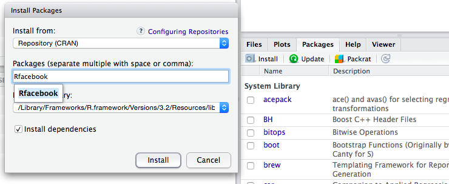
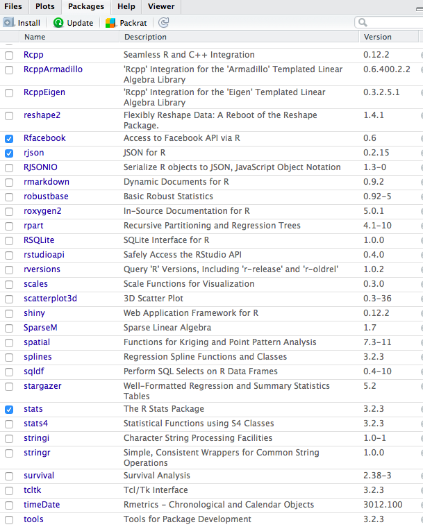
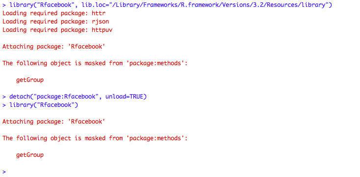

<br>

The purpose of this session is to become familiar with:

1. Basic functionality of R;
2. Reading/Writing data;
3. Simple data manipulations; 
4. Simple plots;
4. The idea of functions


Before starting, make sure you have pulled the [session 1 files](https://github.com/InseadDataAnalytics/INSEADAnalytics/tree/master/CourseSessions/Session1)  on your github repository (if you pull the course github repository you also get the session files automatically). Moreover, make sure you are in the directory of this exercise. Directory paths may be complicated, and sometimes a frustrating source of problems, so it is recommended that you use these R commands to find out your current working directory and, if needed, set it where you have the main files for the specific exercise/project (there are other ways, but for now just be aware of this path issue). For example, assuming we are now in the "MYDIRECTORY/INSEADAnalytics" directory, we can do these: 

```{r echo=TRUE, eval=FALSE, tidy=TRUE}
getwd()
setwd("CourseSessions/Session1")
list.files()
rm(list=ls()) # Clean up the memory, if we want to rerun from scratch
```

**Note:** you can always use the `help` command in Rstudio to find out about any R function (e.g. type `help(list.files)` to learn what the R function `list.files` does).

Let's start.


<hr>
<hr>

One of the major benefits of using open source software is the impressive availability of many functions as well as code people develop and share. There is a very fast growing body of (free) tools you can use (also in your jobs) - so avoid reinventing the wheel and ride the wave.

### Adding libraries

There are many ways to get new tools. First, "mature/tested" tools are available as "packages" that you can install through your RStudio. Take a look at this [list of R packages](https://cran.r-project.org/web/packages/available_packages_by_name.html) and see which ones you like. 

To install a package in R click on the "Packages" menu and then on "Install" and type the name of the package to install, also selecting "Install dependencies", as indicated in this figure: 



This will download the package - hence you need to be online. You can then "load" the library by either slecting it in the list of packages you have or using the `library` command in R, for example `library("Rfacebook")`. 





Once you have the library you can click on it (in the "Packages" menu) to see the commands available (also available on the [list of R packages](https://cran.r-project.org/web/packages/available_packages_by_name.html)  page, for example in this case for the [Rfacebook documentation).](https://cran.r-project.org/web/packages/Rfacebook/Rfacebook.pdf) You can then explore - always searching the internet for sample code (e.g. for [facebook app examples](http://thinktostart.com/analyzing-facebook-with-r/) or [this](http://blog.revolutionanalytics.com/2013/11/how-to-analyze-you-facebook-friends-network-with-r.html)). 

For example you can explore the `RFacebook` library (e.g. start from the `fbOAUth` command and using the [Facebook app id page](https://developers.facebook.com/apps) and the [Facebook app secret](https://developers.facebook.com/apps) pages, then create a token and use it to run commands like these:

```{r eval = FALSE, echo=TRUE, comment=NA, warning=FALSE, message=FALSE,results='asis'}
my_friends <- getFriends(token=token, simplify=TRUE)
my_likes <- getLikes(user="me", token=token)
my_checkins <- getCheckins(user="me", token=token)
my_newsfeed <- getNewsfeed(token=fb_oauth, n=100)
my_network <- getNetwork(token=token, format="adj.matrix")
```

**Note:** Some libraries may require you restart RStudio or install other software or restart your computer. 

**Note:** There are efficient ways to install packages. For example one can use something like what we use [in this code.](https://github.com/InseadDataAnalytics/INSEADAnalytics/blob/master/CourseSessions/Sessions23/R/library.R)


### Getting code from Github Repositories

An alternative way to get code (and see sample code - best way to learn) is to simply browse the vast number of public github accounts online. For example this lists some [trending repositories](https://github.com/trending?l=R) (this takes time to be created!) or even the [R language source code itself](https://github.com/wch/r-source) or of course links from many other [resources on R](http://www.r-bloggers.com/tag/github/). Welcome to this new world!

#### Questions

1. Can you install these packages: `datasets`, `FactoMineR`,`png` and `stringr`?
2. Which packages would you like to explore further? 
3. Can you find some github repositories that you would like to explore further? Can you fork them in your github account?
4. Do you find some Facebook related use of R and code you can further explore? How about for [Twitter](https://cran.r-project.org/web/packages/twitteR/twitteR.pdf)? 

<hr>
<hr>

### Read/Write Data

Let's now read some data. There are many ways to do so, including reading from .csv files using the commands `read.csv` and  `write.csv`. The "native" way to read and write R data though is using the `save` and `load` commands. 

Let's read some data from a .csv file for now - make sure you pulled the course github repository so that you have all the necessary files including the csv files. 

```{r eval = TRUE, echo=TRUE, comment=NA, warning=FALSE, message=FALSE,results='markup'}
ProjectData <- read.csv(file = "data/Boats.csv", header = TRUE, sep=";")
```

Let's see what this data is Run these commands to see the number of rows, number of columns, and names of the rows and the columns:

```{r eval = FALSE, echo=TRUE, comment=NA, warning=FALSE, message=FALSE,results='markup'}
ncol(ProjectData)
colnames(ProjectData)
rownames(ProjectData)
```

Do these look like what you see when you open the .csv file using Excel? 

<hr>
<hr>

### Data Exploration: A Market Segmentation Case

This data is from the case study ["Boats (A): A Segmentation Case"](http://inseaddataanalytics.github.io/INSEADAnalytics/Boats-A-prerelease.pdf) - you can see the data description in the appendix (of course the data are not the actual business data, but similar in spirit). This is based on an actual project of the company (a leader in the boats market) that did a market segmentation in order to re-define its brand and new product development strategies. Business related information on the project is provided in the [Market Segmentation Case Study slides](http://inseaddataanalytics.github.io/INSEADAnalytics/BoatsSegmentationCaseSlides.pdf). We will develop this segmentation solution step by step using the tools we will discuss in sessions 3-6 - see for example the tools of [sessions 2-3](https://github.com/InseadDataAnalytics/INSEADAnalytics/tree/master/CourseSessions/Sessions23) as well as the readings in sessions 3-6.

Let's start with some simple exploration of this data for now. Let's first get some summary statistics. For example the second column (`r colnames(ProjectData)[2]`) has the following descriptive statistics:

```{r eval = TRUE, echo=TRUE, comment=NA, warning=FALSE, message=FALSE,results='markup'}
print(colnames(ProjectData)[2])
mean(ProjectData[,2])
sd(ProjectData[,2])
range(ProjectData[,2])
min(ProjectData[,2])
max(ProjectData[,2])
quantile(ProjectData[,2],0.1)
quantile(ProjectData[,2],0.5)
quantile(ProjectData[,2],0.9)
summary(ProjectData[,2])
```

and the histogram 

```{r eval = TRUE, echo=TRUE, comment=NA, warning=FALSE, message=FALSE,results='markup'}
hist(ProjectData[,2], main = "The second column", xlab = "Ratings", ylab = "Respondents")
```

We can also see how the answers of the respondents to the questions correlate with each other. For example the correlation matrix of the first 10 survey questions is:

```{r eval = TRUE, echo=TRUE, comment=NA, warning=FALSE, message=FALSE,results='markup'}
tmp = ProjectData[,2:10]
colnames(tmp) <- 2:10
print(round(cor(tmp),2))
```

The correlation matrix does not look pretty for now, but we will see example ways to make it nicer looking later (see for example the tables in the readings for [sessions 3-4](http://inseaddataanalytics.github.io/INSEADAnalytics/Report_s23.html)) - there are as usual many ways to make really great visualizations in R, using also Google Charts, see some starting points on the [course website technical resources.](http://inseaddataanalytics.github.io/INSEADAnalytics/TechResources.html)

#### Questions

1. Can you find which column asks about the name of the brand rated? 
2. Can you find the average rating responded gave to question "`r gsub("_", " ", gsub("\\.", " ", "Q1_3_The.brand.of.boat.I.buy.says.a.lot.about.who.I.am"))`" (note the use of the R command `gsub` in the code to manipulate character strings).
3. *(Extra points)* What is the percentage of male in this population? How many of them responded that they plan to purchase a boat in the future? 
4. *(Extra points)* Explore the R command `table` and use it to present in this report some of the data.
5. Explore the R packages or github repositories you found interesting and prepare to discuss one of them in class, and if possible show some demo. 

**Your Answers here:**
<br>
<br>
<br>
<br>

<hr>
<hr>

Once done with this, we can now move to the [S&P 500 finance data exercise set](https://github.com/InseadDataAnalytics/INSEADAnalytics/blob/master/Exercises/Exerciseset1/ExerciseSet1.Rmd) and explore some ways to earn some money using what we learned... 

<br>
<br>
<br>
