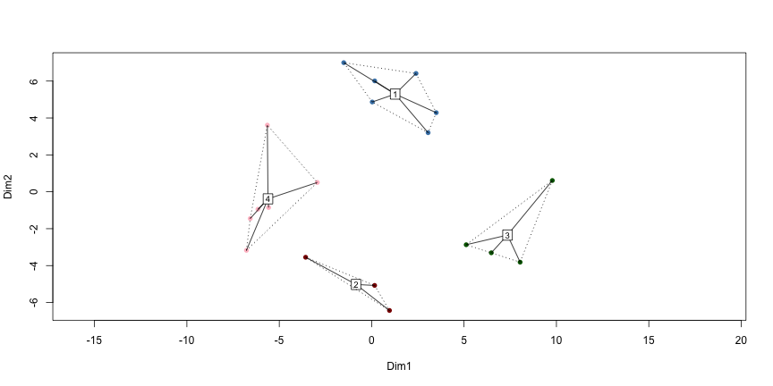
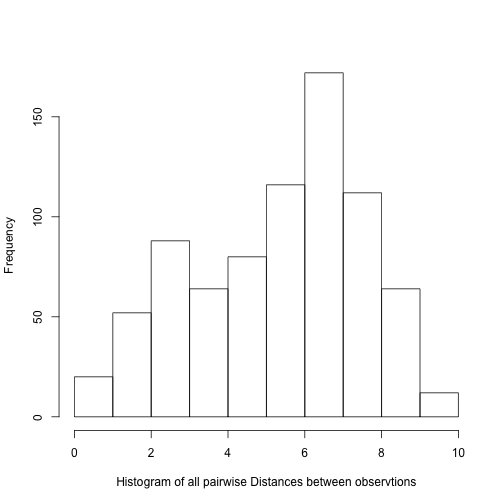
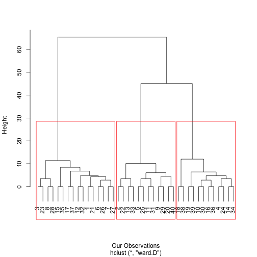
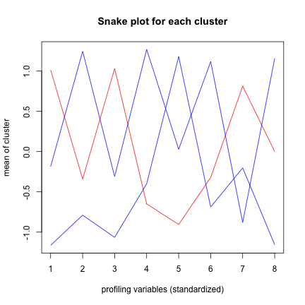

Session 9-10, Clustering and Segmentation (Technical Slides)
========================================================
title : Data Science for Business
author : T. Evgeniou, A. Ovchinnikov, INSEAD


Clustering and Segmentation
========================================================
  
  





 What is Clustering and Segmentation?
========================================================


  
<br>
<br>
<br>

Processes and tools to organize data in a few segments, with data being as similar as possible within each segment, and as different as possible across segments


 Example Usage
========================================================

<br>
<br>

- Market Segmentation

- Co-Moving Asset Classes

- Geo-demographic segmentation

- Recommender Systems

- Text Mining


A Segmentation Process
========================================================


<br>

1. Confirm data is metric
2. Scale the  data (Optional)
3. Select Segmentation Variables
4. Define similarity measure
5. Visualize Pair-wise Distances 
6. Method and Number of Segments
7. Profile and interpret the segments 
8. Robustness Analysis


 Example Data: Market Research Survey
========================================================


V1: Shopping is fun (scale 1-7)

V2: Shopping is bad for your budget (scale 1-7)

V3: I combine shopping with eating out (scale 1-7)

V4: I try to get the best buys while shopping (scale 1-7)

V5: I don't care about shopping (scale 1-7)

V6: You can save lot of money by comparingprices (scale 1-7)

Income: the household income of the respondent (in dollars)

Mall.Visits: how often they visit the mall (scale 1-7)


Step 1: Confirm data is metric
========================================================


<style>
.wrapper{
height: 120%;
width: 900px;
overflow: auto;
}
</style>
<div class="wrapper" style="font-size:20px;">
<div class="row">
<div class="col-md-3">
<!-- Table generated in R 3.3.1 by googleVis 0.6.2 package -->
<!-- Sat Jan 20 14:49:41 2018 -->


<!-- jsHeader -->
<script type="text/javascript">
 
// jsData 
function gvisDataTableIDf44a65ef1705 () {
var data = new google.visualization.DataTable();
var datajson =
[
 [
"1",
6,
4,
7,
3,
2,
3
],
[
"2",
2,
3,
1,
4,
5,
4
],
[
"3",
7,
2,
6,
4,
1,
3
],
[
"4",
4,
6,
4,
5,
3,
6
],
[
"5",
1,
3,
2,
2,
6,
4
],
[
"6",
6,
4,
6,
3,
3,
4
],
[
"7",
5,
3,
6,
3,
3,
4
],
[
"8",
7,
3,
7,
4,
1,
4
],
[
"9",
2,
4,
3,
3,
6,
3
],
[
"10",
3,
5,
3,
6,
4,
6
],
[
"11",
1,
3,
2,
3,
5,
3
],
[
"12",
5,
4,
5,
4,
2,
4
],
[
"13",
2,
2,
1,
5,
4,
4
],
[
"14",
4,
6,
4,
6,
4,
7
],
[
"15",
6,
5,
4,
2,
1,
4
],
[
"16",
3,
5,
4,
6,
4,
7
],
[
"17",
4,
4,
7,
2,
2,
5
],
[
"18",
3,
7,
2,
6,
4,
3
],
[
"19",
4,
6,
3,
7,
2,
7
],
[
"20",
2,
3,
2,
4,
7,
2
],
[
"21",
6,
4,
7,
3,
2,
3
],
[
"22",
2,
3,
1,
4,
5,
4
],
[
"23",
7,
2,
6,
4,
1,
3
],
[
"24",
4,
6,
4,
5,
3,
6
],
[
"25",
1,
3,
2,
2,
6,
4
],
[
"26",
6,
4,
6,
3,
3,
4
],
[
"27",
5,
3,
6,
3,
3,
4
],
[
"28",
7,
3,
7,
4,
1,
4
],
[
"29",
2,
4,
3,
3,
6,
3
],
[
"30",
3,
5,
3,
6,
4,
6
],
[
"31",
1,
3,
2,
3,
5,
3
],
[
"32",
5,
4,
5,
4,
2,
4
],
[
"33",
2,
2,
1,
5,
4,
4
],
[
"34",
4,
6,
4,
6,
4,
7
],
[
"35",
6,
5,
4,
2,
1,
4
],
[
"36",
3,
5,
4,
6,
4,
7
],
[
"37",
4,
4,
7,
2,
2,
5
],
[
"38",
3,
7,
2,
6,
4,
3
],
[
"39",
4,
6,
3,
7,
2,
7
],
[
"40",
2,
3,
2,
4,
7,
2
] 
];
data.addColumn('string','Variables');
data.addColumn('number','V1');
data.addColumn('number','V2');
data.addColumn('number','V3');
data.addColumn('number','V4');
data.addColumn('number','V5');
data.addColumn('number','V6');
data.addRows(datajson);
return(data);
}
 
// jsDrawChart
function drawChartTableIDf44a65ef1705() {
var data = gvisDataTableIDf44a65ef1705();
var options = {};
options["allowHtml"] = true;
options["showRowNumber"] = true;
options["width"] = 1220;
options["height"] = 400;
options["allowHTML"] = true;
options["page"] = "disable";

    var chart = new google.visualization.Table(
    document.getElementById('TableIDf44a65ef1705')
    );
    chart.draw(data,options);
    

}
  
 
// jsDisplayChart
(function() {
var pkgs = window.__gvisPackages = window.__gvisPackages || [];
var callbacks = window.__gvisCallbacks = window.__gvisCallbacks || [];
var chartid = "table";
  
// Manually see if chartid is in pkgs (not all browsers support Array.indexOf)
var i, newPackage = true;
for (i = 0; newPackage && i < pkgs.length; i++) {
if (pkgs[i] === chartid)
newPackage = false;
}
if (newPackage)
  pkgs.push(chartid);
  
// Add the drawChart function to the global list of callbacks
callbacks.push(drawChartTableIDf44a65ef1705);
})();
function displayChartTableIDf44a65ef1705() {
  var pkgs = window.__gvisPackages = window.__gvisPackages || [];
  var callbacks = window.__gvisCallbacks = window.__gvisCallbacks || [];
  window.clearTimeout(window.__gvisLoad);
  // The timeout is set to 100 because otherwise the container div we are
  // targeting might not be part of the document yet
  window.__gvisLoad = setTimeout(function() {
  var pkgCount = pkgs.length;
  google.load("visualization", "1", { packages:pkgs, callback: function() {
  if (pkgCount != pkgs.length) {
  // Race condition where another setTimeout call snuck in after us; if
  // that call added a package, we must not shift its callback
  return;
}
while (callbacks.length > 0)
callbacks.shift()();
} });
}, 100);
}
 
// jsFooter
</script>
 
<!-- jsChart -->  
<script type="text/javascript" src="https://www.google.com/jsapi?callback=displayChartTableIDf44a65ef1705"></script>
 
<!-- divChart -->
  
<div id="TableIDf44a65ef1705" 
  style="width: 1220; height: 400;">
</div>
</div>
</div>
</div>


 Step 2: Scale the  data (Optional)
========================================================

<br>

<style>
.wrapper{
height: 120%;
width: 900px;
overflow: auto;
}
</style>
<div class="wrapper" style="font-size:20px;">
<div class="row">
<div class="col-md-3">
<!-- Table generated in R 3.3.1 by googleVis 0.6.2 package -->
<!-- Sat Jan 20 14:49:41 2018 -->


<!-- jsHeader -->
<script type="text/javascript">
 
// jsData 
function gvisDataTableIDf44a3ce24b40 () {
var data = new google.visualization.DataTable();
var datajson =
[
 [
"V1",
1,
2,
4,
3.85,
5.25,
7,
1.87
],
[
"V2",
2,
3,
4,
4.1,
5,
7,
1.39
],
[
"V3",
1,
2,
4,
3.95,
6,
7,
1.99
],
[
"V4",
2,
3,
4,
4.1,
5.25,
7,
1.5
],
[
"V5",
1,
2,
3.5,
3.45,
4.25,
7,
1.74
],
[
"V6",
2,
3,
4,
4.35,
5.25,
7,
1.48
] 
];
data.addColumn('string','Variables');
data.addColumn('number','min');
data.addColumn('number','X25.percent');
data.addColumn('number','median');
data.addColumn('number','mean');
data.addColumn('number','X75.percent');
data.addColumn('number','max');
data.addColumn('number','std');
data.addRows(datajson);
return(data);
}
 
// jsDrawChart
function drawChartTableIDf44a3ce24b40() {
var data = gvisDataTableIDf44a3ce24b40();
var options = {};
options["allowHtml"] = true;
options["showRowNumber"] = true;
options["width"] = 1220;
options["height"] = 400;
options["allowHTML"] = true;
options["page"] = "disable";

    var chart = new google.visualization.Table(
    document.getElementById('TableIDf44a3ce24b40')
    );
    chart.draw(data,options);
    

}
  
 
// jsDisplayChart
(function() {
var pkgs = window.__gvisPackages = window.__gvisPackages || [];
var callbacks = window.__gvisCallbacks = window.__gvisCallbacks || [];
var chartid = "table";
  
// Manually see if chartid is in pkgs (not all browsers support Array.indexOf)
var i, newPackage = true;
for (i = 0; newPackage && i < pkgs.length; i++) {
if (pkgs[i] === chartid)
newPackage = false;
}
if (newPackage)
  pkgs.push(chartid);
  
// Add the drawChart function to the global list of callbacks
callbacks.push(drawChartTableIDf44a3ce24b40);
})();
function displayChartTableIDf44a3ce24b40() {
  var pkgs = window.__gvisPackages = window.__gvisPackages || [];
  var callbacks = window.__gvisCallbacks = window.__gvisCallbacks || [];
  window.clearTimeout(window.__gvisLoad);
  // The timeout is set to 100 because otherwise the container div we are
  // targeting might not be part of the document yet
  window.__gvisLoad = setTimeout(function() {
  var pkgCount = pkgs.length;
  google.load("visualization", "1", { packages:pkgs, callback: function() {
  if (pkgCount != pkgs.length) {
  // Race condition where another setTimeout call snuck in after us; if
  // that call added a package, we must not shift its callback
  return;
}
while (callbacks.length > 0)
callbacks.shift()();
} });
}, 100);
}
 
// jsFooter
</script>
 
<!-- jsChart -->  
<script type="text/javascript" src="https://www.google.com/jsapi?callback=displayChartTableIDf44a3ce24b40"></script>
 
<!-- divChart -->
  
<div id="TableIDf44a3ce24b40" 
  style="width: 1220; height: 400;">
</div>
</div>
</div>
</div>


 Data Standardization: Example Code
========================================================

<br>
<br>


```r
ProjectData_segment_scaled=apply(ProjectData_segment,2, function(r) {
  if (sd(r)!=0) { 
    res=(r-mean(r))/sd(r) 
    } else { 
      res=0*r; res
      }
  })
```

 Standardized Data: Summary Statistics
========================================================


<br>

<style>
.wrapper{
height: 120%;
width: 900px;
overflow: auto;
}
</style>
<div class="wrapper" style="font-size:20px;">
<div class="row">
<div class="col-md-3">
<!-- Table generated in R 3.3.1 by googleVis 0.6.2 package -->
<!-- Sat Jan 20 14:49:41 2018 -->


<!-- jsHeader -->
<script type="text/javascript">
 
// jsData 
function gvisDataTableIDf44a1f21df6f () {
var data = new google.visualization.DataTable();
var datajson =
[
 [
"V1",
-1.52,
-0.99,
0.08,
0,
0.75,
1.68,
1
],
[
"V2",
-1.51,
-0.79,
-0.07,
0,
0.65,
2.08,
1
],
[
"V3",
-1.49,
-0.98,
0.03,
0,
1.03,
1.54,
1
],
[
"V4",
-1.4,
-0.73,
-0.07,
0,
0.77,
1.93,
1
],
[
"V5",
-1.41,
-0.83,
0.03,
0,
0.46,
2.04,
1
],
[
"V6",
-1.59,
-0.91,
-0.24,
0,
0.61,
1.79,
1
] 
];
data.addColumn('string','Variables');
data.addColumn('number','min');
data.addColumn('number','X25.percent');
data.addColumn('number','median');
data.addColumn('number','mean');
data.addColumn('number','X75.percent');
data.addColumn('number','max');
data.addColumn('number','std');
data.addRows(datajson);
return(data);
}
 
// jsDrawChart
function drawChartTableIDf44a1f21df6f() {
var data = gvisDataTableIDf44a1f21df6f();
var options = {};
options["allowHtml"] = true;
options["showRowNumber"] = true;
options["width"] = 1220;
options["height"] = 400;
options["allowHTML"] = true;
options["page"] = "disable";

    var chart = new google.visualization.Table(
    document.getElementById('TableIDf44a1f21df6f')
    );
    chart.draw(data,options);
    

}
  
 
// jsDisplayChart
(function() {
var pkgs = window.__gvisPackages = window.__gvisPackages || [];
var callbacks = window.__gvisCallbacks = window.__gvisCallbacks || [];
var chartid = "table";
  
// Manually see if chartid is in pkgs (not all browsers support Array.indexOf)
var i, newPackage = true;
for (i = 0; newPackage && i < pkgs.length; i++) {
if (pkgs[i] === chartid)
newPackage = false;
}
if (newPackage)
  pkgs.push(chartid);
  
// Add the drawChart function to the global list of callbacks
callbacks.push(drawChartTableIDf44a1f21df6f);
})();
function displayChartTableIDf44a1f21df6f() {
  var pkgs = window.__gvisPackages = window.__gvisPackages || [];
  var callbacks = window.__gvisCallbacks = window.__gvisCallbacks || [];
  window.clearTimeout(window.__gvisLoad);
  // The timeout is set to 100 because otherwise the container div we are
  // targeting might not be part of the document yet
  window.__gvisLoad = setTimeout(function() {
  var pkgCount = pkgs.length;
  google.load("visualization", "1", { packages:pkgs, callback: function() {
  if (pkgCount != pkgs.length) {
  // Race condition where another setTimeout call snuck in after us; if
  // that call added a package, we must not shift its callback
  return;
}
while (callbacks.length > 0)
callbacks.shift()();
} });
}, 100);
}
 
// jsFooter
</script>
 
<!-- jsChart -->  
<script type="text/javascript" src="https://www.google.com/jsapi?callback=displayChartTableIDf44a1f21df6f"></script>
 
<!-- divChart -->
  
<div id="TableIDf44a1f21df6f" 
  style="width: 1220; height: 400;">
</div>
</div>
</div>
</div>


Step 3. Select Segmentation Variables
========================================================

<br>

The choice of the variables used for clustering is critically important 
<br>
<br>

Tpically we use different variables for segmentation (the "segmentation variables") and different ones for profiling (the "profiling variables")

<br>
<br>

Remember: Segmentation is an iterative process

Step 4. Define similarity measure
========================================================


Defining what we mean when we say "similar" or "different" observations is a key part of cluster analysis which often requires a lot of contextual knowledge and creativity 

<br>
<br>


There are literally thousands of rigorous mathematical definitions of distance between observations/vectors

<br>
<br>

The user can manually define such distance metrics

Distances across our data using the Euclidean distance
========================================================


Pairwise Distances between the first 5 observations using The Euclidean Distance Metric


<style>
.wrapper{
height: 120%;
width: 900px;
overflow: auto;
}
</style>
<div class="wrapper" style="font-size:20px;">
<div class="row">
<div class="col-md-3">
<table class='table table-striped table-hover table-bordered'>
<caption align="top">  </caption>
<tr> <th> 1 </th> <th> 2 </th> <th> 3 </th> <th> 4 </th> <th> 5 </th>  </tr>
  <tr> <td align="right"> 0.0 </td> <td align="right">  </td> <td align="right">  </td> <td align="right">  </td> <td align="right">  </td> </tr>
  <tr> <td align="right"> 8.0 </td> <td align="right"> 0.0 </td> <td align="right">  </td> <td align="right">  </td> <td align="right">  </td> </tr>
  <tr> <td align="right"> 2.8 </td> <td align="right"> 8.2 </td> <td align="right"> 0.0 </td> <td align="right">  </td> <td align="right">  </td> </tr>
  <tr> <td align="right"> 5.6 </td> <td align="right"> 5.6 </td> <td align="right"> 6.6 </td> <td align="right"> 0.0 </td> <td align="right">  </td> </tr>
  <tr> <td align="right"> 8.3 </td> <td align="right"> 2.6 </td> <td align="right"> 9.1 </td> <td align="right"> 6.6 </td> <td align="right"> 0.0 </td> </tr>
   </table>
</div>
</div>
</div>

 Distances across our data using the Manhattan distance
========================================================

Pairwise Distances between the first 5 observations using The Manhattan Distance Metric


<style>
.wrapper{
height: 120%;
width: 900px;
overflow: auto;
}
</style>
<div class="wrapper" style="font-size:20px;">
<div class="row">
<div class="col-md-3">
<table class='table table-striped table-hover table-bordered'>
<caption align="top">  </caption>
<tr> <th> 1 </th> <th> 2 </th> <th> 3 </th> <th> 4 </th> <th> 5 </th>  </tr>
  <tr> <td align="right"> 0.0 </td> <td align="right">  </td> <td align="right">  </td> <td align="right">  </td> <td align="right">  </td> </tr>
  <tr> <td align="right"> 16.0 </td> <td align="right"> 0.0 </td> <td align="right">  </td> <td align="right">  </td> <td align="right">  </td> </tr>
  <tr> <td align="right"> 6.0 </td> <td align="right"> 16.0 </td> <td align="right"> 0.0 </td> <td align="right">  </td> <td align="right">  </td> </tr>
  <tr> <td align="right"> 13.0 </td> <td align="right"> 13.0 </td> <td align="right"> 15.0 </td> <td align="right"> 0.0 </td> <td align="right">  </td> </tr>
  <tr> <td align="right"> 17.0 </td> <td align="right"> 5.0 </td> <td align="right"> 19.0 </td> <td align="right"> 16.0 </td> <td align="right"> 0.0 </td> </tr>
   </table>
</div>
</div>
</div>


 Manually Defined Distances: an Example
========================================================

<br>
<br>
<br>


```r
My_Distance_function<-function(x,y){sum(abs(x-y)>2)}
```

 Manually Defined Distances: an Example
========================================================

Pairwise Distances between the first 5 observations using a simple manually defined Distance Metric


<style>
.wrapper{
height: 120%;
width: 900px;
overflow: auto;
}
</style>
<div class="wrapper" style="font-size:20px;">
<div class="row">
<div class="col-md-3">
<table class='table table-striped table-hover table-bordered'>
<caption align="top">  </caption>
<tr> <th> 1 </th> <th> 2 </th> <th> 3 </th> <th> 4 </th> <th> 5 </th>  </tr>
  <tr> <td align="right"> 0.0 </td> <td align="right">  </td> <td align="right">  </td> <td align="right">  </td> <td align="right">  </td> </tr>
  <tr> <td align="right"> 3.0 </td> <td align="right"> 0.0 </td> <td align="right">  </td> <td align="right">  </td> <td align="right">  </td> </tr>
  <tr> <td align="right"> 0.0 </td> <td align="right"> 3.0 </td> <td align="right"> 0.0 </td> <td align="right">  </td> <td align="right">  </td> </tr>
  <tr> <td align="right"> 2.0 </td> <td align="right"> 2.0 </td> <td align="right"> 3.0 </td> <td align="right"> 0.0 </td> <td align="right">  </td> </tr>
  <tr> <td align="right"> 3.0 </td> <td align="right"> 0.0 </td> <td align="right"> 3.0 </td> <td align="right"> 4.0 </td> <td align="right"> 0.0 </td> </tr>
   </table>
</div>
</div>
</div>


Step 5. Visualize Pair-wise Distances 
========================================================

 Histogram of all pairwise distances 
========================================================

Distance Used:  euclidean 



 Step 6. Method and Number of Segments
========================================================

<br>
<br>

There are many clustering methods. Two common ones are:

* Hierarchical Methods

* Non-Hierarchical Methods (e.g. k-means)

<br>

We can plug-and-play (with CARE) this "black box" in our analysis 

 Hierarchical Clustering: Dendrogram
========================================================

<style>
.wrapper{
height: 120%;
width: 900px;
overflow: auto;
}
</style>
<div class="wrapper" style="font-size:20px;">

<div>

 Hierarchical Clustering Dendrogram Heights Plot
========================================================

<style>
.wrapper{
height: 40%;
width: 800px;
overflow: auto;
}
</style>
<div class="wrapper" style="font-size:15px;">
<!-- LineChart generated in R 3.3.1 by googleVis 0.6.2 package -->
<!-- Sat Jan 20 14:49:42 2018 -->


<!-- jsHeader -->
<script type="text/javascript">
 
// jsData 
function gvisDataLineChartIDf44a17410860 () {
var data = new google.visualization.DataTable();
var datajson =
[
 [
"1",
65.38040421
],
[
"2",
45.09618005
],
[
"3",
11.99746394
],
[
"4",
11.38325339
],
[
"5",
10.08471639
],
[
"6",
8.429505207
],
[
"7",
6.74653889
],
[
"8",
6.395153465
],
[
"9",
6.075978164
],
[
"10",
4.851640529
],
[
"11",
4.740085147
],
[
"12",
4.472135955
],
[
"13",
4.348016005
],
[
"14",
3.464101615
],
[
"15",
3.464101615
],
[
"16",
3.464101615
],
[
"17",
3.464101615
],
[
"18",
2.828427125
],
[
"19",
2.828427125
],
[
"20",
0
],
[
"21",
0
],
[
"22",
0
],
[
"23",
0
],
[
"24",
0
],
[
"25",
0
],
[
"26",
0
],
[
"27",
0
],
[
"28",
0
],
[
"29",
0
],
[
"30",
0
],
[
"31",
0
],
[
"32",
0
],
[
"33",
0
],
[
"34",
0
],
[
"35",
0
],
[
"36",
0
],
[
"37",
0
],
[
"38",
0
],
[
"39",
0
] 
];
data.addColumn('string','index');
data.addColumn('number','distances');
data.addRows(datajson);
return(data);
}
 
// jsDrawChart
function drawChartLineChartIDf44a17410860() {
var data = gvisDataLineChartIDf44a17410860();
var options = {};
options["allowHtml"] = true;
options["title"] = "Distances plot";
options["legend"] = "right";
options["width"] = 900;
options["height"] = 600;
options["hAxis"] = {title:'Number of Components', titleTextStyle:{color:'black'}};
options["vAxes"] = [{title:'Distances'}];
options["series"] = [{color:'green',pointSize:3, targetAxisIndex: 0}];

    var chart = new google.visualization.LineChart(
    document.getElementById('LineChartIDf44a17410860')
    );
    chart.draw(data,options);
    

}
  
 
// jsDisplayChart
(function() {
var pkgs = window.__gvisPackages = window.__gvisPackages || [];
var callbacks = window.__gvisCallbacks = window.__gvisCallbacks || [];
var chartid = "corechart";
  
// Manually see if chartid is in pkgs (not all browsers support Array.indexOf)
var i, newPackage = true;
for (i = 0; newPackage && i < pkgs.length; i++) {
if (pkgs[i] === chartid)
newPackage = false;
}
if (newPackage)
  pkgs.push(chartid);
  
// Add the drawChart function to the global list of callbacks
callbacks.push(drawChartLineChartIDf44a17410860);
})();
function displayChartLineChartIDf44a17410860() {
  var pkgs = window.__gvisPackages = window.__gvisPackages || [];
  var callbacks = window.__gvisCallbacks = window.__gvisCallbacks || [];
  window.clearTimeout(window.__gvisLoad);
  // The timeout is set to 100 because otherwise the container div we are
  // targeting might not be part of the document yet
  window.__gvisLoad = setTimeout(function() {
  var pkgCount = pkgs.length;
  google.load("visualization", "1", { packages:pkgs, callback: function() {
  if (pkgCount != pkgs.length) {
  // Race condition where another setTimeout call snuck in after us; if
  // that call added a package, we must not shift its callback
  return;
}
while (callbacks.length > 0)
callbacks.shift()();
} });
}, 100);
}
 
// jsFooter
</script>
 
<!-- jsChart -->  
<script type="text/javascript" src="https://www.google.com/jsapi?callback=displayChartLineChartIDf44a17410860"></script>
 
<!-- divChart -->
  
<div id="LineChartIDf44a17410860" 
  style="width: 900; height: 600;">
</div>
<div>

 Cluster Membership: Hierarchical Clustering
========================================================

<br>


<style>
.wrapper{
height: 120%;
width: 900px;
overflow: auto;
}
</style>
<div class="wrapper" style="font-size:20px;">
<div class="row">
<div class="col-md-6">
<!-- Table generated in R 3.3.1 by googleVis 0.6.2 package -->
<!-- Sat Jan 20 14:49:42 2018 -->


<!-- jsHeader -->
<script type="text/javascript">
 
// jsData 
function gvisDataTableIDf44a75f2be08 () {
var data = new google.visualization.DataTable();
var datajson =
[
 [
"1",
1,
1
],
[
"2",
2,
2
],
[
"3",
3,
1
],
[
"4",
4,
3
],
[
"5",
5,
2
],
[
"6",
6,
1
],
[
"7",
7,
1
],
[
"8",
8,
1
],
[
"9",
9,
2
],
[
"10",
10,
3
],
[
"11",
11,
2
],
[
"12",
12,
1
],
[
"13",
13,
2
],
[
"14",
14,
3
],
[
"15",
15,
1
],
[
"16",
16,
3
],
[
"17",
17,
1
],
[
"18",
18,
3
],
[
"19",
19,
3
],
[
"20",
20,
2
],
[
"21",
21,
1
],
[
"22",
22,
2
],
[
"23",
23,
1
],
[
"24",
24,
3
],
[
"25",
25,
2
],
[
"26",
26,
1
],
[
"27",
27,
1
],
[
"28",
28,
1
],
[
"29",
29,
2
],
[
"30",
30,
3
],
[
"31",
31,
2
],
[
"32",
32,
1
],
[
"33",
33,
2
],
[
"34",
34,
3
],
[
"35",
35,
1
],
[
"36",
36,
3
],
[
"37",
37,
1
],
[
"38",
38,
3
],
[
"39",
39,
3
],
[
"40",
40,
2
] 
];
data.addColumn('string','Observation');
data.addColumn('number','Observation.Number');
data.addColumn('number','Cluster_Membership');
data.addRows(datajson);
return(data);
}
 
// jsDrawChart
function drawChartTableIDf44a75f2be08() {
var data = gvisDataTableIDf44a75f2be08();
var options = {};
options["allowHtml"] = true;
options["showRowNumber"] = true;
options["width"] = 1220;
options["height"] = 400;
options["allowHTML"] = true;
options["page"] = "disable";

    var chart = new google.visualization.Table(
    document.getElementById('TableIDf44a75f2be08')
    );
    chart.draw(data,options);
    

}
  
 
// jsDisplayChart
(function() {
var pkgs = window.__gvisPackages = window.__gvisPackages || [];
var callbacks = window.__gvisCallbacks = window.__gvisCallbacks || [];
var chartid = "table";
  
// Manually see if chartid is in pkgs (not all browsers support Array.indexOf)
var i, newPackage = true;
for (i = 0; newPackage && i < pkgs.length; i++) {
if (pkgs[i] === chartid)
newPackage = false;
}
if (newPackage)
  pkgs.push(chartid);
  
// Add the drawChart function to the global list of callbacks
callbacks.push(drawChartTableIDf44a75f2be08);
})();
function displayChartTableIDf44a75f2be08() {
  var pkgs = window.__gvisPackages = window.__gvisPackages || [];
  var callbacks = window.__gvisCallbacks = window.__gvisCallbacks || [];
  window.clearTimeout(window.__gvisLoad);
  // The timeout is set to 100 because otherwise the container div we are
  // targeting might not be part of the document yet
  window.__gvisLoad = setTimeout(function() {
  var pkgCount = pkgs.length;
  google.load("visualization", "1", { packages:pkgs, callback: function() {
  if (pkgCount != pkgs.length) {
  // Race condition where another setTimeout call snuck in after us; if
  // that call added a package, we must not shift its callback
  return;
}
while (callbacks.length > 0)
callbacks.shift()();
} });
}, 100);
}
 
// jsFooter
</script>
 
<!-- jsChart -->  
<script type="text/javascript" src="https://www.google.com/jsapi?callback=displayChartTableIDf44a75f2be08"></script>
 
<!-- divChart -->
  
<div id="TableIDf44a75f2be08" 
  style="width: 1220; height: 400;">
</div>
</div>
</div>
</div>

 Cluster Membership: K-means Clustering
========================================================

Note: K-means does not necessarily lead to the same solution every time you run it


<style>
.wrapper{
height: 120%;
width: 900px;
overflow: auto;
}
</style>
<div class="wrapper" style="font-size:20px;">
<div class="row">
<div class="col-md-6">
<!-- Table generated in R 3.3.1 by googleVis 0.6.2 package -->
<!-- Sat Jan 20 14:49:42 2018 -->


<!-- jsHeader -->
<script type="text/javascript">
 
// jsData 
function gvisDataTableIDf44a4347c3a0 () {
var data = new google.visualization.DataTable();
var datajson =
[
 [
"1",
1,
3
],
[
"2",
2,
2
],
[
"3",
3,
3
],
[
"4",
4,
1
],
[
"5",
5,
2
],
[
"6",
6,
3
],
[
"7",
7,
3
],
[
"8",
8,
3
],
[
"9",
9,
2
],
[
"10",
10,
1
],
[
"11",
11,
2
],
[
"12",
12,
3
],
[
"13",
13,
2
],
[
"14",
14,
1
],
[
"15",
15,
3
],
[
"16",
16,
1
],
[
"17",
17,
3
],
[
"18",
18,
1
],
[
"19",
19,
1
],
[
"20",
20,
2
],
[
"21",
21,
3
],
[
"22",
22,
2
],
[
"23",
23,
3
],
[
"24",
24,
1
],
[
"25",
25,
2
],
[
"26",
26,
3
],
[
"27",
27,
3
],
[
"28",
28,
3
],
[
"29",
29,
2
],
[
"30",
30,
1
],
[
"31",
31,
2
],
[
"32",
32,
3
],
[
"33",
33,
2
],
[
"34",
34,
1
],
[
"35",
35,
3
],
[
"36",
36,
1
],
[
"37",
37,
3
],
[
"38",
38,
1
],
[
"39",
39,
1
],
[
"40",
40,
2
] 
];
data.addColumn('string','Observation');
data.addColumn('number','Observation.Number');
data.addColumn('number','Cluster_Membership');
data.addRows(datajson);
return(data);
}
 
// jsDrawChart
function drawChartTableIDf44a4347c3a0() {
var data = gvisDataTableIDf44a4347c3a0();
var options = {};
options["allowHtml"] = true;
options["showRowNumber"] = true;
options["width"] = 1220;
options["height"] = 400;
options["allowHTML"] = true;
options["page"] = "disable";

    var chart = new google.visualization.Table(
    document.getElementById('TableIDf44a4347c3a0')
    );
    chart.draw(data,options);
    

}
  
 
// jsDisplayChart
(function() {
var pkgs = window.__gvisPackages = window.__gvisPackages || [];
var callbacks = window.__gvisCallbacks = window.__gvisCallbacks || [];
var chartid = "table";
  
// Manually see if chartid is in pkgs (not all browsers support Array.indexOf)
var i, newPackage = true;
for (i = 0; newPackage && i < pkgs.length; i++) {
if (pkgs[i] === chartid)
newPackage = false;
}
if (newPackage)
  pkgs.push(chartid);
  
// Add the drawChart function to the global list of callbacks
callbacks.push(drawChartTableIDf44a4347c3a0);
})();
function displayChartTableIDf44a4347c3a0() {
  var pkgs = window.__gvisPackages = window.__gvisPackages || [];
  var callbacks = window.__gvisCallbacks = window.__gvisCallbacks || [];
  window.clearTimeout(window.__gvisLoad);
  // The timeout is set to 100 because otherwise the container div we are
  // targeting might not be part of the document yet
  window.__gvisLoad = setTimeout(function() {
  var pkgCount = pkgs.length;
  google.load("visualization", "1", { packages:pkgs, callback: function() {
  if (pkgCount != pkgs.length) {
  // Race condition where another setTimeout call snuck in after us; if
  // that call added a package, we must not shift its callback
  return;
}
while (callbacks.length > 0)
callbacks.shift()();
} });
}, 100);
}
 
// jsFooter
</script>
 
<!-- jsChart -->  
<script type="text/javascript" src="https://www.google.com/jsapi?callback=displayChartTableIDf44a4347c3a0"></script>
 
<!-- divChart -->
  
<div id="TableIDf44a4347c3a0" 
  style="width: 1220; height: 400;">
</div>
</div>
</div>
</div>

 Step 7. Profile and interpret the segments 
========================================================

<br>
<br>
<br>

Data analytics is used to eventually make decisions, and that is feasible only when we are comfortable (enough) with our understanding of the analytics results, including our ability to clearly interpret them. 

 Cluster Profiling: Cluster Centers of Profling Variables
========================================================


<br>


<style>
.wrapper{
height: 120%;
width: 900px;
overflow: auto;
}
</style>
<div class="wrapper" style="font-size:20px;">
<div class="row">
<div class="col-md-6">
<!-- Table generated in R 3.3.1 by googleVis 0.6.2 package -->
<!-- Sat Jan 20 14:49:42 2018 -->


<!-- jsHeader -->
<script type="text/javascript">
 
// jsData 
function gvisDataTableIDf44a15ed46c4 () {
var data = new google.visualization.DataTable();
var datajson =
[
 [
"V1",
3.85,
5.75,
1.67,
3.5
],
[
"V2",
4.1,
3.62,
3,
5.83
],
[
"V3",
3.95,
6,
1.83,
3.33
],
[
"V4",
4.1,
3.12,
3.5,
6
],
[
"V5",
3.45,
1.88,
5.5,
3.5
],
[
"V6",
4.35,
3.88,
3.33,
6
],
[
"Income",
46000,
60000,
42500,
30833.33
],
[
"Mall.Visits",
3.25,
3.25,
1,
5.5
] 
];
data.addColumn('string','Variables');
data.addColumn('number','Population');
data.addColumn('number','Segment.1');
data.addColumn('number','Segment.2');
data.addColumn('number','Segment.3');
data.addRows(datajson);
return(data);
}
 
// jsDrawChart
function drawChartTableIDf44a15ed46c4() {
var data = gvisDataTableIDf44a15ed46c4();
var options = {};
options["allowHtml"] = true;
options["showRowNumber"] = true;
options["width"] = 1220;
options["height"] = 400;
options["allowHTML"] = true;
options["page"] = "disable";

    var chart = new google.visualization.Table(
    document.getElementById('TableIDf44a15ed46c4')
    );
    chart.draw(data,options);
    

}
  
 
// jsDisplayChart
(function() {
var pkgs = window.__gvisPackages = window.__gvisPackages || [];
var callbacks = window.__gvisCallbacks = window.__gvisCallbacks || [];
var chartid = "table";
  
// Manually see if chartid is in pkgs (not all browsers support Array.indexOf)
var i, newPackage = true;
for (i = 0; newPackage && i < pkgs.length; i++) {
if (pkgs[i] === chartid)
newPackage = false;
}
if (newPackage)
  pkgs.push(chartid);
  
// Add the drawChart function to the global list of callbacks
callbacks.push(drawChartTableIDf44a15ed46c4);
})();
function displayChartTableIDf44a15ed46c4() {
  var pkgs = window.__gvisPackages = window.__gvisPackages || [];
  var callbacks = window.__gvisCallbacks = window.__gvisCallbacks || [];
  window.clearTimeout(window.__gvisLoad);
  // The timeout is set to 100 because otherwise the container div we are
  // targeting might not be part of the document yet
  window.__gvisLoad = setTimeout(function() {
  var pkgCount = pkgs.length;
  google.load("visualization", "1", { packages:pkgs, callback: function() {
  if (pkgCount != pkgs.length) {
  // Race condition where another setTimeout call snuck in after us; if
  // that call added a package, we must not shift its callback
  return;
}
while (callbacks.length > 0)
callbacks.shift()();
} });
}, 100);
}
 
// jsFooter
</script>
 
<!-- jsChart -->  
<script type="text/javascript" src="https://www.google.com/jsapi?callback=displayChartTableIDf44a15ed46c4"></script>
 
<!-- divChart -->
  
<div id="TableIDf44a15ed46c4" 
  style="width: 1220; height: 400;">
</div>
</div>
</div>
</div>

 Interpretation: Snake Plots
========================================================

<style>
.wrapper{
height: 160%;
width: 900px;
overflow: auto;
}
</style>
<div class="wrapper" style="font-size:20px;">

</div>


 Interpretation: Ratio to Average of Total Population -1 (0 = Average)
========================================================


<style>
.wrapper{
height: 120%;
width: 900px;
overflow: auto;
}
</style>
<div class="wrapper" style="font-size:20px;">
<div class="row">
<div class="col-md-6">
<!-- Table generated in R 3.3.1 by googleVis 0.6.2 package -->
<!-- Sat Jan 20 14:49:42 2018 -->


<!-- jsHeader -->
<script type="text/javascript">
 
// jsData 
function gvisDataTableIDf44a67469d64 () {
var data = new google.visualization.DataTable();
var datajson =
[
 [
0.49,
-0.57,
-0.09
],
[
-0.12,
-0.27,
0.42
],
[
0.52,
-0.54,
-0.16
],
[
-0.24,
-0.15,
0.46
],
[
-0.46,
0.59,
0.01
],
[
-0.11,
-0.23,
0.38
],
[
0.3,
-0.08,
-0.33
],
[
0,
-0.69,
0.69
] 
];
data.addColumn('number','Segment.1');
data.addColumn('number','Segment.2');
data.addColumn('number','Segment.3');
data.addRows(datajson);
return(data);
}
 
// jsDrawChart
function drawChartTableIDf44a67469d64() {
var data = gvisDataTableIDf44a67469d64();
var options = {};
options["allowHtml"] = true;
options["width"] = 1920;
options["height"] = 243;
options["allowHTML"] = true;

    var chart = new google.visualization.Table(
    document.getElementById('TableIDf44a67469d64')
    );
    chart.draw(data,options);
    

}
  
 
// jsDisplayChart
(function() {
var pkgs = window.__gvisPackages = window.__gvisPackages || [];
var callbacks = window.__gvisCallbacks = window.__gvisCallbacks || [];
var chartid = "table";
  
// Manually see if chartid is in pkgs (not all browsers support Array.indexOf)
var i, newPackage = true;
for (i = 0; newPackage && i < pkgs.length; i++) {
if (pkgs[i] === chartid)
newPackage = false;
}
if (newPackage)
  pkgs.push(chartid);
  
// Add the drawChart function to the global list of callbacks
callbacks.push(drawChartTableIDf44a67469d64);
})();
function displayChartTableIDf44a67469d64() {
  var pkgs = window.__gvisPackages = window.__gvisPackages || [];
  var callbacks = window.__gvisCallbacks = window.__gvisCallbacks || [];
  window.clearTimeout(window.__gvisLoad);
  // The timeout is set to 100 because otherwise the container div we are
  // targeting might not be part of the document yet
  window.__gvisLoad = setTimeout(function() {
  var pkgCount = pkgs.length;
  google.load("visualization", "1", { packages:pkgs, callback: function() {
  if (pkgCount != pkgs.length) {
  // Race condition where another setTimeout call snuck in after us; if
  // that call added a package, we must not shift its callback
  return;
}
while (callbacks.length > 0)
callbacks.shift()();
} });
}, 100);
}
 
// jsFooter
</script>
 
<!-- jsChart -->  
<script type="text/javascript" src="https://www.google.com/jsapi?callback=displayChartTableIDf44a67469d64"></script>
 
<!-- divChart -->
  
<div id="TableIDf44a67469d64" 
  style="width: 1920; height: 243;">
</div>
</div>
</div>
</div>

 The data
========================================================

V1: Shopping is fun (scale 1-7)

V2: Shopping is bad for your budget (scale 1-7)

V3: I combine shopping with eating out (scale 1-7)

V4: I try to get the best buys while shopping (scale 1-7)

V5: I don't care about shopping (scale 1-7)

V6: You can save lot of money by comparingprices (scale 1-7)

Income: the household income of the respondent (in dollars)

Mall.Visits: how often they visit the mall (scale 1-7)


 Step 8. Robustness Analysis
========================================================

<br>

Are the clusters stable when we use:
<br>

- using different subsets of the original data
- using variations of the original segmentation attributes
- using different distance metrics
- using different segmentation methods
- using different numbers of clusters


 Example Robustness Test: Different Methods
========================================================


<br>

The percentage of observations belonging to the same segment is
<div class="row">
<div class="col-md-3">
<table class='table table-striped table-hover table-bordered'>
<caption align="top">  100 %. </caption>
<tr> <th> Segment 1 </th> <th> Segment 2 </th> <th> Segment 3 </th>  </tr>
  <tr> <td align="right"> 100.0 </td> <td align="right"> 100.0 </td> <td align="right"> 100.0 </td> </tr>
   </table>
</div>
</div>
<br>

How much overlap should we expect across clustering solutions?


 Key Technical Terms and Lessons
========================================================

- Segmentation Variables
- Profiling Variables
- Distance Metrics
- Hierarchical Clustering
- Dendrogram
- K-means Clustering
- Robustness: Statistics, Interpretation, Decisions
- Actionability, Interpretability, Statistical Robustness

 Group Work
========================================================

1. How many market segments (clusters) are there? Why?

2. How would you describe the segments?

3. How would the segments inform the strategy of CreeqBoat?


