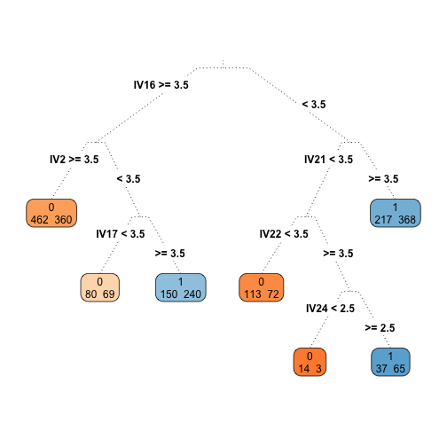
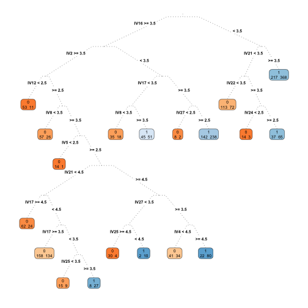
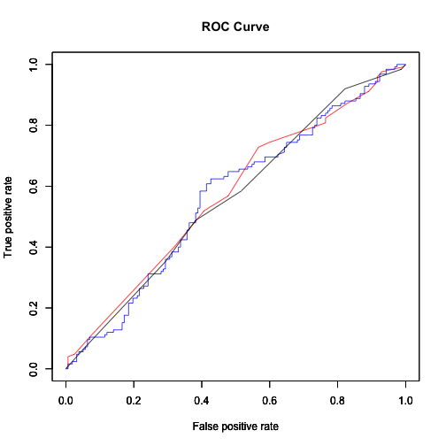

Session 7-8, Discriminant Analysis and Classification (Technical Slides)
========================================================
author : T. Evgeniou, A. Ovchinnikov, INSEAD
title : Data Analytics for Business

Example Applications
========================================================

- Which molecules are most likely to succeed for the drug?
- Whose DNA is most likely to indicate future health problems of a particular type?
- Who are the most likely clients/companies/countries to default on their debt?
- Who are most likely to click on an ad? 
- To whom should we offer a particular promotion?
- How are satisfied customers different from dissatisfied customers in terms of their demographics and attitudes towards your products??? characteristics?
- Which transaction is most likely a fraud?
- Which applicants are most likely to fit in our organization and succeed?
- Which investments are most likely to succeed?

What is common to these problems?
========================================================

1. There is a dependent variable which is categorical e.g. success vs failure (fit vs. non-fit; fraud vs. non-fraud, response vs. non-response, etc.)

2. There are some independent variables which we can use to explain membership in the different categories

Example: Boats Purchase Drivers
========================================================

Who would be the most likely customers to purchase a boat in the future or to recommend their brand?

What would be the **key drivers** that affect people's decision to purchase or recommend?

Various Methods
========================================================

- Logistic regression
- Classification trees
- Boosted Trees
- Nearest Neighbors
- Neural Networks
- Bayesian methods
- Support Vector Machines
- Deep learning methods
- others...

Classification: A Process
========================================================

1. Create an estimation and two validation samples in a balanced way 
2. Setup the dependent variable (what is a success?)
3. Assess and select the independent variables
4. Estimate model (many methods, we consider only 2 here)
5. Assess performance on first validation data, repeat steps 2-5 as necessary
6. Assess performance on second validation data once

Data Splits: Example Split
========================================================

Estimation Data: 80% of the data

Validation Data: 10% of the data

Test Data: 10% of the data

Example: Some Data
========================================================

<table class='table table-striped table-hover table-bordered'>
<caption align="top"> Number of Observations per class in the Estimation Sample </caption>
<tr> <th>  </th> <th> Variables </th> <th> Q16.1 </th> <th> Q16.2 </th> <th> Q16.3 </th> <th> Q16.4 </th> <th> Q16.5 </th> <th> Q16.6 </th> <th> Q16.7 </th> <th> Q16.8 </th> <th> Q16.9 </th> <th> Q16.10 </th> <th> Q16.11 </th> <th> Q16.12 </th> <th> Q16.13 </th> <th> Q16.14 </th> <th> Q16.15 </th> <th> Q16.16 </th> <th> Q16.17 </th> <th> Q16.18 </th> <th> Q16.19 </th> <th> Q16.20 </th> <th> Q16.21 </th> <th> Q16.22 </th> <th> Q16.23 </th> <th> Q16.24 </th> <th> Q16.25 </th> <th> Q16.26 </th> <th> Q16.27 </th>  </tr>
  <tr> <td align="right"> 1 </td> <td> 1 </td> <td align="right"> 3.0 </td> <td align="right"> 4.0 </td> <td align="right"> 4.0 </td> <td align="right"> 3.0 </td> <td align="right"> 4.0 </td> <td align="right"> 4.0 </td> <td align="right"> 4.0 </td> <td align="right"> 4.0 </td> <td align="right"> 4.0 </td> <td align="right"> 4.0 </td> <td align="right"> 4.0 </td> <td align="right"> 4.0 </td> <td align="right"> 4.0 </td> <td align="right"> 4.0 </td> <td align="right"> 4.0 </td> <td align="right"> 4.0 </td> <td align="right"> 4.0 </td> <td align="right"> 4.0 </td> <td align="right"> 4.0 </td> <td align="right"> 4.0 </td> <td align="right"> 4.0 </td> <td align="right"> 4.0 </td> <td align="right"> 4.0 </td> <td align="right"> 5.0 </td> <td align="right"> 4.0 </td> <td align="right"> 4.0 </td> <td align="right"> 4.0 </td> </tr>
  <tr> <td align="right"> 2 </td> <td> 2 </td> <td align="right"> 3.0 </td> <td align="right"> 3.0 </td> <td align="right"> 4.0 </td> <td align="right"> 3.0 </td> <td align="right"> 3.0 </td> <td align="right"> 3.0 </td> <td align="right"> 4.0 </td> <td align="right"> 4.0 </td> <td align="right"> 5.0 </td> <td align="right"> 4.0 </td> <td align="right"> 4.0 </td> <td align="right"> 3.0 </td> <td align="right"> 4.0 </td> <td align="right"> 4.0 </td> <td align="right"> 4.0 </td> <td align="right"> 4.0 </td> <td align="right"> 4.0 </td> <td align="right"> 4.0 </td> <td align="right"> 3.0 </td> <td align="right"> 4.0 </td> <td align="right"> 3.0 </td> <td align="right"> 3.0 </td> <td align="right"> 4.0 </td> <td align="right"> 3.0 </td> <td align="right"> 3.0 </td> <td align="right"> 3.0 </td> <td align="right"> 3.0 </td> </tr>
  <tr> <td align="right"> 3 </td> <td> 3 </td> <td align="right"> 4.0 </td> <td align="right"> 4.0 </td> <td align="right"> 3.0 </td> <td align="right"> 4.0 </td> <td align="right"> 3.0 </td> <td align="right"> 5.0 </td> <td align="right"> 5.0 </td> <td align="right"> 4.0 </td> <td align="right"> 5.0 </td> <td align="right"> 5.0 </td> <td align="right"> 4.0 </td> <td align="right"> 3.0 </td> <td align="right"> 4.0 </td> <td align="right"> 4.0 </td> <td align="right"> 5.0 </td> <td align="right"> 4.0 </td> <td align="right"> 5.0 </td> <td align="right"> 4.0 </td> <td align="right"> 5.0 </td> <td align="right"> 5.0 </td> <td align="right"> 3.0 </td> <td align="right"> 3.0 </td> <td align="right"> 5.0 </td> <td align="right"> 2.0 </td> <td align="right"> 4.0 </td> <td align="right"> 3.0 </td> <td align="right"> 5.0 </td> </tr>
  <tr> <td align="right"> 4 </td> <td> 4 </td> <td align="right"> 4.0 </td> <td align="right"> 4.0 </td> <td align="right"> 4.0 </td> <td align="right"> 4.0 </td> <td align="right"> 5.0 </td> <td align="right"> 4.0 </td> <td align="right"> 5.0 </td> <td align="right"> 4.0 </td> <td align="right"> 5.0 </td> <td align="right"> 5.0 </td> <td align="right"> 4.0 </td> <td align="right"> 4.0 </td> <td align="right"> 5.0 </td> <td align="right"> 4.0 </td> <td align="right"> 5.0 </td> <td align="right"> 4.0 </td> <td align="right"> 5.0 </td> <td align="right"> 5.0 </td> <td align="right"> 4.0 </td> <td align="right"> 4.0 </td> <td align="right"> 4.0 </td> <td align="right"> 4.0 </td> <td align="right"> 4.0 </td> <td align="right"> 2.0 </td> <td align="right"> 5.0 </td> <td align="right"> 5.0 </td> <td align="right"> 4.0 </td> </tr>
  <tr> <td align="right"> 5 </td> <td> 5 </td> <td align="right"> 5.0 </td> <td align="right"> 5.0 </td> <td align="right"> 5.0 </td> <td align="right"> 5.0 </td> <td align="right"> 5.0 </td> <td align="right"> 4.0 </td> <td align="right"> 1.0 </td> <td align="right"> 5.0 </td> <td align="right"> 5.0 </td> <td align="right"> 4.0 </td> <td align="right"> 5.0 </td> <td align="right"> 4.0 </td> <td align="right"> 4.0 </td> <td align="right"> 4.0 </td> <td align="right"> 4.0 </td> <td align="right"> 4.0 </td> <td align="right"> 5.0 </td> <td align="right"> 4.0 </td> <td align="right"> 4.0 </td> <td align="right"> 4.0 </td> <td align="right"> 4.0 </td> <td align="right"> 5.0 </td> <td align="right"> 5.0 </td> <td align="right"> 3.0 </td> <td align="right"> 4.0 </td> <td align="right"> 5.0 </td> <td align="right"> 4.0 </td> </tr>
  <tr> <td align="right"> 6 </td> <td> 6 </td> <td align="right"> 4.0 </td> <td align="right"> 4.0 </td> <td align="right"> 4.0 </td> <td align="right"> 4.0 </td> <td align="right"> 4.0 </td> <td align="right"> 4.0 </td> <td align="right"> 4.0 </td> <td align="right"> 4.0 </td> <td align="right"> 4.0 </td> <td align="right"> 4.0 </td> <td align="right"> 4.0 </td> <td align="right"> 4.0 </td> <td align="right"> 4.0 </td> <td align="right"> 4.0 </td> <td align="right"> 4.0 </td> <td align="right"> 4.0 </td> <td align="right"> 4.0 </td> <td align="right"> 4.0 </td> <td align="right"> 4.0 </td> <td align="right"> 4.0 </td> <td align="right"> 4.0 </td> <td align="right"> 4.0 </td> <td align="right"> 4.0 </td> <td align="right"> 3.0 </td> <td align="right"> 4.0 </td> <td align="right"> 4.0 </td> <td align="right"> 4.0 </td> </tr>
  <tr> <td align="right"> 7 </td> <td> 7 </td> <td align="right"> 4.0 </td> <td align="right"> 4.0 </td> <td align="right"> 3.0 </td> <td align="right"> 3.0 </td> <td align="right"> 3.0 </td> <td align="right"> 3.0 </td> <td align="right"> 4.0 </td> <td align="right"> 4.0 </td> <td align="right"> 3.0 </td> <td align="right"> 3.0 </td> <td align="right"> 4.0 </td> <td align="right"> 4.0 </td> <td align="right"> 3.0 </td> <td align="right"> 4.0 </td> <td align="right"> 3.0 </td> <td align="right"> 3.0 </td> <td align="right"> 3.0 </td> <td align="right"> 3.0 </td> <td align="right"> 3.0 </td> <td align="right"> 3.0 </td> <td align="right"> 3.0 </td> <td align="right"> 3.0 </td> <td align="right"> 3.0 </td> <td align="right"> 3.0 </td> <td align="right"> 4.0 </td> <td align="right"> 3.0 </td> <td align="right"> 3.0 </td> </tr>
  <tr> <td align="right"> 8 </td> <td> 8 </td> <td align="right"> 2.0 </td> <td align="right"> 3.0 </td> <td align="right"> 4.0 </td> <td align="right"> 4.0 </td> <td align="right"> 4.0 </td> <td align="right"> 4.0 </td> <td align="right"> 3.0 </td> <td align="right"> 4.0 </td> <td align="right"> 4.0 </td> <td align="right"> 5.0 </td> <td align="right"> 2.0 </td> <td align="right"> 5.0 </td> <td align="right"> 3.0 </td> <td align="right"> 4.0 </td> <td align="right"> 5.0 </td> <td align="right"> 4.0 </td> <td align="right"> 5.0 </td> <td align="right"> 5.0 </td> <td align="right"> 5.0 </td> <td align="right"> 4.0 </td> <td align="right"> 4.0 </td> <td align="right"> 4.0 </td> <td align="right"> 4.0 </td> <td align="right"> 4.0 </td> <td align="right"> 3.0 </td> <td align="right"> 4.0 </td> <td align="right"> 3.0 </td> </tr>
  <tr> <td align="right"> 9 </td> <td> 9 </td> <td align="right"> 4.0 </td> <td align="right"> 3.0 </td> <td align="right"> 3.0 </td> <td align="right"> 3.0 </td> <td align="right"> 3.0 </td> <td align="right"> 3.0 </td> <td align="right"> 3.0 </td> <td align="right"> 4.0 </td> <td align="right"> 4.0 </td> <td align="right"> 3.0 </td> <td align="right"> 3.0 </td> <td align="right"> 3.0 </td> <td align="right"> 3.0 </td> <td align="right"> 4.0 </td> <td align="right"> 4.0 </td> <td align="right"> 4.0 </td> <td align="right"> 3.0 </td> <td align="right"> 4.0 </td> <td align="right"> 3.0 </td> <td align="right"> 4.0 </td> <td align="right"> 4.0 </td> <td align="right"> 4.0 </td> <td align="right"> 4.0 </td> <td align="right"> 3.0 </td> <td align="right"> 3.0 </td> <td align="right"> 3.0 </td> <td align="right"> 3.0 </td> </tr>
  <tr> <td align="right"> 10 </td> <td> 10 </td> <td align="right"> 4.0 </td> <td align="right"> 2.0 </td> <td align="right"> 4.0 </td> <td align="right"> 4.0 </td> <td align="right"> 4.0 </td> <td align="right"> 4.0 </td> <td align="right"> 5.0 </td> <td align="right"> 3.0 </td> <td align="right"> 3.0 </td> <td align="right"> 5.0 </td> <td align="right"> 5.0 </td> <td align="right"> 3.0 </td> <td align="right"> 4.0 </td> <td align="right"> 3.0 </td> <td align="right"> 4.0 </td> <td align="right"> 5.0 </td> <td align="right"> 2.0 </td> <td align="right"> 3.0 </td> <td align="right"> 2.0 </td> <td align="right"> 2.0 </td> <td align="right"> 1.0 </td> <td align="right"> 4.0 </td> <td align="right"> 4.0 </td> <td align="right"> 4.0 </td> <td align="right"> 5.0 </td> <td align="right"> 5.0 </td> <td align="right"> 3.0 </td> </tr>
  <tr> <td align="right"> 11 </td> <td> 11 </td> <td align="right"> 5.0 </td> <td align="right"> 5.0 </td> <td align="right"> 5.0 </td> <td align="right"> 5.0 </td> <td align="right"> 5.0 </td> <td align="right"> 5.0 </td> <td align="right"> 5.0 </td> <td align="right"> 5.0 </td> <td align="right"> 5.0 </td> <td align="right"> 5.0 </td> <td align="right"> 5.0 </td> <td align="right"> 5.0 </td> <td align="right"> 5.0 </td> <td align="right"> 5.0 </td> <td align="right"> 5.0 </td> <td align="right"> 5.0 </td> <td align="right"> 5.0 </td> <td align="right"> 5.0 </td> <td align="right"> 5.0 </td> <td align="right"> 5.0 </td> <td align="right"> 5.0 </td> <td align="right"> 5.0 </td> <td align="right"> 5.0 </td> <td align="right"> 5.0 </td> <td align="right"> 3.0 </td> <td align="right"> 5.0 </td> <td align="right"> 5.0 </td> </tr>
  <tr> <td align="right"> 12 </td> <td> 12 </td> <td align="right"> 4.0 </td> <td align="right"> 5.0 </td> <td align="right"> 4.0 </td> <td align="right"> 5.0 </td> <td align="right"> 4.0 </td> <td align="right"> 5.0 </td> <td align="right"> 3.0 </td> <td align="right"> 4.0 </td> <td align="right"> 5.0 </td> <td align="right"> 5.0 </td> <td align="right"> 4.0 </td> <td align="right"> 4.0 </td> <td align="right"> 4.0 </td> <td align="right"> 4.0 </td> <td align="right"> 5.0 </td> <td align="right"> 5.0 </td> <td align="right"> 5.0 </td> <td align="right"> 4.0 </td> <td align="right"> 4.0 </td> <td align="right"> 5.0 </td> <td align="right"> 4.0 </td> <td align="right"> 5.0 </td> <td align="right"> 4.0 </td> <td align="right"> 5.0 </td> <td align="right"> 4.0 </td> <td align="right"> 4.0 </td> <td align="right"> 4.0 </td> </tr>
  <tr> <td align="right"> 13 </td> <td> 13 </td> <td align="right"> 4.0 </td> <td align="right"> 5.0 </td> <td align="right"> 4.0 </td> <td align="right"> 4.0 </td> <td align="right"> 4.0 </td> <td align="right"> 5.0 </td> <td align="right"> 4.0 </td> <td align="right"> 4.0 </td> <td align="right"> 5.0 </td> <td align="right"> 4.0 </td> <td align="right"> 4.0 </td> <td align="right"> 4.0 </td> <td align="right"> 4.0 </td> <td align="right"> 3.0 </td> <td align="right"> 4.0 </td> <td align="right"> 3.0 </td> <td align="right"> 3.0 </td> <td align="right"> 3.0 </td> <td align="right"> 4.0 </td> <td align="right"> 3.0 </td> <td align="right"> 3.0 </td> <td align="right"> 4.0 </td> <td align="right"> 3.0 </td> <td align="right"> 3.0 </td> <td align="right"> 4.0 </td> <td align="right"> 3.0 </td> <td align="right"> 4.0 </td> </tr>
  <tr> <td align="right"> 14 </td> <td> 14 </td> <td align="right"> 2.0 </td> <td align="right"> 4.0 </td> <td align="right"> 4.0 </td> <td align="right"> 4.0 </td> <td align="right"> 3.0 </td> <td align="right"> 4.0 </td> <td align="right"> 4.0 </td> <td align="right"> 4.0 </td> <td align="right"> 4.0 </td> <td align="right"> 4.0 </td> <td align="right"> 4.0 </td> <td align="right"> 3.0 </td> <td align="right"> 4.0 </td> <td align="right"> 4.0 </td> <td align="right"> 4.0 </td> <td align="right"> 3.0 </td> <td align="right"> 4.0 </td> <td align="right"> 4.0 </td> <td align="right"> 4.0 </td> <td align="right"> 4.0 </td> <td align="right"> 4.0 </td> <td align="right"> 4.0 </td> <td align="right"> 4.0 </td> <td align="right"> 4.0 </td> <td align="right"> 3.0 </td> <td align="right"> 4.0 </td> <td align="right"> 4.0 </td> </tr>
  <tr> <td align="right"> 15 </td> <td> 15 </td> <td align="right"> 5.0 </td> <td align="right"> 4.0 </td> <td align="right"> 4.0 </td> <td align="right"> 5.0 </td> <td align="right"> 5.0 </td> <td align="right"> 5.0 </td> <td align="right"> 5.0 </td> <td align="right"> 5.0 </td> <td align="right"> 5.0 </td> <td align="right"> 2.0 </td> <td align="right"> 5.0 </td> <td align="right"> 5.0 </td> <td align="right"> 5.0 </td> <td align="right"> 4.0 </td> <td align="right"> 5.0 </td> <td align="right"> 5.0 </td> <td align="right"> 5.0 </td> <td align="right"> 5.0 </td> <td align="right"> 4.0 </td> <td align="right"> 5.0 </td> <td align="right"> 4.0 </td> <td align="right"> 5.0 </td> <td align="right"> 4.0 </td> <td align="right"> 4.0 </td> <td align="right"> 4.0 </td> <td align="right"> 5.0 </td> <td align="right"> 5.0 </td> </tr>
  <tr> <td align="right"> 16 </td> <td> 16 </td> <td align="right"> 4.0 </td> <td align="right"> 4.0 </td> <td align="right"> 4.0 </td> <td align="right"> 4.0 </td> <td align="right"> 4.0 </td> <td align="right"> 3.0 </td> <td align="right"> 4.0 </td> <td align="right"> 4.0 </td> <td align="right"> 3.0 </td> <td align="right"> 5.0 </td> <td align="right"> 5.0 </td> <td align="right"> 4.0 </td> <td align="right"> 4.0 </td> <td align="right"> 4.0 </td> <td align="right"> 5.0 </td> <td align="right"> 4.0 </td> <td align="right"> 4.0 </td> <td align="right"> 4.0 </td> <td align="right"> 4.0 </td> <td align="right"> 4.0 </td> <td align="right"> 4.0 </td> <td align="right"> 5.0 </td> <td align="right"> 5.0 </td> <td align="right"> 5.0 </td> <td align="right"> 4.0 </td> <td align="right"> 5.0 </td> <td align="right"> 5.0 </td> </tr>
  <tr> <td align="right"> 17 </td> <td> 17 </td> <td align="right"> 5.0 </td> <td align="right"> 4.0 </td> <td align="right"> 4.0 </td> <td align="right"> 4.0 </td> <td align="right"> 4.0 </td> <td align="right"> 5.0 </td> <td align="right"> 3.0 </td> <td align="right"> 5.0 </td> <td align="right"> 3.0 </td> <td align="right"> 4.0 </td> <td align="right"> 4.0 </td> <td align="right"> 3.0 </td> <td align="right"> 3.0 </td> <td align="right"> 3.0 </td> <td align="right"> 5.0 </td> <td align="right"> 3.0 </td> <td align="right"> 5.0 </td> <td align="right"> 5.0 </td> <td align="right"> 4.0 </td> <td align="right"> 4.0 </td> <td align="right"> 5.0 </td> <td align="right"> 3.0 </td> <td align="right"> 5.0 </td> <td align="right"> 3.0 </td> <td align="right"> 4.0 </td> <td align="right"> 5.0 </td> <td align="right"> 5.0 </td> </tr>
  <tr> <td align="right"> 18 </td> <td> 18 </td> <td align="right"> 4.0 </td> <td align="right"> 5.0 </td> <td align="right"> 5.0 </td> <td align="right"> 4.0 </td> <td align="right"> 5.0 </td> <td align="right"> 5.0 </td> <td align="right"> 5.0 </td> <td align="right"> 5.0 </td> <td align="right"> 4.0 </td> <td align="right"> 4.0 </td> <td align="right"> 4.0 </td> <td align="right"> 2.0 </td> <td align="right"> 5.0 </td> <td align="right"> 3.0 </td> <td align="right"> 4.0 </td> <td align="right"> 5.0 </td> <td align="right"> 4.0 </td> <td align="right"> 5.0 </td> <td align="right"> 5.0 </td> <td align="right"> 4.0 </td> <td align="right"> 5.0 </td> <td align="right"> 4.0 </td> <td align="right"> 5.0 </td> <td align="right"> 4.0 </td> <td align="right"> 5.0 </td> <td align="right"> 4.0 </td> <td align="right"> 4.0 </td> </tr>
  <tr> <td align="right"> 19 </td> <td> 19 </td> <td align="right"> 4.0 </td> <td align="right"> 4.0 </td> <td align="right"> 5.0 </td> <td align="right"> 4.0 </td> <td align="right"> 5.0 </td> <td align="right"> 5.0 </td> <td align="right"> 5.0 </td> <td align="right"> 4.0 </td> <td align="right"> 5.0 </td> <td align="right"> 4.0 </td> <td align="right"> 5.0 </td> <td align="right"> 4.0 </td> <td align="right"> 4.0 </td> <td align="right"> 4.0 </td> <td align="right"> 5.0 </td> <td align="right"> 5.0 </td> <td align="right"> 4.0 </td> <td align="right"> 5.0 </td> <td align="right"> 5.0 </td> <td align="right"> 4.0 </td> <td align="right"> 4.0 </td> <td align="right"> 4.0 </td> <td align="right"> 4.0 </td> <td align="right"> 4.0 </td> <td align="right"> 5.0 </td> <td align="right"> 4.0 </td> <td align="right"> 4.0 </td> </tr>
  <tr> <td align="right"> 20 </td> <td> 20 </td> <td align="right"> 4.0 </td> <td align="right"> 5.0 </td> <td align="right"> 4.0 </td> <td align="right"> 3.0 </td> <td align="right"> 4.0 </td> <td align="right"> 4.0 </td> <td align="right"> 3.0 </td> <td align="right"> 5.0 </td> <td align="right"> 4.0 </td> <td align="right"> 5.0 </td> <td align="right"> 3.0 </td> <td align="right"> 5.0 </td> <td align="right"> 5.0 </td> <td align="right"> 3.0 </td> <td align="right"> 5.0 </td> <td align="right"> 3.0 </td> <td align="right"> 5.0 </td> <td align="right"> 5.0 </td> <td align="right"> 4.0 </td> <td align="right"> 5.0 </td> <td align="right"> 4.0 </td> <td align="right"> 5.0 </td> <td align="right"> 5.0 </td> <td align="right"> 4.0 </td> <td align="right"> 4.0 </td> <td align="right"> 3.0 </td> <td align="right"> 4.0 </td> </tr>
  <tr> <td align="right"> 21 </td> <td> 21 </td> <td align="right"> 3.0 </td> <td align="right"> 4.0 </td> <td align="right"> 4.0 </td> <td align="right"> 4.0 </td> <td align="right"> 4.0 </td> <td align="right"> 4.0 </td> <td align="right"> 4.0 </td> <td align="right"> 4.0 </td> <td align="right"> 4.0 </td> <td align="right"> 4.0 </td> <td align="right"> 4.0 </td> <td align="right"> 4.0 </td> <td align="right"> 4.0 </td> <td align="right"> 4.0 </td> <td align="right"> 4.0 </td> <td align="right"> 4.0 </td> <td align="right"> 4.0 </td> <td align="right"> 4.0 </td> <td align="right"> 4.0 </td> <td align="right"> 4.0 </td> <td align="right"> 4.0 </td> <td align="right"> 4.0 </td> <td align="right"> 4.0 </td> <td align="right"> 3.0 </td> <td align="right"> 3.0 </td> <td align="right"> 4.0 </td> <td align="right"> 4.0 </td> </tr>
  <tr> <td align="right"> 22 </td> <td> 22 </td> <td align="right"> 5.0 </td> <td align="right"> 4.0 </td> <td align="right"> 4.0 </td> <td align="right"> 4.0 </td> <td align="right"> 4.0 </td> <td align="right"> 4.0 </td> <td align="right"> 4.0 </td> <td align="right"> 5.0 </td> <td align="right"> 3.0 </td> <td align="right"> 4.0 </td> <td align="right"> 5.0 </td> <td align="right"> 2.0 </td> <td align="right"> 5.0 </td> <td align="right"> 3.0 </td> <td align="right"> 3.0 </td> <td align="right"> 3.0 </td> <td align="right"> 4.0 </td> <td align="right"> 4.0 </td> <td align="right"> 4.0 </td> <td align="right"> 5.0 </td> <td align="right"> 4.0 </td> <td align="right"> 5.0 </td> <td align="right"> 4.0 </td> <td align="right"> 3.0 </td> <td align="right"> 4.0 </td> <td align="right"> 3.0 </td> <td align="right"> 3.0 </td> </tr>
  <tr> <td align="right"> 23 </td> <td> 23 </td> <td align="right"> 3.0 </td> <td align="right"> 3.0 </td> <td align="right"> 4.0 </td> <td align="right"> 3.0 </td> <td align="right"> 3.0 </td> <td align="right"> 4.0 </td> <td align="right"> 3.0 </td> <td align="right"> 3.0 </td> <td align="right"> 3.0 </td> <td align="right"> 4.0 </td> <td align="right"> 3.0 </td> <td align="right"> 3.0 </td> <td align="right"> 3.0 </td> <td align="right"> 4.0 </td> <td align="right"> 4.0 </td> <td align="right"> 4.0 </td> <td align="right"> 3.0 </td> <td align="right"> 3.0 </td> <td align="right"> 3.0 </td> <td align="right"> 3.0 </td> <td align="right"> 3.0 </td> <td align="right"> 4.0 </td> <td align="right"> 3.0 </td> <td align="right"> 4.0 </td> <td align="right"> 4.0 </td> <td align="right"> 3.0 </td> <td align="right"> 3.0 </td> </tr>
  <tr> <td align="right"> 24 </td> <td> 24 </td> <td align="right"> 4.0 </td> <td align="right"> 3.0 </td> <td align="right"> 5.0 </td> <td align="right"> 4.0 </td> <td align="right"> 5.0 </td> <td align="right"> 5.0 </td> <td align="right"> 5.0 </td> <td align="right"> 5.0 </td> <td align="right"> 4.0 </td> <td align="right"> 5.0 </td> <td align="right"> 3.0 </td> <td align="right"> 5.0 </td> <td align="right"> 5.0 </td> <td align="right"> 5.0 </td> <td align="right"> 5.0 </td> <td align="right"> 4.0 </td> <td align="right"> 5.0 </td> <td align="right"> 4.0 </td> <td align="right"> 4.0 </td> <td align="right"> 5.0 </td> <td align="right"> 5.0 </td> <td align="right"> 5.0 </td> <td align="right"> 5.0 </td> <td align="right"> 5.0 </td> <td align="right"> 5.0 </td> <td align="right"> 5.0 </td> <td align="right"> 5.0 </td> </tr>
  <tr> <td align="right"> 25 </td> <td> 25 </td> <td align="right"> 5.0 </td> <td align="right"> 5.0 </td> <td align="right"> 4.0 </td> <td align="right"> 5.0 </td> <td align="right"> 5.0 </td> <td align="right"> 5.0 </td> <td align="right"> 5.0 </td> <td align="right"> 5.0 </td> <td align="right"> 5.0 </td> <td align="right"> 5.0 </td> <td align="right"> 5.0 </td> <td align="right"> 5.0 </td> <td align="right"> 5.0 </td> <td align="right"> 5.0 </td> <td align="right"> 5.0 </td> <td align="right"> 5.0 </td> <td align="right"> 4.0 </td> <td align="right"> 5.0 </td> <td align="right"> 5.0 </td> <td align="right"> 5.0 </td> <td align="right"> 5.0 </td> <td align="right"> 5.0 </td> <td align="right"> 5.0 </td> <td align="right"> 5.0 </td> <td align="right"> 5.0 </td> <td align="right"> 5.0 </td> <td align="right"> 5.0 </td> </tr>
  <tr> <td align="right"> 26 </td> <td> 26 </td> <td align="right"> 2.0 </td> <td align="right"> 5.0 </td> <td align="right"> 5.0 </td> <td align="right"> 5.0 </td> <td align="right"> 5.0 </td> <td align="right"> 5.0 </td> <td align="right"> 5.0 </td> <td align="right"> 5.0 </td> <td align="right"> 5.0 </td> <td align="right"> 5.0 </td> <td align="right"> 3.0 </td> <td align="right"> 4.0 </td> <td align="right"> 5.0 </td> <td align="right"> 5.0 </td> <td align="right"> 5.0 </td> <td align="right"> 3.0 </td> <td align="right"> 4.0 </td> <td align="right"> 5.0 </td> <td align="right"> 5.0 </td> <td align="right"> 5.0 </td> <td align="right"> 5.0 </td> <td align="right"> 3.0 </td> <td align="right"> 5.0 </td> <td align="right"> 5.0 </td> <td align="right"> 5.0 </td> <td align="right"> 5.0 </td> <td align="right"> 5.0 </td> </tr>
  <tr> <td align="right"> 27 </td> <td> 27 </td> <td align="right"> 3.0 </td> <td align="right"> 3.0 </td> <td align="right"> 4.0 </td> <td align="right"> 3.0 </td> <td align="right"> 4.0 </td> <td align="right"> 4.0 </td> <td align="right"> 3.0 </td> <td align="right"> 3.0 </td> <td align="right"> 3.0 </td> <td align="right"> 4.0 </td> <td align="right"> 3.0 </td> <td align="right"> 3.0 </td> <td align="right"> 4.0 </td> <td align="right"> 4.0 </td> <td align="right"> 4.0 </td> <td align="right"> 4.0 </td> <td align="right"> 4.0 </td> <td align="right"> 4.0 </td> <td align="right"> 4.0 </td> <td align="right"> 3.0 </td> <td align="right"> 4.0 </td> <td align="right"> 4.0 </td> <td align="right"> 4.0 </td> <td align="right"> 3.0 </td> <td align="right"> 3.0 </td> <td align="right"> 4.0 </td> <td align="right"> 4.0 </td> </tr>
  <tr> <td align="right"> 28 </td> <td> 28 </td> <td align="right"> 5.0 </td> <td align="right"> 4.0 </td> <td align="right"> 5.0 </td> <td align="right"> 5.0 </td> <td align="right"> 5.0 </td> <td align="right"> 5.0 </td> <td align="right"> 5.0 </td> <td align="right"> 5.0 </td> <td align="right"> 5.0 </td> <td align="right"> 5.0 </td> <td align="right"> 3.0 </td> <td align="right"> 5.0 </td> <td align="right"> 4.0 </td> <td align="right"> 5.0 </td> <td align="right"> 5.0 </td> <td align="right"> 5.0 </td> <td align="right"> 5.0 </td> <td align="right"> 5.0 </td> <td align="right"> 5.0 </td> <td align="right"> 5.0 </td> <td align="right"> 5.0 </td> <td align="right"> 5.0 </td> <td align="right"> 5.0 </td> <td align="right"> 4.0 </td> <td align="right"> 5.0 </td> <td align="right"> 5.0 </td> <td align="right"> 3.0 </td> </tr>
  <tr> <td align="right"> 29 </td> <td> 29 </td> <td align="right"> 5.0 </td> <td align="right"> 3.0 </td> <td align="right"> 4.0 </td> <td align="right"> 4.0 </td> <td align="right"> 4.0 </td> <td align="right"> 4.0 </td> <td align="right"> 5.0 </td> <td align="right"> 3.0 </td> <td align="right"> 5.0 </td> <td align="right"> 5.0 </td> <td align="right"> 3.0 </td> <td align="right"> 3.0 </td> <td align="right"> 4.0 </td> <td align="right"> 4.0 </td> <td align="right"> 5.0 </td> <td align="right"> 5.0 </td> <td align="right"> 5.0 </td> <td align="right"> 5.0 </td> <td align="right"> 4.0 </td> <td align="right"> 4.0 </td> <td align="right"> 4.0 </td> <td align="right"> 4.0 </td> <td align="right"> 4.0 </td> <td align="right"> 2.0 </td> <td align="right"> 5.0 </td> <td align="right"> 5.0 </td> <td align="right"> 5.0 </td> </tr>
  <tr> <td align="right"> 30 </td> <td> 30 </td> <td align="right"> 3.0 </td> <td align="right"> 3.0 </td> <td align="right"> 4.0 </td> <td align="right"> 4.0 </td> <td align="right"> 4.0 </td> <td align="right"> 4.0 </td> <td align="right"> 5.0 </td> <td align="right"> 5.0 </td> <td align="right"> 4.0 </td> <td align="right"> 3.0 </td> <td align="right"> 4.0 </td> <td align="right"> 4.0 </td> <td align="right"> 5.0 </td> <td align="right"> 4.0 </td> <td align="right"> 5.0 </td> <td align="right"> 4.0 </td> <td align="right"> 4.0 </td> <td align="right"> 4.0 </td> <td align="right"> 5.0 </td> <td align="right"> 5.0 </td> <td align="right"> 4.0 </td> <td align="right"> 5.0 </td> <td align="right"> 4.0 </td> <td align="right"> 4.0 </td> <td align="right"> 4.0 </td> <td align="right"> 4.0 </td> <td align="right"> 5.0 </td> </tr>
  <tr> <td align="right"> 31 </td> <td> 31 </td> <td align="right"> 4.0 </td> <td align="right"> 5.0 </td> <td align="right"> 4.0 </td> <td align="right"> 5.0 </td> <td align="right"> 4.0 </td> <td align="right"> 4.0 </td> <td align="right"> 3.0 </td> <td align="right"> 5.0 </td> <td align="right"> 5.0 </td> <td align="right"> 4.0 </td> <td align="right"> 4.0 </td> <td align="right"> 4.0 </td> <td align="right"> 4.0 </td> <td align="right"> 5.0 </td> <td align="right"> 4.0 </td> <td align="right"> 5.0 </td> <td align="right"> 4.0 </td> <td align="right"> 5.0 </td> <td align="right"> 5.0 </td> <td align="right"> 5.0 </td> <td align="right"> 5.0 </td> <td align="right"> 5.0 </td> <td align="right"> 4.0 </td> <td align="right"> 4.0 </td> <td align="right"> 5.0 </td> <td align="right"> 4.0 </td> <td align="right"> 4.0 </td> </tr>
  <tr> <td align="right"> 32 </td> <td> 32 </td> <td align="right"> 4.0 </td> <td align="right"> 4.0 </td> <td align="right"> 4.0 </td> <td align="right"> 4.0 </td> <td align="right"> 4.0 </td> <td align="right"> 4.0 </td> <td align="right"> 4.0 </td> <td align="right"> 4.0 </td> <td align="right"> 4.0 </td> <td align="right"> 4.0 </td> <td align="right"> 4.0 </td> <td align="right"> 4.0 </td> <td align="right"> 4.0 </td> <td align="right"> 4.0 </td> <td align="right"> 4.0 </td> <td align="right"> 4.0 </td> <td align="right"> 4.0 </td> <td align="right"> 4.0 </td> <td align="right"> 4.0 </td> <td align="right"> 4.0 </td> <td align="right"> 4.0 </td> <td align="right"> 5.0 </td> <td align="right"> 5.0 </td> <td align="right"> 3.0 </td> <td align="right"> 5.0 </td> <td align="right"> 4.0 </td> <td align="right"> 4.0 </td> </tr>
  <tr> <td align="right"> 33 </td> <td> 33 </td> <td align="right"> 5.0 </td> <td align="right"> 4.0 </td> <td align="right"> 5.0 </td> <td align="right"> 4.0 </td> <td align="right"> 4.0 </td> <td align="right"> 4.0 </td> <td align="right"> 5.0 </td> <td align="right"> 3.0 </td> <td align="right"> 5.0 </td> <td align="right"> 5.0 </td> <td align="right"> 4.0 </td> <td align="right"> 3.0 </td> <td align="right"> 4.0 </td> <td align="right"> 5.0 </td> <td align="right"> 4.0 </td> <td align="right"> 4.0 </td> <td align="right"> 4.0 </td> <td align="right"> 5.0 </td> <td align="right"> 5.0 </td> <td align="right"> 4.0 </td> <td align="right"> 4.0 </td> <td align="right"> 4.0 </td> <td align="right"> 4.0 </td> <td align="right"> 2.0 </td> <td align="right"> 4.0 </td> <td align="right"> 4.0 </td> <td align="right"> 4.0 </td> </tr>
  <tr> <td align="right"> 34 </td> <td> 34 </td> <td align="right"> 2.0 </td> <td align="right"> 3.0 </td> <td align="right"> 4.0 </td> <td align="right"> 4.0 </td> <td align="right"> 4.0 </td> <td align="right"> 4.0 </td> <td align="right"> 4.0 </td> <td align="right"> 4.0 </td> <td align="right"> 3.0 </td> <td align="right"> 4.0 </td> <td align="right"> 4.0 </td> <td align="right"> 4.0 </td> <td align="right"> 4.0 </td> <td align="right"> 4.0 </td> <td align="right"> 4.0 </td> <td align="right"> 4.0 </td> <td align="right"> 4.0 </td> <td align="right"> 3.0 </td> <td align="right"> 4.0 </td> <td align="right"> 4.0 </td> <td align="right"> 4.0 </td> <td align="right"> 3.0 </td> <td align="right"> 4.0 </td> <td align="right"> 3.0 </td> <td align="right"> 3.0 </td> <td align="right"> 4.0 </td> <td align="right"> 4.0 </td> </tr>
  <tr> <td align="right"> 35 </td> <td> 35 </td> <td align="right"> 5.0 </td> <td align="right"> 5.0 </td> <td align="right"> 5.0 </td> <td align="right"> 5.0 </td> <td align="right"> 5.0 </td> <td align="right"> 5.0 </td> <td align="right"> 5.0 </td> <td align="right"> 5.0 </td> <td align="right"> 5.0 </td> <td align="right"> 5.0 </td> <td align="right"> 5.0 </td> <td align="right"> 4.0 </td> <td align="right"> 4.0 </td> <td align="right"> 5.0 </td> <td align="right"> 4.0 </td> <td align="right"> 5.0 </td> <td align="right"> 4.0 </td> <td align="right"> 5.0 </td> <td align="right"> 5.0 </td> <td align="right"> 5.0 </td> <td align="right"> 5.0 </td> <td align="right"> 5.0 </td> <td align="right"> 5.0 </td> <td align="right"> 5.0 </td> <td align="right"> 5.0 </td> <td align="right"> 5.0 </td> <td align="right"> 3.0 </td> </tr>
  <tr> <td align="right"> 36 </td> <td> 36 </td> <td align="right"> 5.0 </td> <td align="right"> 3.0 </td> <td align="right"> 3.0 </td> <td align="right"> 3.0 </td> <td align="right"> 3.0 </td> <td align="right"> 3.0 </td> <td align="right"> 3.0 </td> <td align="right"> 4.0 </td> <td align="right"> 4.0 </td> <td align="right"> 3.0 </td> <td align="right"> 3.0 </td> <td align="right"> 4.0 </td> <td align="right"> 3.0 </td> <td align="right"> 3.0 </td> <td align="right"> 3.0 </td> <td align="right"> 3.0 </td> <td align="right"> 4.0 </td> <td align="right"> 4.0 </td> <td align="right"> 3.0 </td> <td align="right"> 4.0 </td> <td align="right"> 4.0 </td> <td align="right"> 4.0 </td> <td align="right"> 4.0 </td> <td align="right"> 4.0 </td> <td align="right"> 3.0 </td> <td align="right"> 4.0 </td> <td align="right"> 2.0 </td> </tr>
  <tr> <td align="right"> 37 </td> <td> 37 </td> <td align="right"> 4.0 </td> <td align="right"> 3.0 </td> <td align="right"> 4.0 </td> <td align="right"> 4.0 </td> <td align="right"> 4.0 </td> <td align="right"> 4.0 </td> <td align="right"> 4.0 </td> <td align="right"> 4.0 </td> <td align="right"> 4.0 </td> <td align="right"> 4.0 </td> <td align="right"> 3.0 </td> <td align="right"> 4.0 </td> <td align="right"> 4.0 </td> <td align="right"> 4.0 </td> <td align="right"> 4.0 </td> <td align="right"> 4.0 </td> <td align="right"> 4.0 </td> <td align="right"> 4.0 </td> <td align="right"> 4.0 </td> <td align="right"> 4.0 </td> <td align="right"> 4.0 </td> <td align="right"> 4.0 </td> <td align="right"> 4.0 </td> <td align="right"> 4.0 </td> <td align="right"> 4.0 </td> <td align="right"> 4.0 </td> <td align="right"> 4.0 </td> </tr>
  <tr> <td align="right"> 38 </td> <td> 38 </td> <td align="right"> 4.0 </td> <td align="right"> 3.0 </td> <td align="right"> 3.0 </td> <td align="right"> 3.0 </td> <td align="right"> 4.0 </td> <td align="right"> 3.0 </td> <td align="right"> 4.0 </td> <td align="right"> 3.0 </td> <td align="right"> 3.0 </td> <td align="right"> 3.0 </td> <td align="right"> 3.0 </td> <td align="right"> 3.0 </td> <td align="right"> 3.0 </td> <td align="right"> 3.0 </td> <td align="right"> 3.0 </td> <td align="right"> 3.0 </td> <td align="right"> 4.0 </td> <td align="right"> 3.0 </td> <td align="right"> 3.0 </td> <td align="right"> 4.0 </td> <td align="right"> 4.0 </td> <td align="right"> 3.0 </td> <td align="right"> 4.0 </td> <td align="right"> 4.0 </td> <td align="right"> 3.0 </td> <td align="right"> 4.0 </td> <td align="right"> 3.0 </td> </tr>
  <tr> <td align="right"> 39 </td> <td> 39 </td> <td align="right"> 4.0 </td> <td align="right"> 4.0 </td> <td align="right"> 3.0 </td> <td align="right"> 3.0 </td> <td align="right"> 4.0 </td> <td align="right"> 3.0 </td> <td align="right"> 3.0 </td> <td align="right"> 4.0 </td> <td align="right"> 4.0 </td> <td align="right"> 3.0 </td> <td align="right"> 5.0 </td> <td align="right"> 4.0 </td> <td align="right"> 4.0 </td> <td align="right"> 5.0 </td> <td align="right"> 4.0 </td> <td align="right"> 4.0 </td> <td align="right"> 4.0 </td> <td align="right"> 3.0 </td> <td align="right"> 4.0 </td> <td align="right"> 4.0 </td> <td align="right"> 3.0 </td> <td align="right"> 4.0 </td> <td align="right"> 5.0 </td> <td align="right"> 4.0 </td> <td align="right"> 4.0 </td> <td align="right"> 3.0 </td> <td align="right"> 4.0 </td> </tr>
  <tr> <td align="right"> 40 </td> <td> 40 </td> <td align="right"> 3.0 </td> <td align="right"> 4.0 </td> <td align="right"> 4.0 </td> <td align="right"> 4.0 </td> <td align="right"> 4.0 </td> <td align="right"> 4.0 </td> <td align="right"> 4.0 </td> <td align="right"> 3.0 </td> <td align="right"> 4.0 </td> <td align="right"> 4.0 </td> <td align="right"> 4.0 </td> <td align="right"> 4.0 </td> <td align="right"> 4.0 </td> <td align="right"> 4.0 </td> <td align="right"> 4.0 </td> <td align="right"> 4.0 </td> <td align="right"> 4.0 </td> <td align="right"> 4.0 </td> <td align="right"> 4.0 </td> <td align="right"> 4.0 </td> <td align="right"> 4.0 </td> <td align="right"> 4.0 </td> <td align="right"> 3.0 </td> <td align="right"> 4.0 </td> <td align="right"> 4.0 </td> <td align="right"> 4.0 </td> <td align="right"> 3.0 </td> </tr>
  <tr> <td align="right"> 41 </td> <td> 41 </td> <td align="right"> 2.0 </td> <td align="right"> 4.0 </td> <td align="right"> 4.0 </td> <td align="right"> 4.0 </td> <td align="right"> 4.0 </td> <td align="right"> 4.0 </td> <td align="right"> 4.0 </td> <td align="right"> 3.0 </td> <td align="right"> 3.0 </td> <td align="right"> 4.0 </td> <td align="right"> 3.0 </td> <td align="right"> 4.0 </td> <td align="right"> 3.0 </td> <td align="right"> 3.0 </td> <td align="right"> 3.0 </td> <td align="right"> 3.0 </td> <td align="right"> 4.0 </td> <td align="right"> 4.0 </td> <td align="right"> 3.0 </td> <td align="right"> 4.0 </td> <td align="right"> 4.0 </td> <td align="right"> 4.0 </td> <td align="right"> 4.0 </td> <td align="right"> 2.0 </td> <td align="right"> 4.0 </td> <td align="right"> 3.0 </td> <td align="right"> 3.0 </td> </tr>
  <tr> <td align="right"> 42 </td> <td> 42 </td> <td align="right"> 3.0 </td> <td align="right"> 4.0 </td> <td align="right"> 3.0 </td> <td align="right"> 4.0 </td> <td align="right"> 4.0 </td> <td align="right"> 4.0 </td> <td align="right"> 5.0 </td> <td align="right"> 5.0 </td> <td align="right"> 4.0 </td> <td align="right"> 4.0 </td> <td align="right"> 4.0 </td> <td align="right"> 4.0 </td> <td align="right"> 3.0 </td> <td align="right"> 4.0 </td> <td align="right"> 3.0 </td> <td align="right"> 3.0 </td> <td align="right"> 3.0 </td> <td align="right"> 4.0 </td> <td align="right"> 3.0 </td> <td align="right"> 5.0 </td> <td align="right"> 2.0 </td> <td align="right"> 3.0 </td> <td align="right"> 4.0 </td> <td align="right"> 5.0 </td> <td align="right"> 3.0 </td> <td align="right"> 4.0 </td> <td align="right"> 5.0 </td> </tr>
  <tr> <td align="right"> 43 </td> <td> 43 </td> <td align="right"> 4.0 </td> <td align="right"> 4.0 </td> <td align="right"> 4.0 </td> <td align="right"> 4.0 </td> <td align="right"> 4.0 </td> <td align="right"> 4.0 </td> <td align="right"> 4.0 </td> <td align="right"> 4.0 </td> <td align="right"> 4.0 </td> <td align="right"> 4.0 </td> <td align="right"> 4.0 </td> <td align="right"> 3.0 </td> <td align="right"> 3.0 </td> <td align="right"> 3.0 </td> <td align="right"> 4.0 </td> <td align="right"> 3.0 </td> <td align="right"> 5.0 </td> <td align="right"> 5.0 </td> <td align="right"> 3.0 </td> <td align="right"> 4.0 </td> <td align="right"> 3.0 </td> <td align="right"> 3.0 </td> <td align="right"> 3.0 </td> <td align="right"> 3.0 </td> <td align="right"> 3.0 </td> <td align="right"> 3.0 </td> <td align="right"> 4.0 </td> </tr>
  <tr> <td align="right"> 44 </td> <td> 44 </td> <td align="right"> 2.0 </td> <td align="right"> 3.0 </td> <td align="right"> 4.0 </td> <td align="right"> 4.0 </td> <td align="right"> 2.0 </td> <td align="right"> 3.0 </td> <td align="right"> 2.0 </td> <td align="right"> 4.0 </td> <td align="right"> 4.0 </td> <td align="right"> 4.0 </td> <td align="right"> 2.0 </td> <td align="right"> 4.0 </td> <td align="right"> 4.0 </td> <td align="right"> 3.0 </td> <td align="right"> 4.0 </td> <td align="right"> 3.0 </td> <td align="right"> 4.0 </td> <td align="right"> 4.0 </td> <td align="right"> 4.0 </td> <td align="right"> 4.0 </td> <td align="right"> 4.0 </td> <td align="right"> 4.0 </td> <td align="right"> 4.0 </td> <td align="right"> 5.0 </td> <td align="right"> 3.0 </td> <td align="right"> 4.0 </td> <td align="right"> 4.0 </td> </tr>
  <tr> <td align="right"> 45 </td> <td> 45 </td> <td align="right"> 4.0 </td> <td align="right"> 4.0 </td> <td align="right"> 3.0 </td> <td align="right"> 4.0 </td> <td align="right"> 4.0 </td> <td align="right"> 4.0 </td> <td align="right"> 4.0 </td> <td align="right"> 4.0 </td> <td align="right"> 5.0 </td> <td align="right"> 4.0 </td> <td align="right"> 3.0 </td> <td align="right"> 4.0 </td> <td align="right"> 4.0 </td> <td align="right"> 4.0 </td> <td align="right"> 3.0 </td> <td align="right"> 4.0 </td> <td align="right"> 4.0 </td> <td align="right"> 4.0 </td> <td align="right"> 5.0 </td> <td align="right"> 4.0 </td> <td align="right"> 4.0 </td> <td align="right"> 5.0 </td> <td align="right"> 4.0 </td> <td align="right"> 3.0 </td> <td align="right"> 4.0 </td> <td align="right"> 4.0 </td> <td align="right"> 3.0 </td> </tr>
  <tr> <td align="right"> 46 </td> <td> 46 </td> <td align="right"> 3.0 </td> <td align="right"> 3.0 </td> <td align="right"> 3.0 </td> <td align="right"> 3.0 </td> <td align="right"> 3.0 </td> <td align="right"> 3.0 </td> <td align="right"> 4.0 </td> <td align="right"> 3.0 </td> <td align="right"> 3.0 </td> <td align="right"> 3.0 </td> <td align="right"> 3.0 </td> <td align="right"> 3.0 </td> <td align="right"> 3.0 </td> <td align="right"> 3.0 </td> <td align="right"> 3.0 </td> <td align="right"> 4.0 </td> <td align="right"> 3.0 </td> <td align="right"> 3.0 </td> <td align="right"> 3.0 </td> <td align="right"> 3.0 </td> <td align="right"> 3.0 </td> <td align="right"> 3.0 </td> <td align="right"> 3.0 </td> <td align="right"> 3.0 </td> <td align="right"> 3.0 </td> <td align="right"> 3.0 </td> <td align="right"> 3.0 </td> </tr>
  <tr> <td align="right"> 47 </td> <td> 47 </td> <td align="right"> 4.0 </td> <td align="right"> 5.0 </td> <td align="right"> 4.0 </td> <td align="right"> 5.0 </td> <td align="right"> 5.0 </td> <td align="right"> 4.0 </td> <td align="right"> 5.0 </td> <td align="right"> 4.0 </td> <td align="right"> 4.0 </td> <td align="right"> 5.0 </td> <td align="right"> 5.0 </td> <td align="right"> 4.0 </td> <td align="right"> 5.0 </td> <td align="right"> 5.0 </td> <td align="right"> 5.0 </td> <td align="right"> 5.0 </td> <td align="right"> 5.0 </td> <td align="right"> 4.0 </td> <td align="right"> 4.0 </td> <td align="right"> 5.0 </td> <td align="right"> 4.0 </td> <td align="right"> 4.0 </td> <td align="right"> 4.0 </td> <td align="right"> 5.0 </td> <td align="right"> 5.0 </td> <td align="right"> 5.0 </td> <td align="right"> 5.0 </td> </tr>
  <tr> <td align="right"> 48 </td> <td> 48 </td> <td align="right"> 5.0 </td> <td align="right"> 5.0 </td> <td align="right"> 4.0 </td> <td align="right"> 4.0 </td> <td align="right"> 4.0 </td> <td align="right"> 5.0 </td> <td align="right"> 5.0 </td> <td align="right"> 4.0 </td> <td align="right"> 5.0 </td> <td align="right"> 5.0 </td> <td align="right"> 4.0 </td> <td align="right"> 2.0 </td> <td align="right"> 5.0 </td> <td align="right"> 5.0 </td> <td align="right"> 4.0 </td> <td align="right"> 4.0 </td> <td align="right"> 4.0 </td> <td align="right"> 5.0 </td> <td align="right"> 4.0 </td> <td align="right"> 4.0 </td> <td align="right"> 5.0 </td> <td align="right"> 4.0 </td> <td align="right"> 4.0 </td> <td align="right"> 5.0 </td> <td align="right"> 4.0 </td> <td align="right"> 4.0 </td> <td align="right"> 5.0 </td> </tr>
  <tr> <td align="right"> 49 </td> <td> 49 </td> <td align="right"> 4.0 </td> <td align="right"> 4.0 </td> <td align="right"> 4.0 </td> <td align="right"> 4.0 </td> <td align="right"> 5.0 </td> <td align="right"> 4.0 </td> <td align="right"> 5.0 </td> <td align="right"> 5.0 </td> <td align="right"> 4.0 </td> <td align="right"> 5.0 </td> <td align="right"> 5.0 </td> <td align="right"> 4.0 </td> <td align="right"> 5.0 </td> <td align="right"> 5.0 </td> <td align="right"> 5.0 </td> <td align="right"> 5.0 </td> <td align="right"> 5.0 </td> <td align="right"> 5.0 </td> <td align="right"> 4.0 </td> <td align="right"> 5.0 </td> <td align="right"> 4.0 </td> <td align="right"> 4.0 </td> <td align="right"> 4.0 </td> <td align="right"> 4.0 </td> <td align="right"> 5.0 </td> <td align="right"> 4.0 </td> <td align="right"> 4.0 </td> </tr>
  <tr> <td align="right"> 50 </td> <td> 50 </td> <td align="right"> 5.0 </td> <td align="right"> 5.0 </td> <td align="right"> 5.0 </td> <td align="right"> 5.0 </td> <td align="right"> 5.0 </td> <td align="right"> 5.0 </td> <td align="right"> 5.0 </td> <td align="right"> 5.0 </td> <td align="right"> 5.0 </td> <td align="right"> 5.0 </td> <td align="right"> 4.0 </td> <td align="right"> 3.0 </td> <td align="right"> 4.0 </td> <td align="right"> 4.0 </td> <td align="right"> 4.0 </td> <td align="right"> 4.0 </td> <td align="right"> 4.0 </td> <td align="right"> 4.0 </td> <td align="right"> 4.0 </td> <td align="right"> 4.0 </td> <td align="right"> 3.0 </td> <td align="right"> 4.0 </td> <td align="right"> 4.0 </td> <td align="right"> 3.0 </td> <td align="right"> 4.0 </td> <td align="right"> 4.0 </td> <td align="right"> 4.0 </td> </tr>
   </table>

CART: Classification Trees
========================================================

Another Classification Tree
========================================================

KEY QUESTION: Model Complexity
========================================================

Do we want a "large" or a "small" tree? 

How complex should our classifier be?

Logistic Regression
========================================================

<table class='table table-striped table-hover table-bordered'>
<caption align="top"> Logistic Regression: Estimated Coefficients </caption>
<tr> <th>  </th> <th> Estimate </th> <th> Std. Error </th> <th> z value </th> <th> Pr(&gt;|z|) </th>  </tr>
  <tr> <td align="right"> (Intercept) </td> <td align="right"> -0.8 </td> <td align="right"> 0.4 </td> <td align="right"> -2.1 </td> <td align="right"> 0.0 </td> </tr>
  <tr> <td align="right"> Q16.1 </td> <td align="right"> 0.0 </td> <td align="right"> 0.0 </td> <td align="right"> 0.4 </td> <td align="right"> 0.7 </td> </tr>
  <tr> <td align="right"> Q16.2 </td> <td align="right"> -0.2 </td> <td align="right"> 0.1 </td> <td align="right"> -3.4 </td> <td align="right"> 0.0 </td> </tr>
  <tr> <td align="right"> Q16.3 </td> <td align="right"> 0.0 </td> <td align="right"> 0.1 </td> <td align="right"> 0.2 </td> <td align="right"> 0.9 </td> </tr>
  <tr> <td align="right"> Q16.4 </td> <td align="right"> -0.1 </td> <td align="right"> 0.1 </td> <td align="right"> -0.9 </td> <td align="right"> 0.3 </td> </tr>
  <tr> <td align="right"> Q16.5 </td> <td align="right"> 0.1 </td> <td align="right"> 0.1 </td> <td align="right"> 1.1 </td> <td align="right"> 0.3 </td> </tr>
  <tr> <td align="right"> Q16.6 </td> <td align="right"> -0.1 </td> <td align="right"> 0.1 </td> <td align="right"> -1.3 </td> <td align="right"> 0.2 </td> </tr>
  <tr> <td align="right"> Q16.7 </td> <td align="right"> -0.0 </td> <td align="right"> 0.1 </td> <td align="right"> -0.1 </td> <td align="right"> 1.0 </td> </tr>
  <tr> <td align="right"> Q16.8 </td> <td align="right"> 0.1 </td> <td align="right"> 0.1 </td> <td align="right"> 1.8 </td> <td align="right"> 0.1 </td> </tr>
  <tr> <td align="right"> Q16.9 </td> <td align="right"> 0.1 </td> <td align="right"> 0.1 </td> <td align="right"> 2.1 </td> <td align="right"> 0.0 </td> </tr>
  <tr> <td align="right"> Q16.10 </td> <td align="right"> 0.2 </td> <td align="right"> 0.1 </td> <td align="right"> 3.3 </td> <td align="right"> 0.0 </td> </tr>
  <tr> <td align="right"> Q16.11 </td> <td align="right"> -0.1 </td> <td align="right"> 0.1 </td> <td align="right"> -2.0 </td> <td align="right"> 0.0 </td> </tr>
  <tr> <td align="right"> Q16.12 </td> <td align="right"> 0.2 </td> <td align="right"> 0.1 </td> <td align="right"> 3.2 </td> <td align="right"> 0.0 </td> </tr>
  <tr> <td align="right"> Q16.13 </td> <td align="right"> -0.2 </td> <td align="right"> 0.1 </td> <td align="right"> -2.4 </td> <td align="right"> 0.0 </td> </tr>
  <tr> <td align="right"> Q16.14 </td> <td align="right"> -0.1 </td> <td align="right"> 0.1 </td> <td align="right"> -1.4 </td> <td align="right"> 0.2 </td> </tr>
  <tr> <td align="right"> Q16.15 </td> <td align="right"> 0.1 </td> <td align="right"> 0.1 </td> <td align="right"> 1.3 </td> <td align="right"> 0.2 </td> </tr>
  <tr> <td align="right"> Q16.16 </td> <td align="right"> -0.3 </td> <td align="right"> 0.1 </td> <td align="right"> -4.4 </td> <td align="right"> 0.0 </td> </tr>
  <tr> <td align="right"> Q16.17 </td> <td align="right"> -0.1 </td> <td align="right"> 0.1 </td> <td align="right"> -1.7 </td> <td align="right"> 0.1 </td> </tr>
  <tr> <td align="right"> Q16.18 </td> <td align="right"> -0.1 </td> <td align="right"> 0.1 </td> <td align="right"> -1.0 </td> <td align="right"> 0.3 </td> </tr>
  <tr> <td align="right"> Q16.19 </td> <td align="right"> 0.1 </td> <td align="right"> 0.1 </td> <td align="right"> 1.8 </td> <td align="right"> 0.1 </td> </tr>
  <tr> <td align="right"> Q16.20 </td> <td align="right"> 0.0 </td> <td align="right"> 0.1 </td> <td align="right"> 0.3 </td> <td align="right"> 0.8 </td> </tr>
  <tr> <td align="right"> Q16.21 </td> <td align="right"> 0.2 </td> <td align="right"> 0.1 </td> <td align="right"> 2.2 </td> <td align="right"> 0.0 </td> </tr>
  <tr> <td align="right"> Q16.22 </td> <td align="right"> 0.1 </td> <td align="right"> 0.1 </td> <td align="right"> 0.9 </td> <td align="right"> 0.4 </td> </tr>
  <tr> <td align="right"> Q16.23 </td> <td align="right"> -0.0 </td> <td align="right"> 0.1 </td> <td align="right"> -0.5 </td> <td align="right"> 0.6 </td> </tr>
  <tr> <td align="right"> Q16.24 </td> <td align="right"> 0.1 </td> <td align="right"> 0.1 </td> <td align="right"> 1.5 </td> <td align="right"> 0.1 </td> </tr>
  <tr> <td align="right"> Q16.25 </td> <td align="right"> -0.1 </td> <td align="right"> 0.1 </td> <td align="right"> -1.1 </td> <td align="right"> 0.3 </td> </tr>
  <tr> <td align="right"> Q16.26 </td> <td align="right"> 0.1 </td> <td align="right"> 0.1 </td> <td align="right"> 1.6 </td> <td align="right"> 0.1 </td> </tr>
  <tr> <td align="right"> Q16.27 </td> <td align="right"> 0.1 </td> <td align="right"> 0.1 </td> <td align="right"> 1.8 </td> <td align="right"> 0.1 </td> </tr>
   </table>

Drivers Analysis
========================================================

<table class='table table-striped table-hover table-bordered'>
<caption align="top"> Logistic Regression: Estimated Coefficients </caption>
<tr> <th>  </th> <th> CART 1 </th> <th> CART 2 </th> <th> Logistic Regr. </th>  </tr>
  <tr> <td align="right"> Q16.1 </td> <td align="right"> 0.0 </td> <td align="right"> 0.0 </td> <td align="right"> 0.1 </td> </tr>
  <tr> <td align="right"> Q16.2 </td> <td align="right"> -1.0 </td> <td align="right"> -0.9 </td> <td align="right"> -0.8 </td> </tr>
  <tr> <td align="right"> Q16.3 </td> <td align="right"> 0.2 </td> <td align="right"> 0.4 </td> <td align="right"> 0.0 </td> </tr>
  <tr> <td align="right"> Q16.4 </td> <td align="right"> -0.3 </td> <td align="right"> -0.8 </td> <td align="right"> -0.2 </td> </tr>
  <tr> <td align="right"> Q16.5 </td> <td align="right"> 0.2 </td> <td align="right"> 0.7 </td> <td align="right"> 0.2 </td> </tr>
  <tr> <td align="right"> Q16.6 </td> <td align="right"> -0.1 </td> <td align="right"> -0.1 </td> <td align="right"> -0.3 </td> </tr>
  <tr> <td align="right"> Q16.7 </td> <td align="right"> -0.0 </td> <td align="right"> -0.1 </td> <td align="right"> -0.0 </td> </tr>
  <tr> <td align="right"> Q16.8 </td> <td align="right"> 0.1 </td> <td align="right"> 0.7 </td> <td align="right"> 0.4 </td> </tr>
  <tr> <td align="right"> Q16.9 </td> <td align="right"> 0.0 </td> <td align="right"> 0.0 </td> <td align="right"> 0.5 </td> </tr>
  <tr> <td align="right"> Q16.10 </td> <td align="right"> 0.0 </td> <td align="right"> 0.5 </td> <td align="right"> 0.7 </td> </tr>
  <tr> <td align="right"> Q16.11 </td> <td align="right"> -0.3 </td> <td align="right"> -0.2 </td> <td align="right"> -0.5 </td> </tr>
  <tr> <td align="right"> Q16.12 </td> <td align="right"> 0.1 </td> <td align="right"> 0.7 </td> <td align="right"> 0.7 </td> </tr>
  <tr> <td align="right"> Q16.13 </td> <td align="right"> -0.2 </td> <td align="right"> -0.3 </td> <td align="right"> -0.5 </td> </tr>
  <tr> <td align="right"> Q16.14 </td> <td align="right"> -0.2 </td> <td align="right"> -0.2 </td> <td align="right"> -0.3 </td> </tr>
  <tr> <td align="right"> Q16.15 </td> <td align="right"> 0.1 </td> <td align="right"> 0.1 </td> <td align="right"> 0.3 </td> </tr>
  <tr> <td align="right"> Q16.16 </td> <td align="right"> -0.6 </td> <td align="right"> -0.6 </td> <td align="right"> -1.0 </td> </tr>
  <tr> <td align="right"> Q16.17 </td> <td align="right"> -0.5 </td> <td align="right"> -0.8 </td> <td align="right"> -0.4 </td> </tr>
  <tr> <td align="right"> Q16.18 </td> <td align="right"> -0.1 </td> <td align="right"> -0.4 </td> <td align="right"> -0.2 </td> </tr>
  <tr> <td align="right"> Q16.19 </td> <td align="right"> 0.3 </td> <td align="right"> 0.3 </td> <td align="right"> 0.4 </td> </tr>
  <tr> <td align="right"> Q16.20 </td> <td align="right"> 0.3 </td> <td align="right"> 0.3 </td> <td align="right"> 0.1 </td> </tr>
  <tr> <td align="right"> Q16.21 </td> <td align="right"> 1.0 </td> <td align="right"> 1.0 </td> <td align="right"> 0.5 </td> </tr>
  <tr> <td align="right"> Q16.22 </td> <td align="right"> 0.6 </td> <td align="right"> 0.7 </td> <td align="right"> 0.2 </td> </tr>
  <tr> <td align="right"> Q16.23 </td> <td align="right"> -0.4 </td> <td align="right"> -0.4 </td> <td align="right"> -0.1 </td> </tr>
  <tr> <td align="right"> Q16.24 </td> <td align="right"> 0.5 </td> <td align="right"> 0.4 </td> <td align="right"> 0.3 </td> </tr>
  <tr> <td align="right"> Q16.25 </td> <td align="right"> -0.2 </td> <td align="right"> -0.9 </td> <td align="right"> -0.2 </td> </tr>
  <tr> <td align="right"> Q16.26 </td> <td align="right"> 0.3 </td> <td align="right"> 0.2 </td> <td align="right"> 0.4 </td> </tr>
  <tr> <td align="right"> Q16.27 </td> <td align="right"> 0.0 </td> <td align="right"> 0.7 </td> <td align="right"> 0.4 </td> </tr>
   </table>

Hit Ratio: Validation Data
========================================================

<table class='table table-striped table-hover table-bordered'>
<caption align="top"> Validation Data Hit Ratios for different classifiers tested </caption>
<tr> <th>  </th> <th> Hit Ratio </th>  </tr>
  <tr> <td align="right"> First CART </td> <td align="right"> 60.1 </td> </tr>
  <tr> <td align="right"> Second CART </td> <td align="right"> 55.9 </td> </tr>
  <tr> <td align="right"> Logistic Regression </td> <td align="right"> 54.4 </td> </tr>
   </table>

Hit Ratio: Estimation Data
========================================================

<table class='table table-striped table-hover table-bordered'>
<caption align="top"> Estimation Data Hit Ratios for different classifiers tested </caption>
<tr> <th>  </th> <th> Hit Ratio </th>  </tr>
  <tr> <td align="right"> First CART </td> <td align="right"> 59.6 </td> </tr>
  <tr> <td align="right"> Second CART </td> <td align="right"> 64.0 </td> </tr>
  <tr> <td align="right"> Logistic Regression </td> <td align="right"> 59.7 </td> </tr>
   </table>

Fit versus Prediction

========================================================
Should the performance of our model be similar in the estimation and validation data? 

How about when we deploy the model?

Why should performance be different? Why should it not? What can we do about it?

Hit Ratios: Test Data for best validation hit rate method
========================================================

<table class='table table-striped table-hover table-bordered'>
<caption align="top"> Test Data Hit Ratios for different classifiers tested </caption>
<tr> <th>  </th> <th> Hit Ratio </th>  </tr>
  <tr> <td align="right"> First CART </td> <td align="right"> 56.0 </td> </tr>
  <tr> <td align="right"> Second CART </td> <td align="right"> 54.3 </td> </tr>
  <tr> <td align="right"> Logistic Regression </td> <td align="right"> 58.5 </td> </tr>
   </table>

Confusion Matrix: Test Data
========================================================

<table class='table table-striped table-hover table-bordered'>
<caption align="top"> Confusion Matrix for test data </caption>
<tr> <th>  </th> <th> Predicted 1 </th> <th> Predicted 0 </th>  </tr>
  <tr> <td align="right"> Actual 1 </td> <td align="right"> 48.8 </td> <td align="right"> 51.2 </td> </tr>
  <tr> <td align="right"> Actual 0 </td> <td align="right"> 61.8 </td> <td align="right"> 38.2 </td> </tr>
   </table>

ROC Curves: Test Data
========================================================

(black: CART 1; red: CART 2; blue: logistic regression):

Lift Curves: Test Data
========================================================

<!-- LineChart generated in R 3.3.1 by googleVis 0.6.2 package -->
<!-- Thu Jan 18 17:28:22 2018 -->

<!-- jsHeader -->

 
<!-- jsChart -->  

 
<!-- divChart -->
  

<!-- LineChart generated in R 3.3.1 by googleVis 0.6.2 package -->
<!-- Thu Jan 18 17:28:22 2018 -->

<!-- jsHeader -->

 
<!-- jsChart -->  

 
<!-- divChart -->
  

<!-- LineChart generated in R 3.3.1 by googleVis 0.6.2 package -->
<!-- Thu Jan 18 17:28:22 2018 -->

<!-- jsHeader -->

 
<!-- jsChart -->  

 
<!-- divChart -->
  

Profit Matrix
========================================================

<table class='table table-striped table-hover table-bordered'>
<caption align="top"> Assumed Profits and Costs </caption>
<tr> <th>  </th> <th> Predict 1 </th> <th> Predict 0 </th>  </tr>
  <tr> <td align="right"> Actual 1 </td> <td align="right"> 100.0 </td> <td align="right"> -75.0 </td> </tr>
  <tr> <td align="right"> Actual 0 </td> <td align="right"> -50.0 </td> <td align="right"> 0.0 </td> </tr>
   </table>

Profit Curves: Test Data
========================================================

<!-- LineChart generated in R 3.3.1 by googleVis 0.6.2 package -->
<!-- Thu Jan 18 17:28:22 2018 -->

<!-- jsHeader -->

 
<!-- jsChart -->  

 
<!-- divChart -->
  

<!-- LineChart generated in R 3.3.1 by googleVis 0.6.2 package -->
<!-- Thu Jan 18 17:28:22 2018 -->

<!-- jsHeader -->

 
<!-- jsChart -->  

 
<!-- divChart -->
  

<!-- LineChart generated in R 3.3.1 by googleVis 0.6.2 package -->
<!-- Thu Jan 18 17:28:22 2018 -->

<!-- jsHeader -->

 
<!-- jsChart -->  

 
<!-- divChart -->
  

Segment Specific Drivers Analysis
========================================================

What if we do the same analysis but for each segment separately? 

Does it make sense to do so? Why?

Segment Specific Drivers Analysis
========================================================

<table class='table table-striped table-hover table-bordered'>
<caption align="top">  </caption>
<tr> <th>  </th> <th> Segment 1 </th> <th> Segment 2 </th> <th> Segment 3 </th> <th> Segment 4 </th> <th> Segment 5 </th>  </tr>
  <tr> <td align="right"> Q16.2 </td> <td align="right"> -0.4 </td> <td align="right"> -0.8 </td> <td align="right"> -0.1 </td> <td align="right"> -0.2 </td> <td align="right"> -0.8 </td> </tr>
  <tr> <td align="right"> Q16.3 </td> <td align="right"> 0.1 </td> <td align="right"> -0.1 </td> <td align="right"> 0.2 </td> <td align="right"> -0.0 </td> <td align="right"> -0.2 </td> </tr>
  <tr> <td align="right"> Q16.4 </td> <td align="right"> -0.5 </td> <td align="right"> -0.3 </td> <td align="right"> 0.3 </td> <td align="right"> -0.0 </td> <td align="right"> 0.4 </td> </tr>
  <tr> <td align="right"> Q16.5 </td> <td align="right"> 0.7 </td> <td align="right"> 0.4 </td> <td align="right"> -0.5 </td> <td align="right"> -0.2 </td> <td align="right"> 0.6 </td> </tr>
  <tr> <td align="right"> Q16.6 </td> <td align="right"> -0.3 </td> <td align="right"> -0.2 </td> <td align="right"> 0.1 </td> <td align="right"> 0.2 </td> <td align="right"> -0.2 </td> </tr>
  <tr> <td align="right"> Q16.7 </td> <td align="right"> -0.1 </td> <td align="right"> 0.5 </td> <td align="right"> -0.0 </td> <td align="right"> -0.2 </td> <td align="right"> -0.4 </td> </tr>
  <tr> <td align="right"> Q16.8 </td> <td align="right"> 0.1 </td> <td align="right"> 0.1 </td> <td align="right"> 0.2 </td> <td align="right"> 0.3 </td> <td align="right"> 0.9 </td> </tr>
  <tr> <td align="right"> Q16.9 </td> <td align="right"> 0.5 </td> <td align="right"> 0.1 </td> <td align="right"> 0.4 </td> <td align="right"> 0.6 </td> <td align="right"> 0.1 </td> </tr>
  <tr> <td align="right"> Q16.10 </td> <td align="right"> 0.2 </td> <td align="right"> 0.9 </td> <td align="right"> 0.1 </td> <td align="right"> -0.0 </td> <td align="right"> 0.7 </td> </tr>
  <tr> <td align="right"> Q16.11 </td> <td align="right"> -0.3 </td> <td align="right"> -0.4 </td> <td align="right"> 0.3 </td> <td align="right"> -0.6 </td> <td align="right"> 0.2 </td> </tr>
  <tr> <td align="right"> Q16.12 </td> <td align="right"> 0.6 </td> <td align="right"> 0.6 </td> <td align="right"> 1.0 </td> <td align="right"> 0.2 </td> <td align="right"> -0.3 </td> </tr>
  <tr> <td align="right"> Q16.13 </td> <td align="right"> -0.1 </td> <td align="right"> -0.4 </td> <td align="right"> -0.5 </td> <td align="right"> 0.0 </td> <td align="right"> -0.0 </td> </tr>
  <tr> <td align="right"> Q16.14 </td> <td align="right"> -0.3 </td> <td align="right"> -0.6 </td> <td align="right"> 0.2 </td> <td align="right"> -0.1 </td> <td align="right"> -0.4 </td> </tr>
  <tr> <td align="right"> Q16.15 </td> <td align="right"> 0.5 </td> <td align="right"> -0.1 </td> <td align="right"> 0.1 </td> <td align="right"> 0.2 </td> <td align="right"> 0.4 </td> </tr>
  <tr> <td align="right"> Q16.16 </td> <td align="right"> -0.4 </td> <td align="right"> -0.6 </td> <td align="right"> -0.2 </td> <td align="right"> -0.5 </td> <td align="right"> -0.7 </td> </tr>
  <tr> <td align="right"> Q16.17 </td> <td align="right"> 0.0 </td> <td align="right"> -0.2 </td> <td align="right"> -0.5 </td> <td align="right"> -0.4 </td> <td align="right"> 0.0 </td> </tr>
  <tr> <td align="right"> Q16.18 </td> <td align="right"> -0.4 </td> <td align="right"> 0.2 </td> <td align="right"> -0.4 </td> <td align="right"> -0.3 </td> <td align="right"> -0.3 </td> </tr>
  <tr> <td align="right"> Q16.19 </td> <td align="right"> 0.1 </td> <td align="right"> 0.4 </td> <td align="right"> -0.0 </td> <td align="right"> 1.0 </td> <td align="right"> 0.1 </td> </tr>
  <tr> <td align="right"> Q16.20 </td> <td align="right"> -0.0 </td> <td align="right"> -0.2 </td> <td align="right"> 0.1 </td> <td align="right"> 0.0 </td> <td align="right"> -0.1 </td> </tr>
  <tr> <td align="right"> Q16.21 </td> <td align="right"> -0.0 </td> <td align="right"> 1.0 </td> <td align="right"> -0.0 </td> <td align="right"> 0.4 </td> <td align="right"> 0.6 </td> </tr>
  <tr> <td align="right"> Q16.22 </td> <td align="right"> -0.2 </td> <td align="right"> -0.1 </td> <td align="right"> 0.3 </td> <td align="right"> 1.0 </td> <td align="right"> -0.3 </td> </tr>
  <tr> <td align="right"> Q16.23 </td> <td align="right"> -0.1 </td> <td align="right"> 0.2 </td> <td align="right"> 0.1 </td> <td align="right"> -0.8 </td> <td align="right"> 0.1 </td> </tr>
  <tr> <td align="right"> Q16.24 </td> <td align="right"> 0.3 </td> <td align="right"> 0.8 </td> <td align="right"> -0.3 </td> <td align="right"> 0.1 </td> <td align="right"> 0.6 </td> </tr>
  <tr> <td align="right"> Q16.25 </td> <td align="right"> 0.2 </td> <td align="right"> -0.8 </td> <td align="right"> -0.2 </td> <td align="right"> -0.8 </td> <td align="right"> 1.0 </td> </tr>
  <tr> <td align="right"> Q16.26 </td> <td align="right"> 0.7 </td> <td align="right"> 0.3 </td> <td align="right"> -0.1 </td> <td align="right"> 0.7 </td> <td align="right"> -0.0 </td> </tr>
  <tr> <td align="right"> Q16.27 </td> <td align="right"> 1.0 </td> <td align="right"> 0.3 </td> <td align="right"> -0.0 </td> <td align="right"> 0.3 </td> <td align="right"> 0.7 </td> </tr>
   </table>

Segment Specific Profit Curves: Test Data
========================================================

Expected revenues can increase by 15% in this case: Is that a good number?

<!-- LineChart generated in R 3.3.1 by googleVis 0.6.2 package -->
<!-- Thu Jan 18 17:28:23 2018 -->

<!-- jsHeader -->

 
<!-- jsChart -->  

 
<!-- divChart -->
  

<!-- LineChart generated in R 3.3.1 by googleVis 0.6.2 package -->
<!-- Thu Jan 18 17:28:23 2018 -->

<!-- jsHeader -->

 
<!-- jsChart -->  

 
<!-- divChart -->
  

<!-- LineChart generated in R 3.3.1 by googleVis 0.6.2 package -->
<!-- Thu Jan 18 17:28:23 2018 -->

<!-- jsHeader -->

 
<!-- jsChart -->  

 
<!-- divChart -->
  

Iterative Data Analytics Processes
========================================================

Does segment specific analysis help for our business decisions? 

Which solution should we use? 

Should we explore a different solution? 

Should we re-start from data collection, factor analysis, segmentation, or classification and drivers' analysis? 

How can the company use the final solution?

Observations and Lessons
========================================================

- Fitting data is very easy: prediction is the challenge
- Beware of overfitting: key risk
- Beware of changes in the statistics of the data
- Defining what "success" is can be crucial
- Segment specific analysis must be considered when data are heterogeneous (15% increase in revenues in this case)
- Contextual knowledge is absolutely necessary
- Many performance metrics available
- Deployment of classification models requires a number of managerial decisions
- Iterations are necessary: Efficiency, Replicability, Reusability are key
- Data Analytics requires a balance between quantitative and qualitative criteria: it is "Art AND Science"

 

