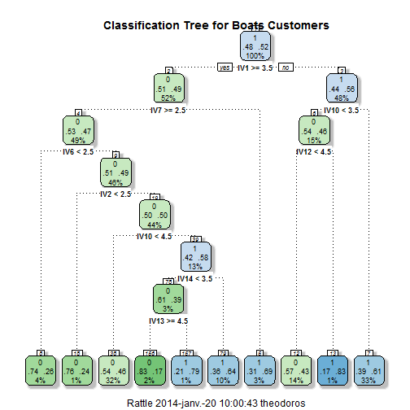
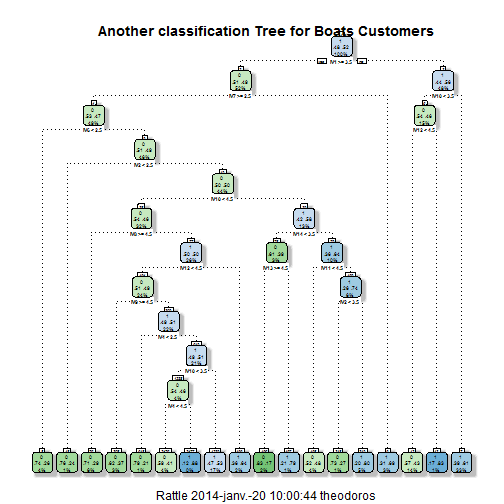

<link rel="stylesheet" href="http://netdna.bootstrapcdn.com/bootstrap/3.0.3/css/bootstrap.min.css">
<style type="text/css"> body {padding: 10px 30px 10px 30px;} table,th, td {text-align: center;}</style>
<style>
td.tableRow
{
text-align:center;
}
</style>


Classification Methods
========================================================

**T. Evgeniou, INSEAD**

What is this for?
---------------------------------------------------------

A bank is interested in knowing which customers are likely to default on loan payments. The bank is also interested in knowing what characteristics of customers will be useful to explain their loan payment behavior. An advertiser is interested in choosing the set of customers or prospects who are most likely to respond to a direct mail campaign. The advertiser is also interested in knowing what characteristics of consumers are most likely to explain responsiveness to a direct mail campaign. A procurement manager is interested in knowing which orders will be delayed. An investor is interested in knowing which assets are most likely to increase in value. 

Classification (or categorization) techniques are useful to help answer such questions. They help predict the group membership (or class - hence called **classification techniques**) of individuals (data), for **predefined group memberships**, and also to describe which characteristics of individuals can predict their group membership. Examples of group memberships/classes could be: (1) loyal customers versus customers who will churn; (2) high price sensitive versus low price sensitive customers; (3) satisfied versus dissatisfied customers; (4) purchasers versus non-purchasers; (5) assets tha increase in value versus not; (6) products that may be good recommendations to a customer versus not, etc. Characteristics that are useful in classifying individuals/data into predefined groups/classes could include for example (1) demographics; (2) psychographics; (3) past behavior; (4) attitudes towards specific products, etc. The choice of characteristics for classification should be based on the usefulness for solving the managerial problem in hand and on its ability to discriminate between the two groups.


There are many techniques for solving classification problems: classification trees, logistic regression, discriminant analysis, neural networks, boosted trees, random forest, deep learning methods (an area Facebook <a href="https://sites.google.com/site/deeplearningworkshopnips2013/schedule">  (Zuckerberg recently in an academic conference as a panelist, too) </a>  has <a href="http://www.wired.com/wiredenterprise/2013/12/facebook-yann-lecun-qa/"> invested in</a>) nearest neighbor, support vector machines, etc, (e.g. see the R packages "e1071" for more example methods). In this report, for simplicity  we focus on the first two, although one can always use some of the other methods instead of the ones discussed here. The focus of this note is not do describe any specific ("black box, math") classification method, but to describe a process for classification independent of the method used (e.g. independent of the method selected in one of the steps in the process outlined below).

An important question when using classification methods is to assess the relative performance of all available ("black box") methods i.e. in order to use the best one according to our criteria. To this purpose there are standard performance **classification assessment metrics**, which we discuss below - this is a key focus of this note.  


Classification using an Example
--------------------------------------------


### The "Business Decision"" 

A boating company had become a victim of the crisis in the boating industry. The business problem of the "Boat" case study, although hypothetical, depicts very well the sort of business problems faced by many real companies in an increasingly data-intensive business environment. The management team was now exploring various growth options. Expanding further in some markets, in particular North America, was no longer something to consider for the distant future. It was becoming an immediate necessity. 

The team believed that in order to develop a strategy for North America, they needed a better understanding of their current and potential customers in that market. They believed that they had to build more targeted boats for their most important segments there. To that purpose, the boating company had been commissioned a project for that market. Being a data-friendly company, the decision was made to develop an understanding of their customers in a data-driven way - none of that soft hold-hands-and-discuss stuff. 

The company would like to understand who would be the most likely customers to purchase a boat in the future or to recommend their brand, as well as what would be the **key purchase drivers** that affect people's decision to visit or re-visit the resort. 

### The Data

With the aid of a market research firm, the boating company gathered various data about the boating market in the US through interviews with almost 3,000 boat owners and intenders. The data consisted, among others, 29 attitudes towards boating, which respondents indicated on a 5-point scale (Q. 1, 1-29 shown in the survey in the appendix).

Other types of information had been collected, such as demographics (Q. 11-15 in the survey). Finally, the boating company had compiled information about the boats, such as the length of the boat they owned, how they used their boats, and the price of the boats (Q. 2-10 in the survey). 

After analyzing the survey data (using for example factor and cluster analysis), the company managers decided to only focus on a few purchase drivers which they thought were the most important ones. They decided to perform the classification and purchase drivers analysis using only the responses to the following questions:

1. "Q16_2_Has.best.in.class.customer.service"                                    
2. "Q16_5_Is.a.leader.in.safety"                                                 
3. "Q16_8_Is.a.good.brand.for.people.that.are.new.to.boating"                    
4. "Q16_10_Offers.boats.that.provide.a.fast.and.powerful.boating.experience"     
5. "Q16_11_Offers.the.best.boats.for.socializing"                                
6. "Q16_12_Offers.the.best.boats.for.water.sports..e.g...tubing..ski..wakeboard."
7. "Q16_13_Offers.boats.with.superior.interior.style"                            
8. "Q16_17_Offers.boats.that.can.handle.rough.weather.or.choppy.water"           
9. "Q16_18_Offers.boats.that.can.handle.frequent.and.heavy.usage"                
10. "Q16_21_Offers.boats.that.are.easy.to.maintain.and.or.repair"                 
11. "Q16_22_Offers.boats.that.are.easy.to.use"                                    
12. "Q16_24_Has.low.prices"                                                       
13. "Q16_25_Is.a.brand.that.gives.me.peace.of.mind"                               
14. "Q16_27_Is.a.brand.that.impresses.others"                                     
15. "Q17_Recommend"                                                               
16. "Q18_PurchaseFuture" 

Let's get the data and see it for a few customers. This is how the first 50 out of the total of 2813 rows look:
<br>


<div class="row">
<div class="col-md-6">
<!-- Table generated in R 3.0.2 by googleVis 0.4.7 package -->
<!-- Mon Jan 20 10:00:40 2014 -->


<!-- jsHeader -->
<script type="text/javascript">
 
// jsData 
function gvisDataTableIDda801d644a72 () {
var data = new google.visualization.DataTable();
var datajson =
[
 [
 "1",
23822,
4,
4,
4,
4,
4,
4,
4,
4,
4,
4,
4,
5,
4,
4,
0,
1 
],
[
 "2",
224795,
3,
3,
4,
4,
4,
3,
4,
4,
4,
3,
3,
3,
3,
3,
1,
1 
],
[
 "3",
20952,
4,
3,
4,
5,
4,
3,
4,
5,
4,
3,
3,
2,
4,
5,
1,
0 
],
[
 "4",
5612,
4,
5,
4,
5,
4,
4,
5,
5,
5,
4,
4,
2,
5,
4,
1,
0 
],
[
 "5",
15016,
5,
5,
5,
4,
5,
4,
4,
5,
4,
4,
5,
3,
4,
4,
0,
0 
],
[
 "6",
14856,
4,
4,
4,
4,
4,
4,
4,
4,
4,
4,
4,
3,
4,
4,
0,
0 
],
[
 "7",
11445,
4,
3,
4,
3,
4,
4,
3,
3,
3,
3,
3,
3,
4,
3,
0,
0 
],
[
 "8",
12342,
3,
4,
4,
5,
2,
5,
3,
5,
5,
4,
4,
4,
3,
3,
0,
0 
],
[
 "9",
235043,
3,
3,
4,
3,
3,
3,
3,
3,
4,
4,
4,
3,
3,
3,
0,
0 
],
[
 "10",
231122,
2,
4,
3,
5,
5,
3,
4,
2,
3,
1,
4,
4,
5,
3,
1,
0 
],
[
 "11",
479709,
5,
5,
5,
5,
5,
5,
5,
5,
5,
5,
5,
5,
3,
5,
1,
1 
],
[
 "12",
489191,
5,
4,
4,
5,
4,
4,
4,
5,
4,
4,
5,
5,
4,
4,
0,
1 
],
[
 "13",
226965,
5,
4,
4,
4,
4,
4,
4,
3,
3,
3,
4,
3,
4,
4,
0,
1 
],
[
 "14",
229147,
4,
3,
4,
4,
4,
3,
4,
4,
4,
4,
4,
4,
3,
4,
0,
1 
],
[
 "15",
16919,
4,
5,
5,
2,
5,
5,
5,
5,
5,
4,
5,
4,
4,
5,
1,
0 
],
[
 "16",
422979,
4,
4,
4,
5,
5,
4,
4,
4,
4,
4,
5,
5,
4,
5,
0,
0 
],
[
 "17",
2404,
4,
4,
5,
4,
4,
3,
3,
5,
5,
5,
3,
3,
4,
5,
0,
0 
],
[
 "18",
19244,
5,
5,
5,
4,
4,
2,
5,
4,
5,
5,
4,
4,
5,
4,
1,
0 
],
[
 "19",
21508,
4,
5,
4,
4,
5,
4,
4,
4,
5,
4,
4,
4,
5,
4,
0,
0 
],
[
 "20",
12142,
5,
4,
5,
5,
3,
5,
5,
5,
5,
4,
5,
4,
4,
4,
1,
0 
],
[
 "21",
18540,
4,
4,
4,
4,
4,
4,
4,
4,
4,
4,
4,
3,
3,
4,
0,
0 
],
[
 "22",
9947,
4,
4,
5,
4,
5,
2,
5,
4,
4,
4,
5,
3,
4,
3,
1,
0 
],
[
 "23",
9830,
3,
3,
3,
4,
3,
3,
3,
3,
3,
3,
4,
4,
4,
3,
0,
0 
],
[
 "24",
225890,
3,
5,
5,
5,
3,
5,
5,
5,
4,
5,
5,
5,
5,
5,
1,
1 
],
[
 "25",
232633,
5,
5,
5,
5,
5,
5,
5,
4,
5,
5,
5,
5,
5,
5,
0,
1 
],
[
 "26",
226124,
5,
5,
5,
5,
3,
4,
5,
4,
5,
5,
3,
5,
5,
5,
1,
1 
],
[
 "27",
225038,
3,
4,
3,
4,
3,
3,
4,
4,
4,
4,
4,
3,
3,
4,
0,
1 
],
[
 "28",
15078,
4,
5,
5,
5,
3,
5,
4,
5,
5,
5,
5,
4,
5,
3,
0,
0 
],
[
 "29",
20229,
3,
4,
3,
5,
3,
3,
4,
5,
5,
4,
4,
2,
5,
5,
1,
0 
],
[
 "30",
5671,
3,
4,
5,
3,
4,
4,
5,
4,
4,
4,
5,
4,
4,
5,
1,
0 
],
[
 "31",
1238,
5,
4,
5,
4,
4,
4,
4,
4,
5,
5,
5,
4,
5,
4,
0,
0 
],
[
 "32",
3404,
4,
4,
4,
4,
4,
4,
4,
4,
4,
4,
5,
3,
5,
4,
0,
0 
],
[
 "33",
8527,
4,
4,
3,
5,
4,
3,
4,
4,
5,
4,
4,
2,
4,
4,
0,
0 
],
[
 "34",
463,
3,
4,
4,
4,
4,
4,
4,
4,
3,
4,
3,
3,
3,
4,
0,
0 
],
[
 "35",
4502,
5,
5,
5,
5,
5,
4,
4,
4,
5,
5,
5,
5,
5,
3,
0,
0 
],
[
 "36",
233106,
3,
3,
4,
3,
3,
4,
3,
4,
4,
4,
4,
4,
3,
2,
0,
0 
],
[
 "37",
473192,
3,
4,
4,
4,
3,
4,
4,
4,
4,
4,
4,
4,
4,
4,
0,
1 
],
[
 "38",
421922,
3,
4,
3,
3,
3,
3,
3,
4,
3,
4,
3,
4,
3,
3,
0,
1 
],
[
 "39",
21898,
4,
4,
4,
3,
5,
4,
4,
4,
3,
3,
4,
4,
4,
4,
0,
0 
],
[
 "40",
220191,
4,
4,
3,
4,
4,
4,
4,
4,
4,
4,
4,
4,
4,
3,
0,
1 
],
[
 "41",
239673,
4,
4,
3,
4,
3,
4,
3,
4,
4,
4,
4,
2,
4,
3,
0,
1 
],
[
 "42",
7162,
4,
4,
5,
4,
4,
4,
3,
3,
4,
2,
3,
5,
3,
5,
1,
0 
],
[
 "43",
225761,
4,
4,
4,
4,
4,
3,
3,
5,
5,
3,
3,
3,
3,
4,
0,
1 
],
[
 "44",
228711,
3,
2,
4,
4,
2,
4,
4,
4,
4,
4,
4,
5,
3,
4,
0,
1 
],
[
 "45",
225948,
4,
4,
4,
4,
3,
4,
4,
4,
4,
4,
5,
3,
4,
3,
0,
1 
],
[
 "46",
1613,
3,
3,
3,
3,
3,
3,
3,
3,
3,
3,
3,
3,
3,
3,
0,
0 
],
[
 "47",
7903,
5,
5,
4,
5,
5,
4,
5,
5,
4,
4,
4,
5,
5,
5,
1,
0 
],
[
 "48",
10465,
5,
4,
4,
5,
4,
2,
5,
4,
5,
5,
4,
5,
4,
5,
1,
0 
],
[
 "49",
4594,
4,
5,
5,
5,
5,
4,
5,
5,
5,
4,
4,
4,
5,
4,
0,
0 
],
[
 "50",
145,
5,
5,
5,
5,
4,
3,
4,
4,
4,
3,
4,
3,
4,
4,
1,
0 
] 
];
data.addColumn('string','Variables');
data.addColumn('number','RESPID');
data.addColumn('number','Q16_2_Has.best.in.class.customer.service');
data.addColumn('number','Q16_5_Is.a.leader.in.safety');
data.addColumn('number','Q16_8_Is.a.good.brand.for.people.that.are.new.to.boating');
data.addColumn('number','Q16_10_Offers.boats.that.provide.a.fast.and.powerful.boating.experience');
data.addColumn('number','Q16_11_Offers.the.best.boats.for.socializing');
data.addColumn('number','Q16_12_Offers.the.best.boats.for.water.sports..e.g...tubing..ski..wakeboard.');
data.addColumn('number','Q16_13_Offers.boats.with.superior.interior.style');
data.addColumn('number','Q16_17_Offers.boats.that.can.handle.rough.weather.or.choppy.water');
data.addColumn('number','Q16_18_Offers.boats.that.can.handle.frequent.and.heavy.usage');
data.addColumn('number','Q16_21_Offers.boats.that.are.easy.to.maintain.and.or.repair');
data.addColumn('number','Q16_22_Offers.boats.that.are.easy.to.use');
data.addColumn('number','Q16_24_Has.low.prices');
data.addColumn('number','Q16_25_Is.a.brand.that.gives.me.peace.of.mind');
data.addColumn('number','Q16_27_Is.a.brand.that.impresses.others');
data.addColumn('number','Q17_Recommend');
data.addColumn('number','Q18_PurchaseFuture');
data.addRows(datajson);
return(data);
}
 
// jsDrawChart
function drawChartTableIDda801d644a72() {
var data = gvisDataTableIDda801d644a72();
var options = {};
options["allowHtml"] = true;
options["showRowNumber"] = true;
options["width"] =   1220;
options["height"] =    400;
options["allowHTML"] = true;
options["page"] = "disable";

    var chart = new google.visualization.Table(
    document.getElementById('TableIDda801d644a72')
    );
    chart.draw(data,options);
    

}
  
 
// jsDisplayChart
(function() {
var pkgs = window.__gvisPackages = window.__gvisPackages || [];
var callbacks = window.__gvisCallbacks = window.__gvisCallbacks || [];
var chartid = "table";
  
// Manually see if chartid is in pkgs (not all browsers support Array.indexOf)
var i, newPackage = true;
for (i = 0; newPackage && i < pkgs.length; i++) {
if (pkgs[i] === chartid)
newPackage = false;
}
if (newPackage)
  pkgs.push(chartid);
  
// Add the drawChart function to the global list of callbacks
callbacks.push(drawChartTableIDda801d644a72);
})();
function displayChartTableIDda801d644a72() {
  var pkgs = window.__gvisPackages = window.__gvisPackages || [];
  var callbacks = window.__gvisCallbacks = window.__gvisCallbacks || [];
  window.clearTimeout(window.__gvisLoad);
  // The timeout is set to 100 because otherwise the container div we are
  // targeting might not be part of the document yet
  window.__gvisLoad = setTimeout(function() {
  var pkgCount = pkgs.length;
  google.load("visualization", "1", { packages:pkgs, callback: function() {
  if (pkgCount != pkgs.length) {
  // Race condition where another setTimeout call snuck in after us; if
  // that call added a package, we must not shift its callback
  return;
}
while (callbacks.length > 0)
callbacks.shift()();
} });
}, 100);
}
 
// jsFooter
</script>
 
<!-- jsChart -->  
<script type="text/javascript" src="https://www.google.com/jsapi?callback=displayChartTableIDda801d644a72"></script>
 
<!-- divChart -->
  
<div id="TableIDda801d644a72"
  style="width: 1220px; height: 400px;">
</div>

</div>
</div>
<br> <br>

We will see some descriptive statistics of the data later, when we get into statistical analysis.

### A Process for Classification

<blockquote> <p>
It is important to remember that Data Analytics Projects require a delicate balance between experimentation, intuition, but also following (once a while) a process to avoid getting fooled by randomness in data and finding "results and patterns" that are mainly driven by our own biases and not by the facts/data themselves.
</p> </blockquote>

There is *not a single best* process for classification. However, we have to start somewhere, so we will use the following process:

#### Classification in 6 steps

1. Create an estimation sample and two validation samples by splitting the data into three groups. Steps 2-5 below will then be performed only on the estimation and the first validation data. You should only do step 6 once on the second validation data, also called **test data**, and report/use the performance on that (second validation) data only to make final business decisions. 

2.  Set up the dependent variable (as a categorical 0-1 variable; multi-class classification is also feasible, and similar, but we do not explore it in this note). 

3. Make a preliminary assessment of the relative importance of the explanatory variables using visualization tools and simple descriptive statistics. 

4.  Estimate the classification model using the estimation data, and interpret the results.

5. Assess the accuracy of classification in the first validation sample, possibly repeating steps 2-5 a few times in different ways to increase performance.

6. Finally, assess the accuracy of classification in the second validation sample.  You should eventually use/report all relevant performance measures/plots on this second validation sample only.

Let's follow these steps.

#### Step 1: Splitting the data into estimation and validation samples

It is very important that you finally measure and report (or expect to see from the data scientists working on the project) the performance of the models on **data that have not been used at all during the analysis, called "out-of-sample" data** (steps 2-5 above). The idea is that in practice we want our models to be used for predicting the class of observations/data we have not seen yet (e.g. "the future data"): although the performance of a classification method may be high in the data used to estimate the model parameters, it may be significantly poorer on data not used for parameter estimation, such as the **out-of-sample** (future) data in practice. The second validation data mimic such out-of-sample data, and the performance on this validation set is a better approximation of the performance one should expect in practice from the selected classification method.  This is why we split the data into an estimation sample and two validation samples  - using some kind of randomized splitting technique.  The estimation data and the first validation data are used during steps 2-5 (with a few iterations of these steps), while the second validation data is only used once at the very end before making final business decisions based on the analysis. The split can be, for example, 80% estimation, 10% validation 1, and 10% validation 2, depending on the number of observations - for example, when there is a lot of data, you may only keep a few hundreds of them for each validation set, and use the rest for estimation. 

While setting up the estimation and validation samples, you should also check that the same proportion of data from each class, i.e. people who plan to purchase a boat versus not, are maintained in each sample, i.e., you should maintain the same balance of the dependent variable categories as in the overall dataset. 

For simplicy, in this note we will  not iterate steps 2-5.  Again, this should **not** be done in practice, as we should usually iterate steps 2-5 a number of times using the first validation sample each time, and make our final assessment of the classification model using the second validation sample only once (ideally). 


We typically call the three data samples as **estimation_data** (e.g. 80% of the data in our case),  **validation_data**  (e.g. the 10% of the data) and **test_data** (e.g. the remaining 10% of the data).

There are 2250 observations in the estimation data, 
281 in the validation data, and 282 in the test data. 

#### Step 2: Setting up the dependent variable

First, make sure the dependent variable is set up as a categorical 0-1 variable. In this illustrative example, the intent to purchase or recommend variable is a 0-1 variable and this is what will be our dependent variable. The data however may not be always readily available with a categorical dependent variable. Suppose a retail store wants to understand what discriminates consumers who are  loyal versus those who are not. If they have data on the amount of  dollars that customers spend in their store, they can create a categorical variable ("loyal vs not-loyal") by using a definition such as: "A loyal customer is one who spends more than X amount at their store". They can then code these loyal customers as "1" and the others as "0". They can choose the threshold X as they wish, which may have a big impact in the overall analysis. This decision can be the most crucial one of the whole data analysis: a wrong choice at this step may lead both to poor performance later as well as to no valuable insights. One should revisit the choice made at this step several times, iterating steps 2-3 and 2-5.

<blockquote> <p>
Carefully deciding what the dependent 0/1 variable is can be the most critical choice of a classification analysis. This decision typically depends on contextual knowledge and needs to be revisited multiple times throughout a data analytics project. 
</p> </blockquote>

In our data the percentages of 0/1's in our estimation sample is as follows:

<TABLE class='table table-striped table-hover table-bordered'>
<CAPTION ALIGN="top"> Number of Observations per class in the Estimation Sample: Boats Customers </CAPTION>
<TR> <TH>  </TH> <TH> Class 1 </TH> <TH> Class 0 </TH>  </TR>
  <TR> <TD align="right"> # of Observations </TD> <TD align="right"> 1177 </TD> <TD align="right"> 1073 </TD> </TR>
   </TABLE>


while in the validation sample these percentages are:

<TABLE class='table table-striped table-hover table-bordered'>
<CAPTION ALIGN="top"> Number of Observations per class in the Validation Sample: Boats Customers </CAPTION>
<TR> <TH>  </TH> <TH> Class 1 </TH> <TH> Class 0 </TH>  </TR>
  <TR> <TD align="right"> # of Observations </TD> <TD align="right"> 100 </TD> <TD align="right"> 181 </TD> </TR>
   </TABLE>


#### Step 3: Make a preliminary assessment of the relative importance of the explanatory variables using visualization tools and simple descriptive statistics.

Good data analytics starts with good contextual knowledge as well as a simple statistical and visualization exploration of the data. In the case of classification, one can explore "simple classifications" by assessing how the  classes differ along any of the independent variables. For example, these are the statistics of our independent variables across the two classes, class 1, "purchase" (first table), and class 0, "no purchase" (second table):


<div class="row">
<div class="col-md-6">
<!-- Table generated in R 3.0.2 by googleVis 0.4.7 package -->
<!-- Mon Jan 20 10:00:42 2014 -->


<!-- jsHeader -->
<script type="text/javascript">
 
// jsData 
function gvisDataTableIDda8074465527 () {
var data = new google.visualization.DataTable();
var datajson =
[
 [
 "RESPID",
23099,
227250,
234287,
309712.21,
423202,
489698,
115173.73 
],
[
 "Q16_2_Has.best.in.class.customer.service",
1,
3,
3,
3.53,
4,
5,
0.87 
],
[
 "Q16_5_Is.a.leader.in.safety",
1,
3,
4,
3.75,
4,
5,
0.8 
],
[
 "Q16_8_Is.a.good.brand.for.people.that.are.new.to.boating",
1,
4,
4,
4,
5,
5,
0.75 
],
[
 "Q16_10_Offers.boats.that.provide.a.fast.and.powerful.boating.experience",
1,
3,
4,
3.93,
4,
5,
0.8 
],
[
 "Q16_11_Offers.the.best.boats.for.socializing",
1,
3,
4,
3.64,
4,
5,
0.93 
],
[
 "Q16_12_Offers.the.best.boats.for.water.sports..e.g...tubing..ski..wakeboard.",
1,
3,
4,
3.66,
4,
5,
0.88 
],
[
 "Q16_13_Offers.boats.with.superior.interior.style",
1,
3,
4,
3.69,
4,
5,
0.87 
],
[
 "Q16_17_Offers.boats.that.can.handle.rough.weather.or.choppy.water",
1,
3,
4,
3.9,
4,
5,
0.76 
],
[
 "Q16_18_Offers.boats.that.can.handle.frequent.and.heavy.usage",
1,
4,
4,
3.92,
4,
5,
0.74 
],
[
 "Q16_21_Offers.boats.that.are.easy.to.maintain.and.or.repair",
1,
4,
4,
4.01,
4,
5,
0.69 
],
[
 "Q16_22_Offers.boats.that.are.easy.to.use",
1,
4,
4,
3.98,
4,
5,
0.71 
],
[
 "Q16_24_Has.low.prices",
1,
3,
3,
3.38,
4,
5,
0.93 
],
[
 "Q16_25_Is.a.brand.that.gives.me.peace.of.mind",
1,
3,
4,
3.69,
4,
5,
0.83 
],
[
 "Q16_27_Is.a.brand.that.impresses.others",
1,
3,
4,
3.73,
4,
5,
0.8 
],
[
 "Q17_Recommend",
0,
0,
0,
0.42,
1,
1,
0.49 
],
[
 "Q18_PurchaseFuture",
1,
1,
1,
1,
1,
1,
0 
] 
];
data.addColumn('string','Variables');
data.addColumn('number','min');
data.addColumn('number','X25.percent');
data.addColumn('number','median');
data.addColumn('number','mean');
data.addColumn('number','X75.percent');
data.addColumn('number','max');
data.addColumn('number','std');
data.addRows(datajson);
return(data);
}
 
// jsDrawChart
function drawChartTableIDda8074465527() {
var data = gvisDataTableIDda8074465527();
var options = {};
options["allowHtml"] = true;
options["showRowNumber"] = true;
options["width"] =   1220;
options["height"] =    400;
options["allowHTML"] = true;
options["page"] = "disable";

    var chart = new google.visualization.Table(
    document.getElementById('TableIDda8074465527')
    );
    chart.draw(data,options);
    

}
  
 
// jsDisplayChart
(function() {
var pkgs = window.__gvisPackages = window.__gvisPackages || [];
var callbacks = window.__gvisCallbacks = window.__gvisCallbacks || [];
var chartid = "table";
  
// Manually see if chartid is in pkgs (not all browsers support Array.indexOf)
var i, newPackage = true;
for (i = 0; newPackage && i < pkgs.length; i++) {
if (pkgs[i] === chartid)
newPackage = false;
}
if (newPackage)
  pkgs.push(chartid);
  
// Add the drawChart function to the global list of callbacks
callbacks.push(drawChartTableIDda8074465527);
})();
function displayChartTableIDda8074465527() {
  var pkgs = window.__gvisPackages = window.__gvisPackages || [];
  var callbacks = window.__gvisCallbacks = window.__gvisCallbacks || [];
  window.clearTimeout(window.__gvisLoad);
  // The timeout is set to 100 because otherwise the container div we are
  // targeting might not be part of the document yet
  window.__gvisLoad = setTimeout(function() {
  var pkgCount = pkgs.length;
  google.load("visualization", "1", { packages:pkgs, callback: function() {
  if (pkgCount != pkgs.length) {
  // Race condition where another setTimeout call snuck in after us; if
  // that call added a package, we must not shift its callback
  return;
}
while (callbacks.length > 0)
callbacks.shift()();
} });
}, 100);
}
 
// jsFooter
</script>
 
<!-- jsChart -->  
<script type="text/javascript" src="https://www.google.com/jsapi?callback=displayChartTableIDda8074465527"></script>
 
<!-- divChart -->
  
<div id="TableIDda8074465527"
  style="width: 1220px; height: 400px;">
</div>

</div>
</div>

<div class="row">
<div class="col-md-6">
<!-- Table generated in R 3.0.2 by googleVis 0.4.7 package -->
<!-- Mon Jan 20 10:00:42 2014 -->


<!-- jsHeader -->
<script type="text/javascript">
 
// jsData 
function gvisDataTableIDda8053887b25 () {
var data = new google.visualization.DataTable();
var datajson =
[
 [
 "RESPID",
37,
3105,
11445,
76993.47,
21508,
489965,
147791.84 
],
[
 "Q16_2_Has.best.in.class.customer.service",
1,
3,
4,
3.67,
4,
5,
0.85 
],
[
 "Q16_5_Is.a.leader.in.safety",
1,
3,
4,
3.76,
4,
5,
0.81 
],
[
 "Q16_8_Is.a.good.brand.for.people.that.are.new.to.boating",
1,
3,
4,
3.93,
4,
5,
0.77 
],
[
 "Q16_10_Offers.boats.that.provide.a.fast.and.powerful.boating.experience",
1,
3,
4,
3.83,
4,
5,
0.84 
],
[
 "Q16_11_Offers.the.best.boats.for.socializing",
1,
3,
4,
3.76,
4,
5,
0.89 
],
[
 "Q16_12_Offers.the.best.boats.for.water.sports..e.g...tubing..ski..wakeboard.",
1,
3,
4,
3.58,
4,
5,
0.9 
],
[
 "Q16_13_Offers.boats.with.superior.interior.style",
1,
3,
4,
3.76,
4,
5,
0.84 
],
[
 "Q16_17_Offers.boats.that.can.handle.rough.weather.or.choppy.water",
1,
3,
4,
3.92,
4,
5,
0.78 
],
[
 "Q16_18_Offers.boats.that.can.handle.frequent.and.heavy.usage",
1,
3,
4,
3.96,
4,
5,
0.76 
],
[
 "Q16_21_Offers.boats.that.are.easy.to.maintain.and.or.repair",
1,
3,
4,
3.93,
4,
5,
0.76 
],
[
 "Q16_22_Offers.boats.that.are.easy.to.use",
1,
3,
4,
3.94,
4,
5,
0.71 
],
[
 "Q16_24_Has.low.prices",
1,
3,
3,
3.32,
4,
5,
0.91 
],
[
 "Q16_25_Is.a.brand.that.gives.me.peace.of.mind",
1,
3,
4,
3.75,
4,
5,
0.86 
],
[
 "Q16_27_Is.a.brand.that.impresses.others",
1,
3,
4,
3.69,
4,
5,
0.83 
],
[
 "Q17_Recommend",
0,
0,
0,
0.3,
1,
1,
0.46 
],
[
 "Q18_PurchaseFuture",
0,
0,
0,
0,
0,
0,
0 
] 
];
data.addColumn('string','Variables');
data.addColumn('number','min');
data.addColumn('number','X25.percent');
data.addColumn('number','median');
data.addColumn('number','mean');
data.addColumn('number','X75.percent');
data.addColumn('number','max');
data.addColumn('number','std');
data.addRows(datajson);
return(data);
}
 
// jsDrawChart
function drawChartTableIDda8053887b25() {
var data = gvisDataTableIDda8053887b25();
var options = {};
options["allowHtml"] = true;
options["showRowNumber"] = true;
options["width"] =   1220;
options["height"] =    400;
options["allowHTML"] = true;
options["page"] = "disable";

    var chart = new google.visualization.Table(
    document.getElementById('TableIDda8053887b25')
    );
    chart.draw(data,options);
    

}
  
 
// jsDisplayChart
(function() {
var pkgs = window.__gvisPackages = window.__gvisPackages || [];
var callbacks = window.__gvisCallbacks = window.__gvisCallbacks || [];
var chartid = "table";
  
// Manually see if chartid is in pkgs (not all browsers support Array.indexOf)
var i, newPackage = true;
for (i = 0; newPackage && i < pkgs.length; i++) {
if (pkgs[i] === chartid)
newPackage = false;
}
if (newPackage)
  pkgs.push(chartid);
  
// Add the drawChart function to the global list of callbacks
callbacks.push(drawChartTableIDda8053887b25);
})();
function displayChartTableIDda8053887b25() {
  var pkgs = window.__gvisPackages = window.__gvisPackages || [];
  var callbacks = window.__gvisCallbacks = window.__gvisCallbacks || [];
  window.clearTimeout(window.__gvisLoad);
  // The timeout is set to 100 because otherwise the container div we are
  // targeting might not be part of the document yet
  window.__gvisLoad = setTimeout(function() {
  var pkgCount = pkgs.length;
  google.load("visualization", "1", { packages:pkgs, callback: function() {
  if (pkgCount != pkgs.length) {
  // Race condition where another setTimeout call snuck in after us; if
  // that call added a package, we must not shift its callback
  return;
}
while (callbacks.length > 0)
callbacks.shift()();
} });
}, 100);
}
 
// jsFooter
</script>
 
<!-- jsChart -->  
<script type="text/javascript" src="https://www.google.com/jsapi?callback=displayChartTableIDda8053887b25"></script>
 
<!-- divChart -->
  
<div id="TableIDda8053887b25"
  style="width: 1220px; height: 400px;">
</div>

</div>
</div>


The purpose of such an analysis by class is to get an initial idea about whether the classes are indeed separable as well as to understant which of the independent variables have most discriminatory power. Can you see any differences across the two classes in the tables above? 

Notice however that:

<blockquote> <p>
Even though each independent variable may not differ across classes, classification may still be feasible as a (linear or nonlinear) combination of independent variables may still be discriminatory. 
</p> </blockquote>

A simple visualization tool to assess the discriminatory power of the independent variables are the **box plots**. These visually indicate simple summary statistics of an independent variable (e.g. mean, median, )
For example consider the box plots for our data for the first 4 independent variables are:


```
## Warning: calling par(new=TRUE) with no plot
```

[1]  97  98  99 100
 


Can you see which variables appear to be most discrimatory?


#### Step 4: Estimate the classification model using the estimation data, and interpret the results.

Once we decide which  dependent and independent variables to use, one can use a number of classification methods to develop a model that discriminated the different classes. 

<blockquote> <p>
Some of the widely used classification methods are:  classification and regression trees, boosted trees,support vector machines, neural networks, nearest neighbors, logistic regression, lasso, random forests, deep learning methods, etc.
</p> </blockquote>

In this note we will consider only two classification methods: **logistic regression** and **classification and regression trees (CART)**. However, replacing them with other methods is simple. Understanding how these methods work is beyond the scope of this note - there are many references available online for all these classification methods. 

CART is a widely used classification method largely because the estimated classification models are easy to interpret. This classification tool iteratively "splits" the data using the most discriminatory independent variable at each step, building a "tree" - as shown below - on the way. The CART methods **limit the size of the tree** using various statistical techniques in order to avoid **overfitting the data**. For example, using the rpart and rpart.control functions in R, we can limit the size of the try by selecting the functions' **complexity control** paramater **cp** (what this does it beyond the scope of this note. For the rpart and rpart.control functions in R, smaller values, e.g. cp=0.001, lead to larger trees that larger values, e.g. cp = 0.01, as we will see next).

<blockquote> <p>
One of the biggest risks of developing classification models is overfitting: while it is always trivial to develop a model (e.g. a tree) that classifies any (estimation) dataset with no misclassification error at all, there is no guarantee that the quality of a classifier in out-of-sample data (e.g. in the validation data) will be close to that in the estimation data. Finding the right balance between "over-fitting" and "under-fitting" is one of the most important aspects in data analytics. While there are a number of statistical techniques to help us find this balance - including the use of validation data - it is largely a combination of good statistical analysis with qualitative criteria (e.g. regarding the interpretability or simplicity of the estimated models) that leads to classification models which can work well in practice. 
</p> </blockquote>

Running a basic CART model with complexity control cp=0.01,  leads to the following tree (**NOTE**: for better readability of the tree figures below,  we will rename the independent variables as IV1 to IV14 when using CART):


 


The leaves of the tree indicate the number of estimation data observations that belong to each class which "reach that leaf". A perfect classification would only have data from one class in each of the tree leaves. However, such a perfect classification of the estimation data would most likely not be able to classify well out-of-sample data due to over-fitting the estimation data.

One can estimate larger trees through changing the tree's **complexity control** parameter (in this case the rpart.control argument cp). For example, this is how the tree would look like if we set cp = 0.005

 


One can use the percentage of data in each leaf of the tree to have an estimate that an observation (e.g. person) belongs to a given class. Specifically, given a new observation (e.g .person), the tree can be used to understand the leaf this observation would belong to. The **purity of the leaf** can indicate the probability am observation belongs to a class. In our case, the probability our validation data belong to class 1 (e.g. the customer is likely to purchase a boat) for the first few validation data observations, using the first CART above, is:


<!-- Table generated in R 3.0.2 by googleVis 0.4.7 package -->
<!-- Mon Jan 20 10:00:47 2014 -->


<!-- jsHeader -->
<script type="text/javascript">
 
// jsData 
function gvisDataTableIDda80715b764e () {
var data = new google.visualization.DataTable();
var datajson =
[
 [
 "Actual Class",
1,
1,
1,
1,
1,
1,
1,
1,
1,
1,
1,
1,
1,
1,
1,
1,
1,
1,
1,
1,
1,
1,
1,
1,
1,
1,
1,
1,
1,
1,
1,
1,
1,
1,
1,
1,
1,
1,
1,
1,
1,
1,
1,
1,
1,
1,
1,
1,
1,
1 
],
[
 "Probability of Class 1",
0.61,
0.61,
0.46,
0.61,
0.61,
0.61,
0.61,
0.61,
0.46,
0.61,
0.61,
0.61,
0.61,
0.61,
0.61,
0.46,
0.61,
0.46,
0.43,
0.43,
0.46,
0.46,
0.43,
0.61,
0.26,
0.61,
0.61,
0.43,
0.61,
0.61,
0.61,
0.61,
0.61,
0.61,
0.61,
0.83,
0.43,
0.43,
0.43,
0.43,
0.43,
0.43,
0.43,
0.43,
0.43,
0.43,
0.43,
0.43,
0.43,
0.43 
] 
];
data.addColumn('number','Obs.1');
data.addColumn('number','Obs.2');
data.addColumn('number','Obs.3');
data.addColumn('number','Obs.4');
data.addColumn('number','Obs.5');
data.addColumn('number','Obs.6');
data.addColumn('number','Obs.7');
data.addColumn('number','Obs.8');
data.addColumn('number','Obs.9');
data.addColumn('number','Obs.10');
data.addColumn('number','Obs.11');
data.addColumn('number','Obs.12');
data.addColumn('number','Obs.13');
data.addColumn('number','Obs.14');
data.addColumn('number','Obs.15');
data.addColumn('number','Obs.16');
data.addColumn('number','Obs.17');
data.addColumn('number','Obs.18');
data.addColumn('number','Obs.19');
data.addColumn('number','Obs.20');
data.addColumn('number','Obs.21');
data.addColumn('number','Obs.22');
data.addColumn('number','Obs.23');
data.addColumn('number','Obs.24');
data.addColumn('number','Obs.25');
data.addColumn('number','Obs.26');
data.addColumn('number','Obs.27');
data.addColumn('number','Obs.28');
data.addColumn('number','Obs.29');
data.addColumn('number','Obs.30');
data.addColumn('number','Obs.31');
data.addColumn('number','Obs.32');
data.addColumn('number','Obs.33');
data.addColumn('number','Obs.34');
data.addColumn('number','Obs.35');
data.addColumn('number','Obs.36');
data.addColumn('number','Obs.37');
data.addColumn('number','Obs.38');
data.addColumn('number','Obs.39');
data.addColumn('number','Obs.40');
data.addColumn('number','Obs.41');
data.addColumn('number','Obs.42');
data.addColumn('number','Obs.43');
data.addColumn('number','Obs.44');
data.addColumn('number','Obs.45');
data.addColumn('number','Obs.46');
data.addColumn('number','Obs.47');
data.addColumn('number','Obs.48');
data.addColumn('number','Obs.49');
data.addColumn('number','Obs.50');
data.addRows(datajson);
return(data);
}
 
// jsDrawChart
function drawChartTableIDda80715b764e() {
var data = gvisDataTableIDda80715b764e();
var options = {};
options["allowHtml"] = true;
options["showRowNumber"] = true;
options["width"] =   1220;
options["height"] =    140;
options["allowHTML"] = true;
options["page"] = "disable";

    var chart = new google.visualization.Table(
    document.getElementById('TableIDda80715b764e')
    );
    chart.draw(data,options);
    

}
  
 
// jsDisplayChart
(function() {
var pkgs = window.__gvisPackages = window.__gvisPackages || [];
var callbacks = window.__gvisCallbacks = window.__gvisCallbacks || [];
var chartid = "table";
  
// Manually see if chartid is in pkgs (not all browsers support Array.indexOf)
var i, newPackage = true;
for (i = 0; newPackage && i < pkgs.length; i++) {
if (pkgs[i] === chartid)
newPackage = false;
}
if (newPackage)
  pkgs.push(chartid);
  
// Add the drawChart function to the global list of callbacks
callbacks.push(drawChartTableIDda80715b764e);
})();
function displayChartTableIDda80715b764e() {
  var pkgs = window.__gvisPackages = window.__gvisPackages || [];
  var callbacks = window.__gvisCallbacks = window.__gvisCallbacks || [];
  window.clearTimeout(window.__gvisLoad);
  // The timeout is set to 100 because otherwise the container div we are
  // targeting might not be part of the document yet
  window.__gvisLoad = setTimeout(function() {
  var pkgCount = pkgs.length;
  google.load("visualization", "1", { packages:pkgs, callback: function() {
  if (pkgCount != pkgs.length) {
  // Race condition where another setTimeout call snuck in after us; if
  // that call added a package, we must not shift its callback
  return;
}
while (callbacks.length > 0)
callbacks.shift()();
} });
}, 100);
}
 
// jsFooter
</script>
 
<!-- jsChart -->  
<script type="text/javascript" src="https://www.google.com/jsapi?callback=displayChartTableIDda80715b764e"></script>
 
<!-- divChart -->
  
<div id="TableIDda80715b764e"
  style="width: 1220px; height: 140px;">
</div>


In practice we need to select the **probability threshold** above which we consider an observation as "class 1": this is an important choice that we will discuss below. First we discuss another method widely used, namely logistic regression.

**Logistic Regression** is a method similar to linear regression except that the dependent variable can be discrete (e.g. 0 or 1). **Linear** logistic regression estimates the coefficients of a linear regression using the selected independent variables while optimizing a classification criterion. For example, this is the logistic regression equation for our data:


<TABLE class='table table-striped table-hover table-bordered'>
<CAPTION ALIGN="top"> Logistic Regression: Estimated Coefficients </CAPTION>
<TR> <TH>  </TH> <TH> Estimate </TH> <TH> Std. Error </TH> <TH> z value </TH> <TH> Pr(&gt |z|) </TH>  </TR>
  <TR> <TD align="right"> (Intercept) </TD> <TD align="right"> -0.6 </TD> <TD align="right"> 0.4 </TD> <TD align="right"> -1.6 </TD> <TD align="right"> 0.1 </TD> </TR>
  <TR> <TD align="right"> Q16_2_Has.best.in.class.customer.service </TD> <TD align="right"> -0.2 </TD> <TD align="right"> 0.1 </TD> <TD align="right"> -3.3 </TD> <TD align="right"> 0.0 </TD> </TR>
  <TR> <TD align="right"> Q16_5_Is.a.leader.in.safety </TD> <TD align="right"> 0.0 </TD> <TD align="right"> 0.1 </TD> <TD align="right"> 0.2 </TD> <TD align="right"> 0.8 </TD> </TR>
  <TR> <TD align="right"> Q16_8_Is.a.good.brand.for.people.that.are.new.to.boating </TD> <TD align="right"> 0.1 </TD> <TD align="right"> 0.1 </TD> <TD align="right"> 2.1 </TD> <TD align="right"> 0.0 </TD> </TR>
  <TR> <TD align="right"> Q16_10_Offers.boats.that.provide.a.fast.and.powerful.boating.experience </TD> <TD align="right"> 0.2 </TD> <TD align="right"> 0.1 </TD> <TD align="right"> 3.6 </TD> <TD align="right"> 0.0 </TD> </TR>
  <TR> <TD align="right"> Q16_11_Offers.the.best.boats.for.socializing </TD> <TD align="right"> -0.1 </TD> <TD align="right"> 0.1 </TD> <TD align="right"> -1.9 </TD> <TD align="right"> 0.1 </TD> </TR>
  <TR> <TD align="right"> Q16_12_Offers.the.best.boats.for.water.sports..e.g...tubing..ski..wakeboard. </TD> <TD align="right"> 0.1 </TD> <TD align="right"> 0.1 </TD> <TD align="right"> 2.0 </TD> <TD align="right"> 0.0 </TD> </TR>
  <TR> <TD align="right"> Q16_13_Offers.boats.with.superior.interior.style </TD> <TD align="right"> -0.2 </TD> <TD align="right"> 0.1 </TD> <TD align="right"> -3.7 </TD> <TD align="right"> 0.0 </TD> </TR>
  <TR> <TD align="right"> Q16_17_Offers.boats.that.can.handle.rough.weather.or.choppy.water </TD> <TD align="right"> -0.1 </TD> <TD align="right"> 0.1 </TD> <TD align="right"> -1.6 </TD> <TD align="right"> 0.1 </TD> </TR>
  <TR> <TD align="right"> Q16_18_Offers.boats.that.can.handle.frequent.and.heavy.usage </TD> <TD align="right"> -0.1 </TD> <TD align="right"> 0.1 </TD> <TD align="right"> -1.1 </TD> <TD align="right"> 0.3 </TD> </TR>
  <TR> <TD align="right"> Q16_21_Offers.boats.that.are.easy.to.maintain.and.or.repair </TD> <TD align="right"> 0.2 </TD> <TD align="right"> 0.1 </TD> <TD align="right"> 2.8 </TD> <TD align="right"> 0.0 </TD> </TR>
  <TR> <TD align="right"> Q16_22_Offers.boats.that.are.easy.to.use </TD> <TD align="right"> 0.1 </TD> <TD align="right"> 0.1 </TD> <TD align="right"> 1.5 </TD> <TD align="right"> 0.1 </TD> </TR>
  <TR> <TD align="right"> Q16_24_Has.low.prices </TD> <TD align="right"> 0.0 </TD> <TD align="right"> 0.0 </TD> <TD align="right"> 0.9 </TD> <TD align="right"> 0.4 </TD> </TR>
  <TR> <TD align="right"> Q16_25_Is.a.brand.that.gives.me.peace.of.mind </TD> <TD align="right"> -0.1 </TD> <TD align="right"> 0.1 </TD> <TD align="right"> -1.4 </TD> <TD align="right"> 0.2 </TD> </TR>
  <TR> <TD align="right"> Q16_27_Is.a.brand.that.impresses.others </TD> <TD align="right"> 0.1 </TD> <TD align="right"> 0.1 </TD> <TD align="right"> 2.1 </TD> <TD align="right"> 0.0 </TD> </TR>
   </TABLE>


Given a set of independent variables, the output of the estimated logistic regression (the sum of the products of the independent variables with the corresponding regression coefficients) can be used to assess the probability an observation belongs to one of the classes. Specifically, the regression output can be transformed into a probability of belonging to, say, class 1 for each observation. In our case, the probability our validation data belong to class 1 (e.g. the customer is likely to visit the resort) for the first few validation data observations, using the logistic regression above, is:


```
## Error: 'data' must be a data.frame, not a matrix or an array
```

```
## Error: 'data' must be a data.frame, not a matrix or an array
```

```
## Error: 'data' must be a data.frame, not a matrix or an array
```

```
## Error: object 'estimation_Probability_class1_log' not found
```

```
## Error: object 'validation_Probability_class1_log' not found
```

```
## Error: object 'test_Probability_class1_log' not found
```


```
## Error: object 'validation_Probability_class1_log' not found
```

<!-- Table generated in R 3.0.2 by googleVis 0.4.7 package -->
<!-- Mon Jan 20 10:00:48 2014 -->


<!-- jsHeader -->
<script type="text/javascript">
 
// jsData 
function gvisDataTableIDda8012c86084 () {
var data = new google.visualization.DataTable();
var datajson =
[
 [
 "Actual Class",
1,
1,
1,
1,
1,
1,
1,
1,
1,
1,
1,
1,
1,
1,
1,
1,
1,
1,
1,
1,
1,
1,
1,
1,
1,
1,
1,
1,
1,
1,
1,
1,
1,
1,
1,
1,
1,
1,
1,
1,
1,
1,
1,
1,
1,
1,
1,
1,
1,
1 
],
[
 "Probability of Class 1",
0.61,
0.61,
0.46,
0.61,
0.61,
0.61,
0.61,
0.61,
0.46,
0.61,
0.61,
0.61,
0.61,
0.61,
0.61,
0.46,
0.61,
0.46,
0.43,
0.43,
0.46,
0.46,
0.43,
0.61,
0.26,
0.61,
0.61,
0.43,
0.61,
0.61,
0.61,
0.61,
0.61,
0.61,
0.61,
0.83,
0.43,
0.43,
0.43,
0.43,
0.43,
0.43,
0.43,
0.43,
0.43,
0.43,
0.43,
0.43,
0.43,
0.43 
] 
];
data.addColumn('number','Obs.1');
data.addColumn('number','Obs.2');
data.addColumn('number','Obs.3');
data.addColumn('number','Obs.4');
data.addColumn('number','Obs.5');
data.addColumn('number','Obs.6');
data.addColumn('number','Obs.7');
data.addColumn('number','Obs.8');
data.addColumn('number','Obs.9');
data.addColumn('number','Obs.10');
data.addColumn('number','Obs.11');
data.addColumn('number','Obs.12');
data.addColumn('number','Obs.13');
data.addColumn('number','Obs.14');
data.addColumn('number','Obs.15');
data.addColumn('number','Obs.16');
data.addColumn('number','Obs.17');
data.addColumn('number','Obs.18');
data.addColumn('number','Obs.19');
data.addColumn('number','Obs.20');
data.addColumn('number','Obs.21');
data.addColumn('number','Obs.22');
data.addColumn('number','Obs.23');
data.addColumn('number','Obs.24');
data.addColumn('number','Obs.25');
data.addColumn('number','Obs.26');
data.addColumn('number','Obs.27');
data.addColumn('number','Obs.28');
data.addColumn('number','Obs.29');
data.addColumn('number','Obs.30');
data.addColumn('number','Obs.31');
data.addColumn('number','Obs.32');
data.addColumn('number','Obs.33');
data.addColumn('number','Obs.34');
data.addColumn('number','Obs.35');
data.addColumn('number','Obs.36');
data.addColumn('number','Obs.37');
data.addColumn('number','Obs.38');
data.addColumn('number','Obs.39');
data.addColumn('number','Obs.40');
data.addColumn('number','Obs.41');
data.addColumn('number','Obs.42');
data.addColumn('number','Obs.43');
data.addColumn('number','Obs.44');
data.addColumn('number','Obs.45');
data.addColumn('number','Obs.46');
data.addColumn('number','Obs.47');
data.addColumn('number','Obs.48');
data.addColumn('number','Obs.49');
data.addColumn('number','Obs.50');
data.addRows(datajson);
return(data);
}
 
// jsDrawChart
function drawChartTableIDda8012c86084() {
var data = gvisDataTableIDda8012c86084();
var options = {};
options["allowHtml"] = true;
options["showRowNumber"] = true;
options["width"] =   1220;
options["height"] =    140;
options["allowHTML"] = true;
options["page"] = "disable";

    var chart = new google.visualization.Table(
    document.getElementById('TableIDda8012c86084')
    );
    chart.draw(data,options);
    

}
  
 
// jsDisplayChart
(function() {
var pkgs = window.__gvisPackages = window.__gvisPackages || [];
var callbacks = window.__gvisCallbacks = window.__gvisCallbacks || [];
var chartid = "table";
  
// Manually see if chartid is in pkgs (not all browsers support Array.indexOf)
var i, newPackage = true;
for (i = 0; newPackage && i < pkgs.length; i++) {
if (pkgs[i] === chartid)
newPackage = false;
}
if (newPackage)
  pkgs.push(chartid);
  
// Add the drawChart function to the global list of callbacks
callbacks.push(drawChartTableIDda8012c86084);
})();
function displayChartTableIDda8012c86084() {
  var pkgs = window.__gvisPackages = window.__gvisPackages || [];
  var callbacks = window.__gvisCallbacks = window.__gvisCallbacks || [];
  window.clearTimeout(window.__gvisLoad);
  // The timeout is set to 100 because otherwise the container div we are
  // targeting might not be part of the document yet
  window.__gvisLoad = setTimeout(function() {
  var pkgCount = pkgs.length;
  google.load("visualization", "1", { packages:pkgs, callback: function() {
  if (pkgCount != pkgs.length) {
  // Race condition where another setTimeout call snuck in after us; if
  // that call added a package, we must not shift its callback
  return;
}
while (callbacks.length > 0)
callbacks.shift()();
} });
}, 100);
}
 
// jsFooter
</script>
 
<!-- jsChart -->  
<script type="text/javascript" src="https://www.google.com/jsapi?callback=displayChartTableIDda8012c86084"></script>
 
<!-- divChart -->
  
<div id="TableIDda8012c86084"
  style="width: 1220px; height: 140px;">
</div>


The default decision is to classify each observation in the group with the highest probability - but we will relax this below. 

Selecting the best subset of independent variables for logistic regression, a special case of the general problem of **feature selection**, is an iterative process where both the significance of the regression coefficients as well as the performance of the estimated logistic regression equation on the first validation data are used as guidance. A number of variations are tested in practice, each leading to different performance, which we discuss next. 

#### Step 5: Assess the accuracy of classification in the first validation sample


Using the predicted class probabilities  of the validation data, as outlined above, we can  generate four basic measures of classification performance. Before discussing them, note that given the probability an observation belongs to a class, **a reasonable class prediction choice is to predict the class that has the highest probability**. However, this does not need to be the only choice in practice.

<blockquote> <p>
Selecting the probability threshold based on which we predict the class of an observation is a decision the user needs to make. While in some cases a reasonable probability threshold is 50%, in other cases it may be 99.9% or 0.01%. Can you think of such cases?
</p> </blockquote>

For different choices of the probability threshold, one can measure a number of classification performance metrics. Specifically: 

### 1.  **Hit ratio** 
This is simply the percentage of the observations that have been correctly classified (the posterior is the same as the prior classification). We can just count the number of the (first) validation data correctly classified and divide this number with the total number of the (fist) validation data, using the two CART and the logistic regression above. These are as follows for the probability threshold  50% for the validation data:


```
## Error: object 'validation_prediction_class_log' not found
```

```
## Error: object 'validation_prediction_class_log' not found
```

```
## Error: object 'validation_hit_rates' not found
```

```
## Error: object 'validation_hit_rates' not found
```

```
## Error: object 'validation_hit_rates' not found
```


while for the estimation data the hit rates are:


```
## Error: object 'estimation_prediction_class_log' not found
```

```
## Error: object 'estimation_prediction_class_log' not found
```

```
## Error: object 'estimation_hit_rates' not found
```

```
## Error: object 'estimation_hit_rates' not found
```

```
## Error: object 'estimation_hit_rates' not found
```


**Why are the performances on the estimation and validation data different? How different can they possibly be? What does this diffference depend on?** Is the Validation Data Hit Rate satisfactory? Which classifier should we use? What should be the benchmark against which to compare the hit rate? There is one basic benchmark to be used: the Maximum Chance Criterion.

The **Maximum Chance Criterion** suggests that the hit rate should exceed the proportion of the class with the largest size. For our validation data the largest group is people who did not visit the resort: 100 out of 281 people). Clearly without doing any discriminant analysis, if we classified all individuals into the largest group, then we could get a hit-rate of 0.3559% without doing any work. This is the Maximum Chance Criterion. Clearly, discriminant analysis should get a hit rate of at least the Maximum Chance Criterion. 

###2. **Confusion matrix**

The confusion matrix shows the percentage of the estimation data that are put in the right group, for each group. For example for the method above with the highest hit rate in the validation data, the confusion matrix for the validation data is:


```
## Error: object 'validation_predictions' not found
```

```
## Error: object 'validation_prediction_best' not found
```

```
## Error: object 'cmp' not found
```

```
## Error: object 'confp' not found
```


### 3.	**ROC curve** 

Remember that each observation is classified in a group by our model according to the probabilities Pr(0) and Pr(1). Typically we set the probability threshold to 0.5 - so that observations for which Pr(0) > 0.5 are classified as 0's. However, we can vary this threshold, for example if we are interested in correctly predicting all 1's but do not mind missing some 0's (and vice-versa) as may be the case of security alarms - what threshold for Pr(1) should we use in that case? When we change this threshold we get different values of hit rate, false positive, and false negative. We can plot the false positive versus false negative values we get this way, and generate the so called ROC curve. The proportion of well-classified positive events is called the sensitivity. The specificity is the proportion of well-classified negative events.  

The ROC curves for the validation data for both the CARTs above as well as the logistic regression are as follows:

crs$pr <- predict(crs$glm, type="response", newdata=crs$dataset)
  pred <- prediction(crs$pr, no.miss)
plot(performance(pred, "tpr", "fpr"), col="#CC0000FF", lty=1, add=FALSE)


