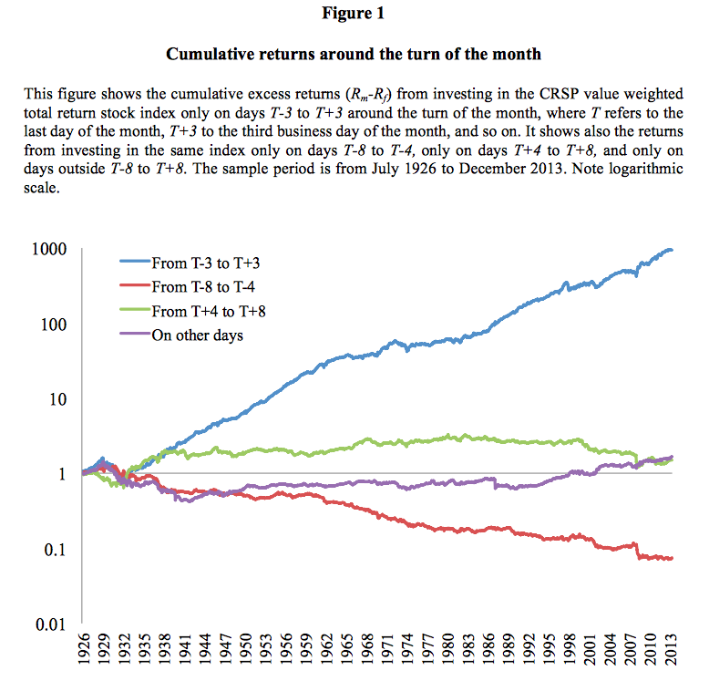

---
title: "Exercise Set 1"
author: "T. Evgeniou"
output: html_document
---


<br>

The purpose of this exercise is to become familiar with:

1. Basic statistics functions in R;
2. Simple matrix operations;
3. Simple data manipulations; 
4. The idea of functions as well as some useful customized functions provided. 

While doing this exercise we will also see how to generate replicable and customizable reports. For this purpose the exercise uses the R Markdown capabilities (see [Markdown Cheat Sheet](https://www.rstudio.com/wp-content/uploads/2015/02/rmarkdown-cheatsheet.pdf) or a [basic introduction to R Markdown](http://rmarkdown.rstudio.com/authoring_basics.html)).  These capabilities allow us to create dynamic reports. For example today's date is `r Sys.Date()` (you need to see the .Rmd to understand that this is *not* a static typed-in date but it changes every time you compile the .Rmd - if the date changed of course).

Before starting, make sure you have pulled the [exercise files](https://github.com/InseadDataAnalytics/INSEADAnalytics/tree/master/Exercises/Exerciseset1)  on your github repository (if you pull the course github repository you also get the exercise set files automatically). Moreover, make sure you are in the directory of this exercise. Directory paths may be complicated, and sometimes a frustrating source of problems, so it is recommended that you use these R commands to find out your current working directory and, if needed, set it where you have the main files for the specific exercise/project (there are other ways, but for now just be aware of this path issue). For example, assuming we are now in the "MYDIRECTORY/INSEADAnalytics" directory, we can do these: 

```{r echo=TRUE, eval=FALSE, tidy=TRUE}
#getwd()

#setwd("Exercises/Exerciseset1/")

#list.files()
```

**Note:** you can always use the `help` command in Rstudio to find out about any R function (e.g. type `help(list.files)` to learn what the R function `list.files` does).

Let's now see the exercise. 

**IMPORTANT:** You should answer all questions by simply adding your code/answers in this document through editing the file ExerciseSet1.Rmd and then clicking on the "Knit HTML" button in RStudio.  Once done, please post your .Rmd and html files in your github repository. 

<hr>
<hr>

### Exercise Data

We download daily prices (open, high, low, close, and adjusted close) and volume data of publicly traded companies and markets from the web (e.g. Yahoo! or Google, etc). This is done by sourcing the file data.R as well as some helper functions in herpersSet1.R which also installs a number of R libraries (hence the first time you run this code you will see a lot of red color text indicating the *download* and *installation* process):

```{r eval = TRUE, echo=TRUE, error = FALSE, warning=FALSE,message=FALSE,results='asis'}
source("helpersSet1.R")
source("dataSet1.R")
```

For more information on downloading finance data from the internet as well as on finance related R tools see these starting points (there is a lot more of course available):

* [Some finance data loading tools](http://www.r-bloggers.com/r-code-yahoo-finance-data-loading/)
* [Connecting directly to Bloomberg](http://www.r-bloggers.com/rblpapi-connecting-r-to-bloomberg/)
* [Some time series plot tools](http://www.r-bloggers.com/plotting-time-series-in-r-using-yahoo-finance-data/)
* [Various finance code links](https://cran.r-project.org/web/views/Finance.html)
* [More links](http://blog.revolutionanalytics.com/2013/12/quantitative-finance-applications-in-r.html)
* [Even more links](http://www.r-bloggers.com/financial-data-accessible-from-r-part-iv/)
* Of course endless available code (e.g. like this one that seems to [get companies' earnings calendars](https://github.com/gsee/qmao/blob/master/R/getCalendar.R))

#### Optional Question 

1. Can you find some interesting finance related R package or github repository? 

**Your Answers here:**

<br>
Many!

<hr>
<hr>

### Part I: Statistics of S&P Daily Returns

We have `r nrow(StockReturns)` days of data, starting from `r rownames(StockReturns)[1]` until `r tail(rownames(StockReturns),1)`.  Here are some basic statistics about the S&P returns:

1. The cumulative returns of the S&P index during this period is `r round(100*sum(StockReturns[,1]),1)`%.
2. The average daily returns of the S&P index during this period is `r round(100*mean(StockReturns[,1]),3)`%;
2. The standard deviation of the daily returns of the S&P index during this period is `r round(100*sd(StockReturns[,1]),3)`%;

Here are returns of the S&P in this period (note the use of the helper function pnl_plot - defined in file helpersSet1.R):

```{r echo=FALSE, comment=NA, warning=FALSE, message=FALSE,results='asis',fig.align='center', fig.height=4,fig.width= 6, fig=TRUE}
SPY = StockReturns[,"SPY"]
pnl_plot(SPY)
```

#### Questions

1. Notice that the code also downloads the returns of Apple during the same period. Can you explain where this is done in the code (including the .R files used)?
2. What are the cumulative, average daily returns, and the standard deviation of the daily returns of Apple in the same period? 
3. *(Extra points)* What if we want to also see the returns of another company, say Yahoo!, in the same period? Can you get that data and report the statistics for Yahoo!'s stock, too? 

**Your Answers here:**
<br>
**Note**: *The code downloads the data till the day you run it, so numbers may change depending on the day you generate the report.*

<br>
*Question 1*: 

See file `dataset1.R` the line that says `mytickers = c("SPY", "AAPL")`

*Question 2*: 

```{r eval = TRUE, echo=TRUE, error = FALSE, warning=FALSE,message=FALSE,results='asis'}
Apple = StockReturns[,"AAPL"]
cumulative_apple = sum(Apple) 
# Just removing possible non-trading (missing) days
average_daily = ifelse(sum(!is.na(Apple)) > 0, mean(Apple[!is.na(Apple)]), 0)
# Need at least 3 days to get the standard deviation
sd_daily = ifelse(sum(!is.na(Apple)) > 2, sd(Apple[!is.na(Apple)]), 0)
```
Cumulative is `r cumulative_apple`, average is `r average_daily` and standard deviation is `r sd_daily`.

*Question 3*: 

Just modify the `dataset1.R` file line to `mytickers = c("SPY", "AAPL","YHOO")` and then do for Yahoo! exactly what we did for Apple in Question 2. 

<br>
<hr>
<hr>

### Part II: Simple Matrix Manipulations

For this part of the exercise we will do some basic manipulations of the data. First note that the data are in a so-called matrix format. If you run these commands in RStudio (use help to find out what they do) you will see how matrices work: 

```{r eval = FALSE, echo=TRUE}
class(StockReturns)
dim(StockReturns)
nrow(StockReturns)
ncol(StockReturns)
StockReturns[1:4,]
head(StockReturns,5)
tail(StockReturns,5) 
```

We will now use an R function for matrices that is extremely useful for analyzing data. It is called *apply*. Check it out using help in R. 

For example, we can now quickly estimate the average returns of S&P and Apple (of course this can be done manually, too, but what if we had 500 stocks - e.g. a matrix with 500 columns?) and plot the returns of that 50-50 on S&P and Apple portfolio:

```{r echo=FALSE, comment=NA, warning=FALSE, message=FALSE,results='asis',fig.align='center', fig=TRUE}
portfolio = apply(StockReturns,1,mean)
names(portfolio) <- rownames(StockReturns)
pnl_plot(portfolio)
```


We can also transpose the matrix of returns to create a new "horizontal" matrix. Let's call this matrix (variable name) transposedData. We can do so using this command:  `transposedData = t(StockReturns)`. 

#### Questions

1. What R commands can you use to get the number of rows and number of columns of the new matrix called transposedData?
2. Based on the help for the R function *apply* (`help(apply)`), can you create again the portfolio of S&P and Apple and plot the returns in a new figure below?

**Your Answers here:**

*Question 1*: 

Let's define **first** `transposedData`, otherwise the code afterwards will not know what this is!

```{r eval = TRUE, echo=TRUE, error = FALSE, warning=FALSE,message=FALSE,results='asis'}
transposedData = t(StockReturns)
```

We can use the command `nrow(transposedData)` for the rows, which gives the answer `r nrow(transposedData)`, and the command `ncol(transposedData)` for the columns, which gives the answer `r ncol(transposedData)`.

*Question 2*: 

We now need to `apply` the function `mean` on the **columns** of `transposedData`, hence we use `apply(transposedData, 2, mean)`:

```{r eval = TRUE, echo=TRUE, error = FALSE, warning=FALSE,message=FALSE,results='asis'}
portfolio_transpose = apply(transposedData,2,mean)
names(portfolio_transpose) <- rownames(StockReturns)
```

```{r echo=FALSE, comment=NA, warning=FALSE, message=FALSE,results='asis',fig.align='center', fig=TRUE}
pnl_plot(portfolio_transpose)
```

<br>

<hr>
<hr>

### Part III: Reproducibility and Customization

This is an important step and will get you to think about the overall process once again. 

#### Questions

1. We want to re-do all this analysis with data since 2001-01-01: what change do we need to make in the code (hint: all you need to change is one line - exactly 1 number! - in dataSet1.R file), and how can you get the new exercise set with the data since 2001-01-01? 
2. *(Extra Exercise)*  Can you get the returns of a few companies and plot the returns of an equal weighted portfolio with those companies during some period you select? 

**Your Answers here:**

*Question 1*:

Just change the line`startDate = "2005-01-01"` in file `dataSet1.R` to `startDate = "2001-01-01"` and generate the report again. 

*Question 2*: 

All you need to do is change the line `mytickers = c("SPY", "AAPL")` in file `dataSet1.R` to add as many tickers as you like, paying attention to missing values (e.g. `is.na()` - see example above), and rerun the report. 

<br>

<hr>
<hr>

###  Part IV: Read/Write .CSV files

Finally, one can read and write data in .CSV files. For example, we can save the first 20 days of data for S&P and Apple in a file using the command:

```{r eval = TRUE, echo=TRUE, comment=NA, warning=FALSE, message=FALSE,results='asis'}
write.csv(StockReturns[1:20,c("SPY","AAPL")], file = "twentydays.csv", row.names = TRUE, col.names = TRUE) 
```

Do not get surpsised if you see the csv file in your directories suddenly! You can then read the data from the csv file using the read.csv command. For example, this will load the data from the csv file and save it in a new variable that now is called "myData": 

```{r eval = TRUE, echo=TRUE, comment=NA, warning=FALSE, message=FALSE,results='asis'}
myData <- read.csv(file = "twentydays.csv", header = TRUE, sep=",")
```

Try it!

#### Questions

1. Once you write and read the data as described above, what happens when you run this command in the console of the RStudio: `sum(myData != StockReturns[1:20,])`

2. *(Extra exercise)* What do you think will happen if you now run this command, and why:  

```{r eval = FALSE, echo=TRUE, error = FALSE, warning=FALSE,message=FALSE,results='asis'}
myData + StockReturns[1:40,]
```

**Your Answers here:**

*Question 1*

(see also answer to question 2)

To see this you need to run the code chunks of this report manually in the "Console"! Else, any "bugs" in this line will not allow html to work.  Hence we set the "eval=FALSE" in this chunk so that the code is not evaluated when we generate the html report. 

```{r eval = FALSE, echo=TRUE, error = FALSE, warning=FALSE,message=FALSE,results='asis'}
myData + StockReturns[1:40,]
```
Depending on how you read your .csv file - and how it is stored on your computer! - you may get different warnings/errors. One error says `non-numeric argument to binary operator`: this is if `myData` also has the dates - see next question. Another error may complain that the dimensionality of `myData` and  `StockReturns[1:40,]` is not the same: one has 20 rows and the other one 40.  **Key lesson:** errors are ways for us to learn how things work. 

*Question 2*

```{r eval = TRUE, echo=TRUE, error = FALSE, warning=FALSE,message=FALSE,results='asis'}
myData <- read.csv(file = "twentydays.csv", header = TRUE, sep=",")
myData_semicolon <- read.csv(file = "twentydays.csv", header = TRUE, sep=";")
```

There are many issues here:

1. read.csv may need to use `sep=";"` instead of `sep=","` depending on how the data is stored in the csv. You should check the number of columns of `myData` and see some parts of  `myData` to make sure all is read well. **Always check the data you read from any file.** For example, if we do `myData_semicolon <- read.csv(file = "twentydays.csv", header = TRUE, sep=";")` (note the ";" used for `sep`) we may get `dim(myData_semicolon)` to be `r dim(myData_semicolon)`, while if we use the "," as `sep`, as in `myData <- read.csv(file = "twentydays.csv", header = TRUE, sep=",")` (note the ",") we may get `dim(myData)` to be `r dim(myData)`. We **should always also see some subsets of the data**, e.g. run the command `myData[1:4,]` or see other parts of the data. 

2. read.csv may read the rows, which are dates. For example we may have `myData[1:2,1]` give `r myData[1:2,1]`. So we may want to format well our data, for example doing this:
<br> 

```{r eval = TRUE, echo=TRUE, error = FALSE, warning=FALSE,message=FALSE,results='asis'}
rownames(myData) <- myData[,1] # use the first column as row names (these are the dates)
myData <- myData[,-1] # remove the first column which was the dates
```
<br>

In this case the command `dim(myData)` will give `r dim(myData)` and we can also now "sum" the data in `myData`, e.g. `sum(myData)` will give `r sum(myData)`, which was not working before removing the column of dates (how can it add dates and numbers!).

**Bottom line:** *Make sure you always confirm how the data look like, and format them before you do anything else*

<hr>
<hr>

### Extra Question

Can you now load another dataset from some CSV file and report some basic statistics about that data? 

<br>

### Creating Interactive Documents

Finally, just for fun, one can add some interactivity in the report using [Shiny](http://rmarkdown.rstudio.com/authoring_shiny.html).All one needs to do is set the eval flag of the code chunk below (see the .Rmd file) to "TRUE", add the line "runtime: shiny" at the very begining of the .Rmd file, make the markdown output to be "html_document", and then press "Run Document". 

```{r, eval=FALSE, echo = TRUE}
sliderInput("startdate", "Starting Date:", min = 1, max = length(portfolio), 
            value = 1)
sliderInput("enddate", "End Date:", min = 1, max = length(portfolio), 
            value = length(portfolio))

renderPlot({
  pnl_plot(portfolio[input$startdate:input$enddate])
})
```

<br>

<hr>
<hr>

### Endless explorations (optional homework)

This is a [recent research article](http://poseidon01.ssrn.com/delivery.php?ID=851091091009083082092113118102076099034023058067019062072066007100008111081022102123034016097101060099003106125099002090116089026058012038004030005113111105079028059062024121067073126072090091089069014121102110107075029090001011087028011082124103085&EXT=pdf)  that won an award in 2016. Can you implement a simple strategy as in Figure 1 of this paper? You may find these R commands useful: `names`, `which`, `str_sub`,`diff`,`as.vector`, `length`, `pmin`, `pmax`, `sapply`, `lapply`,`Reduce`,`unique`, `as.numeric`, `%in%`
 

What if you also include information about bonds? (e.g. download the returns of the the ETF with ticker "TLT") Is there any relation between stocks and bonds? 

**A Trading Strategy:** Here it is, since `r startDate`:

```{r eval = TRUE, echo=TRUE, error = FALSE, warning=FALSE,message=FALSE,results='asis'}
SPY = scrub(StockReturns[,"SPY"])

month_date = c(0,diff(as.numeric(str_sub(names(SPY), start=6, end=7))))!=0

minus3plus3 = pmin(pmax(1,unique(as.vector(sapply((-3):3, function(i) which(month_date) + i)))),length(SPY))
SPY_minus3plus3 = structure(ifelse(1:length(SPY) %in% minus3plus3, SPY, 0), .Names = names(SPY))

minus8minus4 = pmin(pmax(1,unique(as.vector(sapply((-8):(-4), function(i) which(month_date) + i)))),length(SPY))
SPY_minus8minus4 = structure(ifelse(1:length(SPY) %in% minus8minus4, SPY, 0), .Names = names(SPY))
```

The +-3 days end of month market looks like this:

```{r echo=FALSE, comment=NA, warning=FALSE, message=FALSE,results='asis',fig.align='center', fig=TRUE}
pnl_plot(SPY_minus3plus3)
```


The -8 to -4 days end of month market looks like this:

```{r echo=FALSE, comment=NA, warning=FALSE, message=FALSE,results='asis',fig.align='center', fig=TRUE}
pnl_plot(SPY_minus8minus4)
```

**Have fun** 

