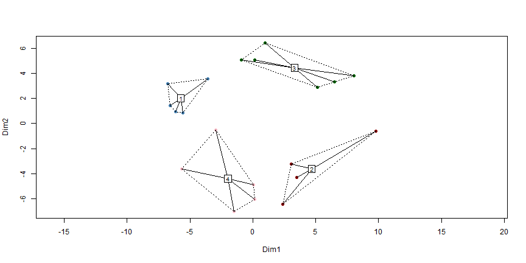

---

title : (Big) Data Analytics for Business
subtitle : Sessions 4-5, Clustering and Segmentation
author : T. Evgeniou and J. Niessing
job : INSEAD
widgets : []
mode : standalone 

---

## Clustering and Segmentation




---

## What is Clustering and Segmentation?

<br>
<br>
<br>

Processes and tools to organize data in a few segments, with data being as similar as possible within each segment, and as different as possible across segments

---

## Example Usage

<br>
<br>

- Market Segmentation

- Co-Moving Asset Classes

- Geo-demographic segmentation

- Recommender Systems

- Text Mining


---

## A Segmentation Process

<br>

1. Confirm the data in metric 

2. Decide whether to scale or standardize the data

3. Decide which variables to use for clustering

4. Define similarity or dissimilarity measures between observations

5. Visualize Individual Attributes and  Pair-wise Distances between the Observations

6. Select the clustering method to use and decide how many clusters to have

7. Profile and interpret the clusters 

8. Assess the robustness of our clusters

---

## Example Data: Market Research Survey


Size of data: 2813 observations with 82 variables each

V1: Shopping is fun (scale 1-7)

V2: Shopping is bad for your budget (scale 1-7)

V3: I combine shopping with eating out (scale 1-7)

V4: I try to get the best buys while shopping (scale 1-7)

V5: I don't care about shopping (scale 1-7)

V6: You can save lot of money by comparingprices (scale 1-7)

Income: the household income of the respondent (in dollars)

Mall.Visits: how often they visit the mall (scale 1-7)

---

## Step 1: Confirm the data are metric 

(Pls scroll to see the data)

<style>
.wrapper{
            height: 120%;
            width: 900px;
            overflow: auto;
          }
</style>
<div class="wrapper" style="font-size:20px;">
<div class="row">
<div class="col-md-3">
<!-- Table generated in R 3.0.2 by googleVis 0.4.7 package -->
<!-- Wed Jan 15 08:36:52 2014 -->


<!-- jsHeader -->
<script type="text/javascript">
 
// jsData 
function gvisDataTableID6dccc7a5332f2 () {
var data = new google.visualization.DataTable();
var datajson =
[
 [
 "1",
5,
1,
5,
5,
5,
5 
],
[
 "2",
3,
2,
4,
4,
4,
4 
],
[
 "3",
3,
1,
4,
4,
5,
4 
],
[
 "4",
5,
2,
3,
4,
5,
5 
],
[
 "5",
4,
2,
4,
5,
5,
4 
],
[
 "6",
4,
2,
2,
4,
5,
5 
],
[
 "7",
4,
3,
4,
4,
5,
5 
],
[
 "8",
4,
3,
4,
4,
4,
5 
],
[
 "9",
4,
3,
4,
4,
4,
4 
],
[
 "10",
2,
5,
3,
2,
1,
3 
],
[
 "11",
5,
5,
5,
5,
5,
4 
],
[
 "12",
5,
5,
4,
4,
5,
4 
],
[
 "13",
4,
3,
4,
4,
3,
3 
],
[
 "14",
4,
4,
3,
4,
4,
4 
],
[
 "15",
4,
5,
4,
4,
4,
4 
],
[
 "16",
5,
5,
4,
3,
4,
4 
],
[
 "17",
4,
3,
4,
2,
3,
4 
],
[
 "18",
3,
5,
3,
5,
4,
4 
],
[
 "19",
4,
4,
5,
4,
5,
5 
],
[
 "20",
5,
2,
3,
5,
5,
5 
],
[
 "21",
4,
3,
5,
4,
5,
5 
],
[
 "22",
4,
2,
2,
4,
3,
4 
],
[
 "23",
5,
5,
4,
5,
5,
4 
],
[
 "24",
5,
2,
5,
4,
5,
5 
],
[
 "25",
4,
2,
5,
4,
3,
5 
],
[
 "26",
5,
1,
3,
4,
4,
5 
],
[
 "27",
4,
3,
3,
4,
4,
4 
],
[
 "28",
5,
3,
5,
5,
5,
5 
],
[
 "29",
5,
3,
4,
4,
5,
5 
],
[
 "30",
4,
3,
4,
4,
4,
5 
],
[
 "31",
5,
4,
5,
4,
5,
5 
],
[
 "32",
5,
3,
3,
4,
4,
4 
],
[
 "33",
5,
2,
4,
5,
4,
4 
],
[
 "34",
4,
3,
4,
3,
4,
5 
],
[
 "35",
5,
4,
5,
3,
4,
5 
],
[
 "36",
4,
2,
3,
4,
4,
4 
],
[
 "37",
4,
4,
3,
4,
3,
4 
],
[
 "38",
3,
5,
3,
3,
3,
3 
],
[
 "39",
4,
5,
4,
5,
4,
5 
],
[
 "40",
4,
3,
3,
4,
3,
4 
],
[
 "41",
5,
3,
3,
4,
4,
3 
],
[
 "42",
5,
3,
3,
5,
5,
3 
],
[
 "43",
4,
4,
3,
4,
2,
4 
],
[
 "44",
4,
2,
2,
4,
4,
3 
],
[
 "45",
5,
3,
3,
4,
3,
4 
],
[
 "46",
5,
3,
3,
4,
4,
5 
],
[
 "47",
4,
4,
5,
4,
4,
5 
],
[
 "48",
4,
5,
4,
4,
5,
5 
],
[
 "49",
5,
5,
4,
4,
5,
5 
],
[
 "50",
4,
5,
2,
1,
3,
2 
] 
];
data.addColumn('string','Variables');
data.addColumn('number','Q1_1_When.buying.a.boat..I.do.a.lot.of.shopping.around.and.visit.multiple.dealers');
data.addColumn('number','Q1_2_When.buying.a.boat..getting.the.lowest.price.is.more.important.than.the.boat.brand');
data.addColumn('number','Q1_3_The.brand.of.boat.I.buy.says.a.lot.about.who.I.am');
data.addColumn('number','Q1_4_I.only.consider.buying.a.boat.from.a.reputable.brand');
data.addColumn('number','Q1_5_I.am.willing.to.pay.a.premium.for.a.brand.with.a.reputation.for.high.quality');
data.addColumn('number','Q1_6_Owning.a.boat.is.a.way.of.rewarding.myself.for.my.hard.work');
data.addRows(datajson);
return(data);
}
 
// jsDrawChart
function drawChartTableID6dccc7a5332f2() {
var data = gvisDataTableID6dccc7a5332f2();
var options = {};
options["allowHtml"] = true;
options["showRowNumber"] = true;
options["width"] =   1220;
options["height"] =    400;
options["allowHTML"] = true;
options["page"] = "disable";

    var chart = new google.visualization.Table(
    document.getElementById('TableID6dccc7a5332f2')
    );
    chart.draw(data,options);
    

}
  
 
// jsDisplayChart
(function() {
var pkgs = window.__gvisPackages = window.__gvisPackages || [];
var callbacks = window.__gvisCallbacks = window.__gvisCallbacks || [];
var chartid = "table";
  
// Manually see if chartid is in pkgs (not all browsers support Array.indexOf)
var i, newPackage = true;
for (i = 0; newPackage && i < pkgs.length; i++) {
if (pkgs[i] === chartid)
newPackage = false;
}
if (newPackage)
  pkgs.push(chartid);
  
// Add the drawChart function to the global list of callbacks
callbacks.push(drawChartTableID6dccc7a5332f2);
})();
function displayChartTableID6dccc7a5332f2() {
  var pkgs = window.__gvisPackages = window.__gvisPackages || [];
  var callbacks = window.__gvisCallbacks = window.__gvisCallbacks || [];
  window.clearTimeout(window.__gvisLoad);
  // The timeout is set to 100 because otherwise the container div we are
  // targeting might not be part of the document yet
  window.__gvisLoad = setTimeout(function() {
  var pkgCount = pkgs.length;
  google.load("visualization", "1", { packages:pkgs, callback: function() {
  if (pkgCount != pkgs.length) {
  // Race condition where another setTimeout call snuck in after us; if
  // that call added a package, we must not shift its callback
  return;
}
while (callbacks.length > 0)
callbacks.shift()();
} });
}, 100);
}
 
// jsFooter
</script>
 
<!-- jsChart -->  
<script type="text/javascript" src="https://www.google.com/jsapi?callback=displayChartTableID6dccc7a5332f2"></script>
 
<!-- divChart -->
  
<div id="TableID6dccc7a5332f2"
  style="width: 1220px; height: 400px;">
</div>

</div>
</div>
</div>

---

## Step 2: Decide whether to scale or standardize the data: Summary Statistics

<br>

<style>
.wrapper{
            height: 120%;
            width: 900px;
            overflow: auto;
          }
</style>
<div class="wrapper" style="font-size:20px;">
<div class="row">
<div class="col-md-3">
<!-- Table generated in R 3.0.2 by googleVis 0.4.7 package -->
<!-- Wed Jan 15 08:36:53 2014 -->


<!-- jsHeader -->
<script type="text/javascript">
 
// jsData 
function gvisDataTableID6dccc5e79e66 () {
var data = new google.visualization.DataTable();
var datajson =
[
 [
 "Q1_1_When.buying.a.boat..I.do.a.lot.of.shopping.around.and.visit.multiple.dealers",
1,
4,
4,
4.03,
5,
5,
0.82 
],
[
 "Q1_2_When.buying.a.boat..getting.the.lowest.price.is.more.important.than.the.boat.brand",
1,
2,
3,
2.89,
4,
5,
1.01 
],
[
 "Q1_3_The.brand.of.boat.I.buy.says.a.lot.about.who.I.am",
1,
2,
3,
3.12,
4,
5,
1.02 
],
[
 "Q1_4_I.only.consider.buying.a.boat.from.a.reputable.brand",
1,
3,
4,
3.89,
4,
5,
0.82 
],
[
 "Q1_5_I.am.willing.to.pay.a.premium.for.a.brand.with.a.reputation.for.high.quality",
1,
3,
4,
3.55,
4,
5,
0.93 
],
[
 "Q1_6_Owning.a.boat.is.a.way.of.rewarding.myself.for.my.hard.work",
1,
4,
4,
3.95,
4,
5,
0.82 
] 
];
data.addColumn('string','Variables');
data.addColumn('number','min');
data.addColumn('number','X25.percent');
data.addColumn('number','median');
data.addColumn('number','mean');
data.addColumn('number','X75.percent');
data.addColumn('number','max');
data.addColumn('number','std');
data.addRows(datajson);
return(data);
}
 
// jsDrawChart
function drawChartTableID6dccc5e79e66() {
var data = gvisDataTableID6dccc5e79e66();
var options = {};
options["allowHtml"] = true;
options["showRowNumber"] = true;
options["width"] =   1220;
options["height"] =    400;
options["allowHTML"] = true;
options["page"] = "disable";

    var chart = new google.visualization.Table(
    document.getElementById('TableID6dccc5e79e66')
    );
    chart.draw(data,options);
    

}
  
 
// jsDisplayChart
(function() {
var pkgs = window.__gvisPackages = window.__gvisPackages || [];
var callbacks = window.__gvisCallbacks = window.__gvisCallbacks || [];
var chartid = "table";
  
// Manually see if chartid is in pkgs (not all browsers support Array.indexOf)
var i, newPackage = true;
for (i = 0; newPackage && i < pkgs.length; i++) {
if (pkgs[i] === chartid)
newPackage = false;
}
if (newPackage)
  pkgs.push(chartid);
  
// Add the drawChart function to the global list of callbacks
callbacks.push(drawChartTableID6dccc5e79e66);
})();
function displayChartTableID6dccc5e79e66() {
  var pkgs = window.__gvisPackages = window.__gvisPackages || [];
  var callbacks = window.__gvisCallbacks = window.__gvisCallbacks || [];
  window.clearTimeout(window.__gvisLoad);
  // The timeout is set to 100 because otherwise the container div we are
  // targeting might not be part of the document yet
  window.__gvisLoad = setTimeout(function() {
  var pkgCount = pkgs.length;
  google.load("visualization", "1", { packages:pkgs, callback: function() {
  if (pkgCount != pkgs.length) {
  // Race condition where another setTimeout call snuck in after us; if
  // that call added a package, we must not shift its callback
  return;
}
while (callbacks.length > 0)
callbacks.shift()();
} });
}, 100);
}
 
// jsFooter
</script>
 
<!-- jsChart -->  
<script type="text/javascript" src="https://www.google.com/jsapi?callback=displayChartTableID6dccc5e79e66"></script>
 
<!-- divChart -->
  
<div id="TableID6dccc5e79e66"
  style="width: 1220px; height: 400px;">
</div>

</div>
</div>
</div>


---

## Data Standardization: Example Code

<br>
<br>


```r
ProjectData_segment_scaled = apply(ProjectData_segment, 2, function(r) {
    if (sd(r) != 0) {
        res = (r - mean(r))/sd(r)
    } else {
        res = 0 * r
        res
    }
})
```


---

## Standardized Data: Summary Statistics

<br>

<style>
.wrapper{
            height: 120%;
            width: 900px;
            overflow: auto;
          }
</style>
<div class="wrapper" style="font-size:20px;">
<div class="row">
<div class="col-md-3">
<!-- Table generated in R 3.0.2 by googleVis 0.4.7 package -->
<!-- Wed Jan 15 08:36:54 2014 -->


<!-- jsHeader -->
<script type="text/javascript">
 
// jsData 
function gvisDataTableID6dccc3dfc2887 () {
var data = new google.visualization.DataTable();
var datajson =
[
 [
 "Q1_1_When.buying.a.boat..I.do.a.lot.of.shopping.around.and.visit.multiple.dealers",
-3.69,
-0.03,
-0.03,
0,
1.19,
1.19,
1 
],
[
 "Q1_2_When.buying.a.boat..getting.the.lowest.price.is.more.important.than.the.boat.brand",
-1.86,
-0.87,
0.11,
0,
1.1,
2.09,
1 
],
[
 "Q1_3_The.brand.of.boat.I.buy.says.a.lot.about.who.I.am",
-2.07,
-1.09,
-0.11,
0,
0.87,
1.85,
1 
],
[
 "Q1_4_I.only.consider.buying.a.boat.from.a.reputable.brand",
-3.53,
-1.09,
0.13,
0,
0.13,
1.35,
1 
],
[
 "Q1_5_I.am.willing.to.pay.a.premium.for.a.brand.with.a.reputation.for.high.quality",
-2.75,
-0.6,
0.48,
0,
0.48,
1.56,
1 
],
[
 "Q1_6_Owning.a.boat.is.a.way.of.rewarding.myself.for.my.hard.work",
-3.58,
0.06,
0.06,
0,
0.06,
1.27,
1 
] 
];
data.addColumn('string','Variables');
data.addColumn('number','min');
data.addColumn('number','X25.percent');
data.addColumn('number','median');
data.addColumn('number','mean');
data.addColumn('number','X75.percent');
data.addColumn('number','max');
data.addColumn('number','std');
data.addRows(datajson);
return(data);
}
 
// jsDrawChart
function drawChartTableID6dccc3dfc2887() {
var data = gvisDataTableID6dccc3dfc2887();
var options = {};
options["allowHtml"] = true;
options["showRowNumber"] = true;
options["width"] =   1220;
options["height"] =    400;
options["allowHTML"] = true;
options["page"] = "disable";

    var chart = new google.visualization.Table(
    document.getElementById('TableID6dccc3dfc2887')
    );
    chart.draw(data,options);
    

}
  
 
// jsDisplayChart
(function() {
var pkgs = window.__gvisPackages = window.__gvisPackages || [];
var callbacks = window.__gvisCallbacks = window.__gvisCallbacks || [];
var chartid = "table";
  
// Manually see if chartid is in pkgs (not all browsers support Array.indexOf)
var i, newPackage = true;
for (i = 0; newPackage && i < pkgs.length; i++) {
if (pkgs[i] === chartid)
newPackage = false;
}
if (newPackage)
  pkgs.push(chartid);
  
// Add the drawChart function to the global list of callbacks
callbacks.push(drawChartTableID6dccc3dfc2887);
})();
function displayChartTableID6dccc3dfc2887() {
  var pkgs = window.__gvisPackages = window.__gvisPackages || [];
  var callbacks = window.__gvisCallbacks = window.__gvisCallbacks || [];
  window.clearTimeout(window.__gvisLoad);
  // The timeout is set to 100 because otherwise the container div we are
  // targeting might not be part of the document yet
  window.__gvisLoad = setTimeout(function() {
  var pkgCount = pkgs.length;
  google.load("visualization", "1", { packages:pkgs, callback: function() {
  if (pkgCount != pkgs.length) {
  // Race condition where another setTimeout call snuck in after us; if
  // that call added a package, we must not shift its callback
  return;
}
while (callbacks.length > 0)
callbacks.shift()();
} });
}, 100);
}
 
// jsFooter
</script>
 
<!-- jsChart -->  
<script type="text/javascript" src="https://www.google.com/jsapi?callback=displayChartTableID6dccc3dfc2887"></script>
 
<!-- divChart -->
  
<div id="TableID6dccc3dfc2887"
  style="width: 1220px; height: 400px;">
</div>

</div>
</div>
</div>

---

## Step 3. Decide which variables to use for clustering

<br>
<br>
<br>

The choice of the variables used for clustering is critically important 
<br>
<br>

Tpically we use different variables for segmentation (the "segmentation variables") and different ones for profiling (the "profiling variables")

<br>
<br>

Remember: Segmentation is an iterative process

---

## Step 4. Define similarity or dissimilarity measures between observations


Defining what we mean when we say "similar" or "different" observations is a key part of cluster analysis which often requires a lot of contextual knowledge and creativity 

<br>
<br>


There are literally thousands of rigorous mathematical definitions of distance between observations/vectors

<br>
<br>

The user can manually define such distance metrics

---

## Distances across our data using the Euclidean distance

<br>
<br>


<style>
.wrapper{
            height: 120%;
            width: 900px;
            overflow: auto;
          }
</style>
<div class="wrapper" style="font-size:20px;">
<div class="row">
<div class="col-md-3">
<TABLE class='table table-striped table-hover table-bordered'>
<CAPTION ALIGN="top"> Pairwise Distances between the first 5 observations using The Euclidean Distance Metric: Mall Visits </CAPTION>
<TR> <TH> 1 </TH> <TH> 2 </TH> <TH> 3 </TH> <TH> 4 </TH> <TH> 5 </TH>  </TR>
  <TR> <TD align="right"> 0.0 </TD> <TD align="right">  </TD> <TD align="right">  </TD> <TD align="right">  </TD> <TD align="right">  </TD> </TR>
  <TR> <TD align="right"> 3.0 </TD> <TD align="right"> 0.0 </TD> <TD align="right">  </TD> <TD align="right">  </TD> <TD align="right">  </TD> </TR>
  <TR> <TD align="right"> 2.6 </TD> <TD align="right"> 1.4 </TD> <TD align="right"> 0.0 </TD> <TD align="right">  </TD> <TD align="right">  </TD> </TR>
  <TR> <TD align="right"> 2.4 </TD> <TD align="right"> 2.6 </TD> <TD align="right"> 2.6 </TD> <TD align="right"> 0.0 </TD> <TD align="right">  </TD> </TR>
  <TR> <TD align="right"> 2.0 </TD> <TD align="right"> 1.7 </TD> <TD align="right"> 1.7 </TD> <TD align="right"> 2.0 </TD> <TD align="right"> 0.0 </TD> </TR>
   </TABLE>

</div>
</div>
</div>


---

## Distances across our data using the Manhattan distance

<br>
<br>


<style>
.wrapper{
            height: 120%;
            width: 900px;
            overflow: auto;
          }
</style>
<div class="wrapper" style="font-size:20px;">
<div class="row">
<div class="col-md-3">
<TABLE class='table table-striped table-hover table-bordered'>
<CAPTION ALIGN="top"> Pairwise Distances between the first 5 observations using The Manhattan Distance Metric: Mall Visits </CAPTION>
<TR> <TH> 1 </TH> <TH> 2 </TH> <TH> 3 </TH> <TH> 4 </TH> <TH> 5 </TH>  </TR>
  <TR> <TD align="right"> 0.0 </TD> <TD align="right">  </TD> <TD align="right">  </TD> <TD align="right">  </TD> <TD align="right">  </TD> </TR>
  <TR> <TD align="right"> 7.0 </TD> <TD align="right"> 0.0 </TD> <TD align="right">  </TD> <TD align="right">  </TD> <TD align="right">  </TD> </TR>
  <TR> <TD align="right"> 5.0 </TD> <TD align="right"> 2.0 </TD> <TD align="right"> 0.0 </TD> <TD align="right">  </TD> <TD align="right">  </TD> </TR>
  <TR> <TD align="right"> 4.0 </TD> <TD align="right"> 5.0 </TD> <TD align="right"> 5.0 </TD> <TD align="right"> 0.0 </TD> <TD align="right">  </TD> </TR>
  <TR> <TD align="right"> 4.0 </TD> <TD align="right"> 3.0 </TD> <TD align="right"> 3.0 </TD> <TD align="right"> 4.0 </TD> <TD align="right"> 0.0 </TD> </TR>
   </TABLE>

</div>
</div>
</div>


---


## Manually Defined Distances: an Example

<br>
<br>
<br>


```r
My_Distance_function <- function(x, y) {
    sum(abs(x - y) > 2)
}
```


---


## Manually Defined Distances: an Example

<br>
<br>


<style>
.wrapper{
            height: 120%;
            width: 900px;
            overflow: auto;
          }
</style>
<div class="wrapper" style="font-size:20px;">
<div class="row">
<div class="col-md-3">
<TABLE class='table table-striped table-hover table-bordered'>
<CAPTION ALIGN="top"> Pairwise Distances between the first 5 observations using a simple manually defined Distance Metric: Mall Visits </CAPTION>
<TR> <TH> 1 </TH> <TH> 2 </TH> <TH> 3 </TH> <TH> 4 </TH> <TH> 5 </TH>  </TR>
  <TR> <TD align="right"> 0.0 </TD> <TD align="right">  </TD> <TD align="right">  </TD> <TD align="right">  </TD> <TD align="right">  </TD> </TR>
  <TR> <TD align="right"> 0.0 </TD> <TD align="right"> 0.0 </TD> <TD align="right">  </TD> <TD align="right">  </TD> <TD align="right">  </TD> </TR>
  <TR> <TD align="right"> 0.0 </TD> <TD align="right"> 0.0 </TD> <TD align="right"> 0.0 </TD> <TD align="right">  </TD> <TD align="right">  </TD> </TR>
  <TR> <TD align="right"> 0.0 </TD> <TD align="right"> 0.0 </TD> <TD align="right"> 0.0 </TD> <TD align="right"> 0.0 </TD> <TD align="right">  </TD> </TR>
  <TR> <TD align="right"> 0.0 </TD> <TD align="right"> 0.0 </TD> <TD align="right"> 0.0 </TD> <TD align="right"> 0.0 </TD> <TD align="right"> 0.0 </TD> </TR>
   </TABLE>

</div>
</div>
</div>


---

## Step 5. Visualize Individual Attributes and  Pair-wise Distances between the Observations

---

## Histograms of some Variables

<style>
.wrapper{
            height: 40%;
            width: 800px;
            overflow: auto;
          }
</style>
<div class="wrapper" style="font-size:15px;">


